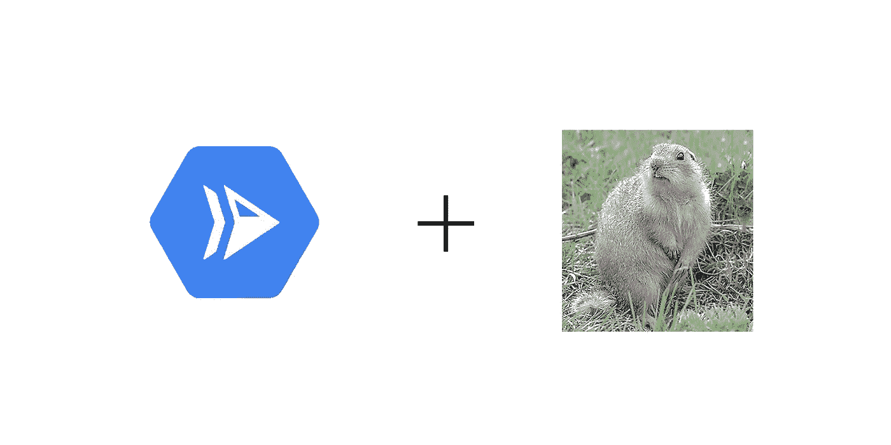
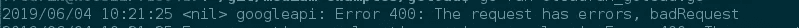
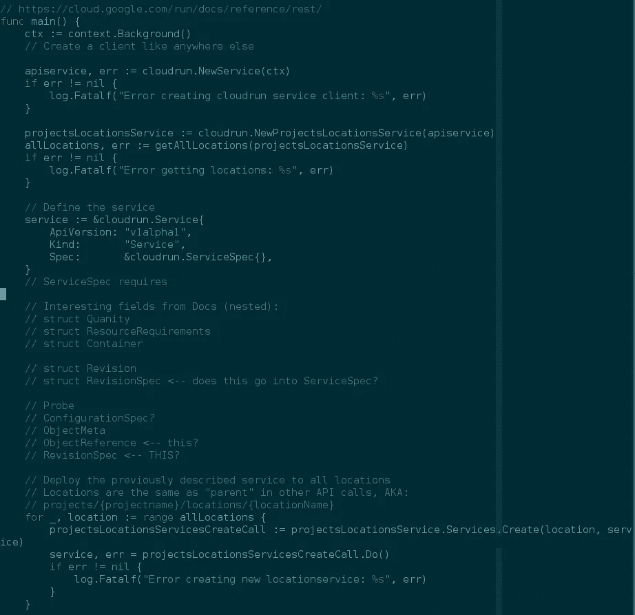
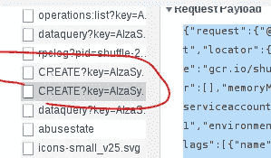
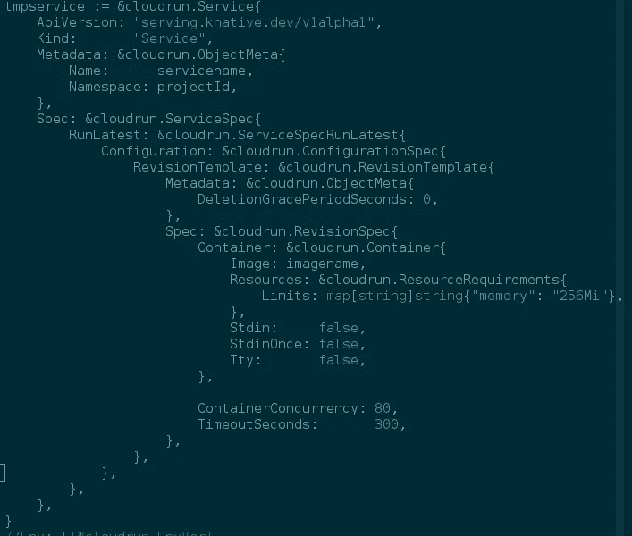
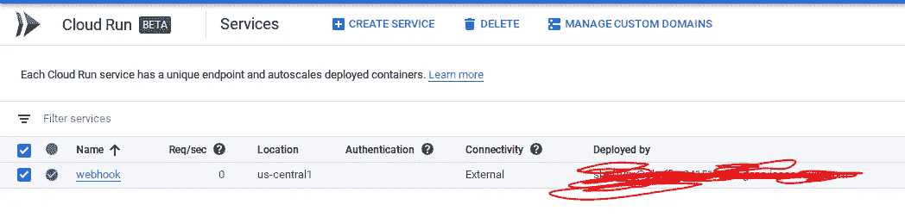

# 将 pure Golang 用于 Google cloud

> 原文：<https://medium.com/swlh/using-pure-golang-for-google-cloud-bacc6b62e0ed>

在过去的半年里，我一直在使用 pure Golang 研究 Google cloud 的开发和部署选项。我很快意识到使用这些 API 实际上很难，至少作为一个第一次使用的用户是这样，我想分享一下为什么我一直在努力。我将展示一些例子，并讨论使用 Golang 构建[云运行(新)](https://cloud.google.com/run/)、[云任务(新 ish)](https://cloud.google.com/tasks/) 和[数据存储](https://cloud.google.com/datastore/)的烦恼。

每当我想尝试一个新的 GCP API 时，我都会遇到这些问题，当你使用任何云平台时，这是很常见的。我的挣扎是由于缺乏[示例](https://github.com/GoogleCloudPlatform/golang-samples)和 [godoc 理解](https://www.reddit.com/r/golang/comments/6zo3q0/help_is_it_me_or_are_godocs_hard_to_read/)，更糟糕的是，代码感觉非常复杂。在继续之前，我希望您已经[正确设置了认证](https://cloud.google.com/go/getting-started/authenticate-users)。

首先，这里有一个简单的从**数据存储库**上传和获取的操作，其中包含两者的基本要素。由于 Datastore 是一个文档存储解决方案(dictionaries，JSON)，我们将只上传一个简单的 JSON 对象。对于以下所有示例，您必须定义 projectID 变量，这是您的 GCP 项目名称。[例题](https://github.com/frikky/medium-examples/tree/master/gcloud)此处！

```
package main

import (
 "cloud.google.com/go/datastore"
 "context"
 "encoding/json"
 "log"
)

// Create an item we're gonna put in and remove
// Uses datastore and json tags to map it directly
type Data struct {
 Key string `datastore:"key" json:"key"`
}

// Puts some data from the struct Data into the database
func putDatastore(ctx context.Context, client *datastore.Client, dbname string, data Data) error {
 // Make a key to map to datastore
 datastoreKey := datastore.NameKey(dbname, data.Key, nil)

 // Adds the key described above with the 
        // data from datastoreKey
 if _, err := client.Put(ctx, datastoreKey, &data); err != nil {
  log.Fatalf("Error adding testdata to %s: %s", dbname, err)
  return err
 }

 return nil
}

// Gets the data back from the datastore
func getDatastore(ctx context.Context, client *datastore.Client, dbname string, identifier string) (*Data, error) {
 // Defines the key
 datastoreKey := datastore.NameKey(dbname, identifier, nil)

 // Creates an empty variable of struct Data, which we map the data back to
 newdata := &Data{}
 if err := client.Get(ctx, datastoreKey, newdata); err != nil {
  return &Data{}, err
 }

 return newdata, nil
}

func main() {
 // Describe the project
 projectID := "yourprojectnamehere"
 dbname := "medium-test"

 ctx := context.Background()

 // Create a client
 client, err := datastore.NewClient(ctx, projectID)
 if err != nil {
  log.Fatalf("Failed setting up client")
 }

 // Create som json data to map to struct
 jsondata := `{
  "key": "qwertyuiopasdfghjkl"
 }`

 // Map the jsondata to the struct Data
 var structData Data
 if err := json.Unmarshal([]byte(jsondata), &structData); err != nil {
  log.Fatalf("Failed unmarshalling: %s", err)
 }

 // Puts the data described above in the datastore
 if err := putDatastore(ctx, client, dbname, structData); err != nil {
  log.Fatalf("Failed putting in datastore: %s", err)
 }

 // Gets the same data back from the datastore
 returnData, err := getDatastore(ctx, client, dbname, structData.Key)
 if err != nil {
  log.Fatalf("Failed getting from datastore: %s", err)
 }

 // Print with some extra value
 log.Printf("%#v", returnData)
}
```

至于数据存储，它有一个 ok API，使用起来非常简单。您创建了一个客户机，创建了一个结构来映射数据，这样就基本上完成了。这个样品有你需要的大部分东西。

继续，让我们看一个更烦人的例子: [**云任务**](https://cloud.google.com/tasks/) **。**我在任何示例可用之前开发了这些函数，这意味着它可能无法 100%准确地使用 live。(参见:apiv2beta3)。我花了很多时间来理解这个 API，但好的一面是它教会了我如何更好地读取和跟踪 godoc，这在总体上很方便。

该代码创建一个客户端，定义一个项目位置(目标任务名称)，创建一个任务，然后计算任务的数量。PS:任务在钩子之后被自动删除，这意味着你可能不得不停止它来测试迭代器。

```
package main

import (
 cloudtasks "cloud.google.com/go/cloudtasks/apiv2beta3"
 "context"
 "fmt"
 "google.golang.org/api/iterator"
 taskspb "google.golang.org/genproto/googleapis/cloud/tasks/v2beta3"
 "log"
)

func createTask(ctx context.Context, client *cloudtasks.Client, parent string) {
 // Define some endpoint you want the data to hit from
 url := "/api/test"

 // Nested structs. Just mapped them like this so it's actually readable
 var appEngineHttpRequest *taskspb.AppEngineHttpRequest = &taskspb.AppEngineHttpRequest{
  HttpMethod:  taskspb.HttpMethod_GET,
  RelativeUri: url,
 }

 var appeng *taskspb.Task_AppEngineHttpRequest = &taskspb.Task_AppEngineHttpRequest{
  AppEngineHttpRequest: appEngineHttpRequest,
 }

 var task *taskspb.Task = &taskspb.Task{
  PayloadType: appeng,
 }

 // Structs added into the last struct which creates the task
 req := &taskspb.CreateTaskRequest{
  Parent: parent,
  Task:   task,
 }

 ret, err := client.CreateTask(ctx, req)
 if err != nil {
  log.Printf("Error creating task: %s", err)
  return
 }

 log.Printf("%#v", ret)

}

func listAllTasks(ctx context.Context, client *cloudtasks.Client, parent string) {
 // Makes a struct to map
 req := &taskspb.ListTasksRequest{
  Parent: parent,
 }

 // Returns an iterator over the parent tasks and counts
 ret := client.ListTasks(ctx, req)
 cnt := 0
 for {
  _, err := ret.Next()

  if err == iterator.Done {
   break
  }

  if err != nil {
   log.Printf("Error in iterator: %s", err)
   break
  }

  cnt += 1
 }

 log.Printf("Current amount of tasks: %d", cnt)
}

func main() {
 // Define the client
 ctx := context.Background()
 client, err := cloudtasks.NewClient(ctx)
 if err != nil {
  log.Fatalf("Error creating cloudtask client: %s", err)
 }

 // Set the projectId, location and queuename for the specific request
 projectID := "yourprojectnamehere"
 location := "europe-west3"
 queuename := "myqueue"
 var formattedParent string = fmt.Sprintf("projects/%s/locations/%s/queues/myqueue", projectID, location, queuename)

 // Creates a task
 createTask(ctx, client, formattedParent)
 listAllTasks(ctx, client, formattedParent)
}
```

这不是很容易吗？良好的..不完全是。这就是 google cloud 代码结构内部难以理解的地方，对于新手来说，这确实是一个麻烦。我个人认为*真的*愚蠢的一个例子是针对四个嵌套的结构，它们只是定义一个 GET 请求和一个端点。我知道 appengine 集成有一定的深度，但是拜托..

在继续之前，让我们向 GCP 的容器注册中心添加一个 Docker 图像。如果您有一个基于环境变量“PORT”监听的 web 服务器 docker 映像，请跳过这一步。(是的，我知道这是虚伪的，但我真的不想再花一天时间去宣传一个码头工人的形象..[(我最终会回到这个话题)](https://cloud.google.com/container-registry/docs/reference/libraries)

```
git clone [https://github.com/frikky/medium-examples](https://github.com/medium-examples)
cd medium-examples/gcloud/webhook# Set the "projectname" variable in gcp_run.sh
vim gcp_run.sh # ..# Run the script to build and deploy the webserver
./gcp_run.sh# run.sh can will run the same file locally
```



至于最后一部分，**云跑**，我很兴奋地看到}

现在，这可能看起来不太糟糕，但是为了管理这个庞然大物的创建，我必须通过首先创建 Get 调用来逆向创建它。我最初是从 godocs 的[开始逆向构建的，寻找对“locations.services.create”的引用，在这里找到了](https://godoc.org/google.golang.org/api/run/v1alpha1#EnvVar)(其余的 api 文档实际上非常简洁)。在构建了结构并测试了 API 调用之后，我必须构建“服务”结构，这看起来是可行的(它很大而且非常复杂)，直到我发现当我的 API 调用失败时，API 并没有告诉我出了什么问题。这意味着我必须在七个(是的，真的)嵌套结构中寻找无效或缺失的变量，以找到所需的或缺失的变量。



Horrible error code



Notes while trying to understand and build the structure

所以为了进一步调试需要的东西，我查看了 Google cloud 中的日志记录工具，很高兴地发现他们有 ok 审计日志记录。然而，真正的问题是审计日志也没有告诉你任何事情。

我的问题和愤怒不断堆积，我甚至开始逆向工程前端 API 调用，在创建新的云运行服务时遍历必填字段，但无济于事。



The CREATE function calls when creating in the frontend.

我很快想起我完全忘记了一个“简单”的叫法，我应该早点想到的。webhooks 也有一个 GET 语句。我构建了 GET 语句，并很快基于遍历 run 的所有字段开发了以下 struct。从 Get 调用返回的服务。



The finished cloudrun example struct

最终，经过一番努力，我得到了期待已久的 200 封回信。这是它在 GUI 中的样子(是的，我知道我很擅长审查)。



现在，真正的问题是什么？是我太笨看不懂 API，缺乏实例，还是它在 alpha 中？良好的..不，不是真的。我认为我在这方面的挣扎有多种原因，其中一个主要原因是它太复杂了，无法直接理解，这本身就是它自己的陷阱。我没有在其他语言中这样做过，但是所有这些背后的 JSON 必须在任何语言中构建，所以它依赖于包装器，但是代码生成是他们库中的一个大主题，我无法想象他们会好到哪里去。

> 我发现令人烦恼的是，我花了一整天的时间仅仅是为了理解一个结构应该如何构建。

这就是一些完整的工作示例，并附有一些上下文。一个易于使用，一个有点复杂，没有很好的示例，定义非常奇怪，还有一个非常复杂，因为代码是分层的。这是他们三个的来源。

[](https://github.com/frikky/medium-examples/tree/master/gcloud) [## frikky/medium-示例

### 中等博客的例子。在 GitHub 上创建一个帐户，为 frikky/medium-examples 开发做贡献。

github.com](https://github.com/frikky/medium-examples/tree/master/gcloud) 

再次强调，这里的重点不是贬低 Google cloud，因为我喜欢他们的服务，并且每天都在使用它们，但是我想分享我的沮丧和对一些功能和服务的学习，我觉得这些功能和服务缺少正确实现所需的文档。我也是问题的一部分，因为每当我完成一些我还没有找到样本的东西时，我通常不会花时间做拉请求。(无论如何，他们不会在[Google cloud platform/golang-samples](https://github.com/googlecloudplatform/golang-samples)repo 中接受全新的样本)

快乐无服务器编码:)