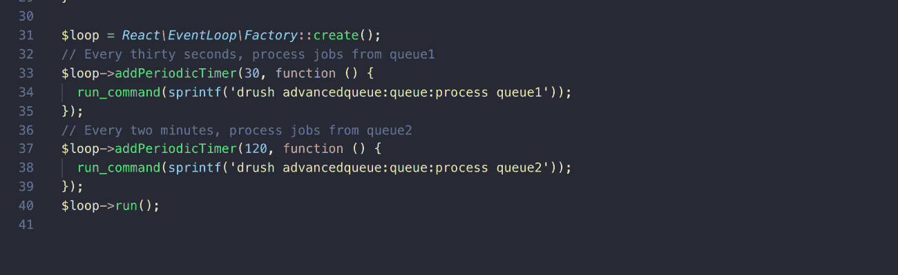

# 使用 ReactPHP 运行 Drupal 任务

> 原文：<https://medium.com/swlh/using-reactphp-to-run-drupal-tasks-asynchronously-26d5800cdf3e>

ReactPHP 是一个事件驱动的非阻塞 PHP 框架，允许你通过一个事件循环在一个长时间运行的脚本中工作。ReactPHP 的核心是提供一个事件循环和实用程序，以特定的时间间隔触发事件并运行您的代码。这不同于普通的 PHP 脚本执行，后者的生命周期很短，并且是针对单个请求的。