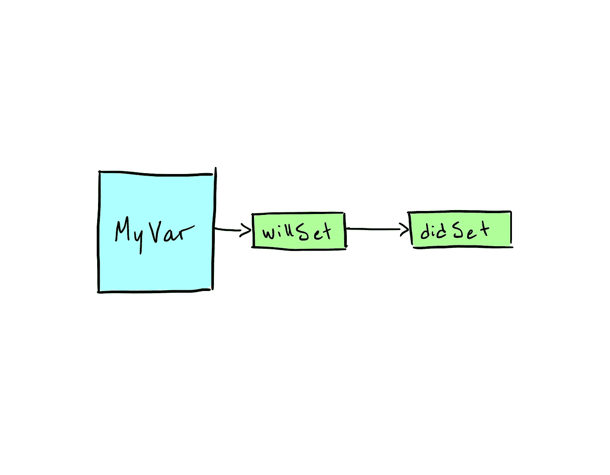

# 使用 Swift 属性观察器清理对象

> 原文：<https://medium.com/swlh/using-swift-property-observers-to-clean-up-objects-c0a78fda0317>

在上一篇文章中，我们浏览了如何使用委托模式将我们的视图与我们的控制器分开。今天，我们将进入属性观察者的世界，看看我们如何使用它们来使我们的对象更容易处理。

# 什么是物业观察员？

> 财产观察者观察并回应…