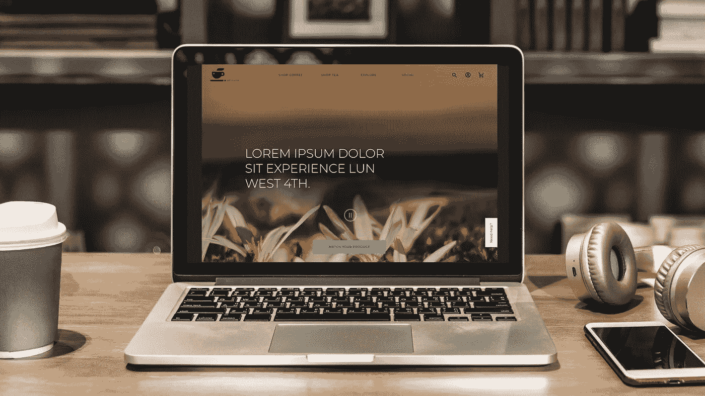

# UX 案例研究:咖啡和茶

> 原文：<https://medium.com/swlh/ux-case-study-coffee-and-tea-west4th-9de9920640f9>

## 温哥华西四街

在三周的时间内，我们开始了我们的第二个项目，作为 UX 在 RED 的设计师。目标是设计一个电子商务商店，将多个零售商店聚合成一个独特的在线体验，提供来自商店的信息，增加客户参与、社会参与和销售。我的关注点:西四的咖啡和茶商店。