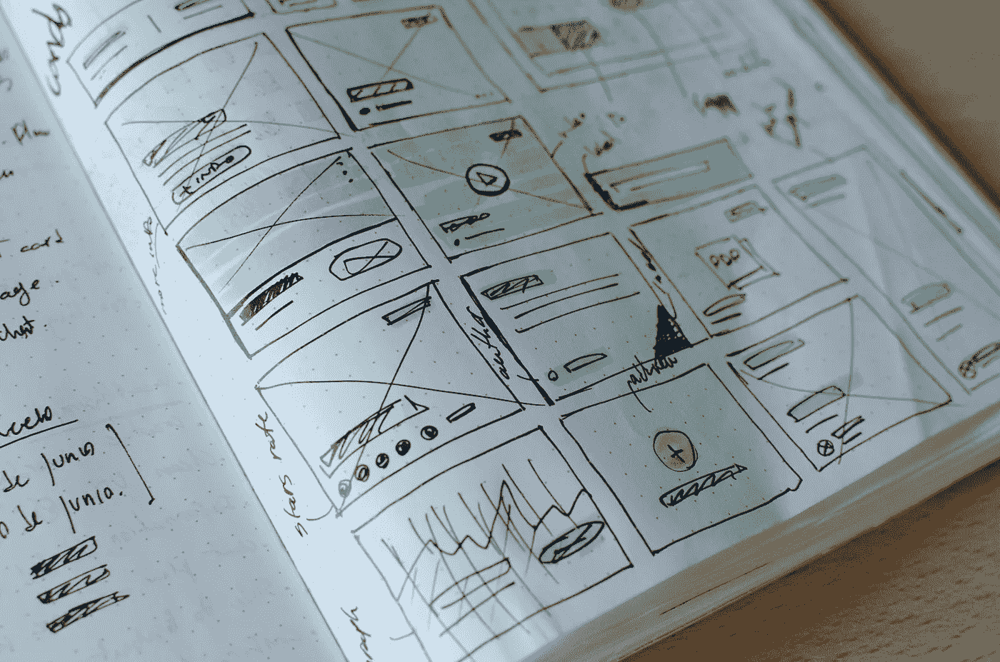

# 产品经理的 UX

> 原文：<https://medium.com/swlh/ux-for-product-managers-12a33cf78475>

Photo by [José Alejandro Cuffia](https://unsplash.com/@alecuffia?utm_source=unsplash&utm_medium=referral&utm_content=creditCopyText) on [Unsplash](https://unsplash.com/search/photos/prototype?utm_source=unsplash&utm_medium=referral&utm_content=creditCopyText)

产品经理的工作是与跨职能团队合作，通过解决明确的用户问题来创造出色的体验。要成功做到这一点，他们需要精通技术、业务和用户体验，这在下面的维恩图中有所描述。