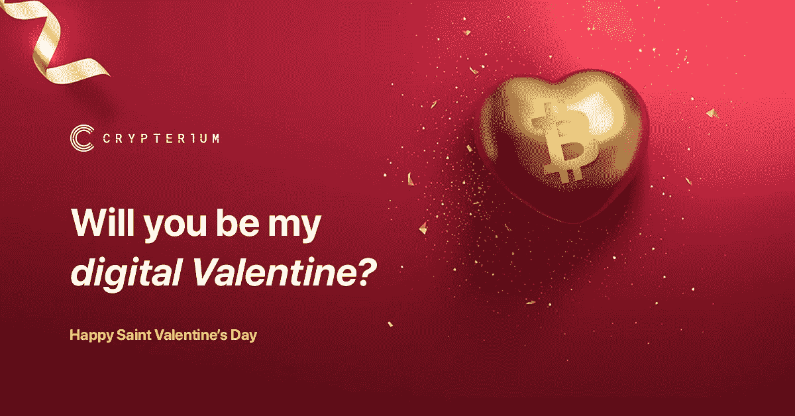

# 加密货币情人节

> 原文：<https://medium.com/swlh/valentines-day-with-cryptocurrencies-b90c97888c78>

你愿意做我的电子情人吗？是的，你没听错。你可以用密码来计划你的完美约会。

许多爱好者不知道如何在日常生活中使用 crypto。好吧，也许是时候花在别人身上了？喜欢你的后半段！这里有一些在 2 月 14 日给你爱的人惊喜的完美方法。

## 浪漫的假期

计划一次浪漫的旅行？Expedia 和 Cheapair.com 接受数字资产作为支付手段。所以，也许是时候预订最后一分钟的假期，在温暖的沙滩上度过这一天了？或者最好去世界上最浪漫的城市，比如威尼斯、巴黎或布拉格？选择面广，只属于你。

## 钻石是女孩最好的朋友

珠宝总是一个好主意。接受数字资产的店铺之一是[里德的珠宝](https://reedsjewelers.com/?gclid=CjwKCAiA-9rTBRBNEiwAt0Znw83gcTl1XJZo9fVGu-LNWROWiFe8gQUKCQ_enU4fSl07Lfr2-1wVBBoCoxIQAvD_BwE)。他们甚至专门为情人节设计了一个特别的系列，并且主要在网上经营。如果你准备在今年春天大展拳脚，钻石永远是首选。你的下半部分会喜欢的！

**经历和回忆**

一起去跳伞，带着降落伞跳，参观射击场，或者只是做一些你们都喜欢和享受的有趣的事情！还有什么比这更好的呢？通过选择[将数字资产直接发送到银行账户](https://crypterium.com/products/bank-transfers)，Crypteriums 拓宽了你的视野，让你以多种不同的方式使用你的密码！

## 随波逐流:鲜花、巧克力、游戏。

谁说传统礼物不好？所有女孩都喜欢收到鲜花或巧克力，而男孩喜欢在游戏机上玩游戏。如果你害怕带一个原始的礼物，或者你认为他/她可能不喜欢你的惊喜，去买一些漂亮舒适的礼物篮吧！Crypterium 使得向欧洲的任何银行账户发送数字货币成为可能。

## 最现代的礼物:密码！

将数字资产发送给您所爱的人！你的另一半会喜欢的。这与给钱不一样，而且这意味着他/她可以选择花什么加密货币。 [Crypterium 使之成为可能](https://crypterium.com/products/wallet)。现在是 2019 年，伙计们，是时候让一切都变得现代和最新了，甚至是情人节礼物！

附言:礼物固然很好，但你给予对方的关注才是最重要的。一定要在百忙之中抽出时间，享受这美好的一天！

P.S .如果你是单身，你可以把所有的密码都花在自己身上。去享受双倍的乐趣吧，:D

*我们 Crypterium 祝大家情人节快乐。就像加密货币一样，我们对社区的爱没有边界，没有限制。*

## 关于地下室

据毕马威和 H2Ventures 称，   C Crypterium 是最有前途的金融科技公司之一。我们正在打造一款移动应用，以满足数字资产时代的银行需求。

我们的目标很明确:有了 Crypterium，无论你用传统货币做什么，你都可以用数字资产来做。这个想法得到了 TechCrunch 联合创始人 Keith Teare 和超过 40 万注册用户的支持，这个数字每天都在增长。

该团队由 Visa 中欧和东欧前总经理 Steven Parker 以及来自全球金融机构(如复兴保险、伦敦衍生品交易所、美国运通等)的高管领导。

加入我们的 [**电报新闻频道**](https://t.me/crypterium_en) 或其他社交媒体，保持更新！

[**网站**](http://crypterium.com)**๏**[**电报**](https://t.me/crypterium)**๏**[**脸书**](https://www.facebook.com/pg/crypterium.org)**๏**[**推特**](https://twitter.com/crypterium)**๏**[**bitcointalk**](https://bitcointalk.org/index.php?topic=2214098.0)****************

************

## ******这个故事发表在 [The Startup](https://medium.com/swlh) 上，这是 Medium 最大的创业刊物，拥有+423，678 人关注。******

## ******订阅接收[我们的头条新闻在这里](https://growthsupply.com/the-startup-newsletter/)。******

************