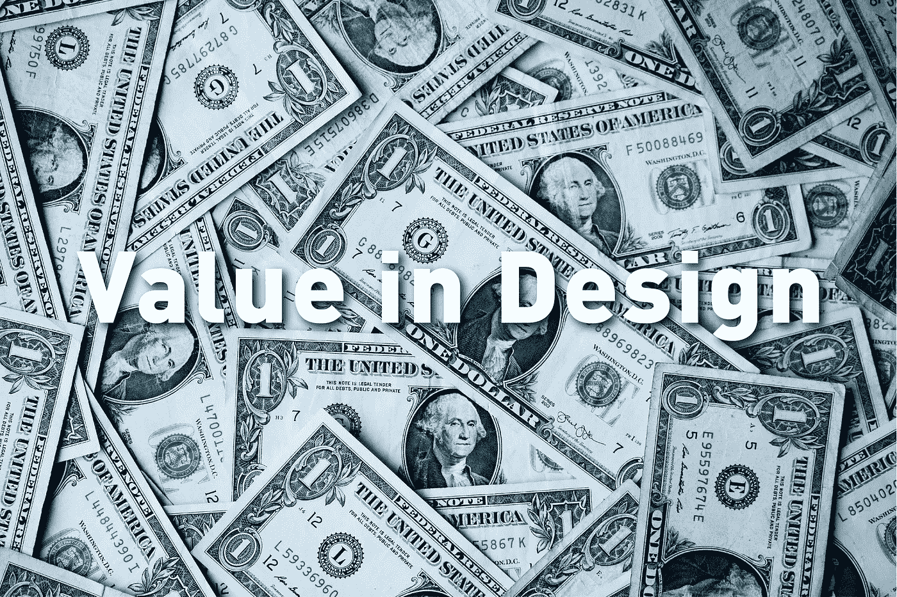
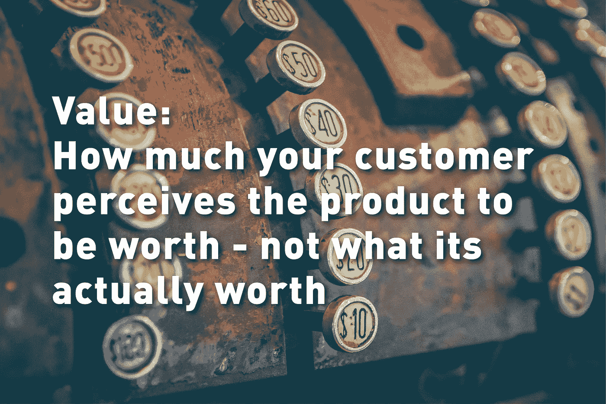
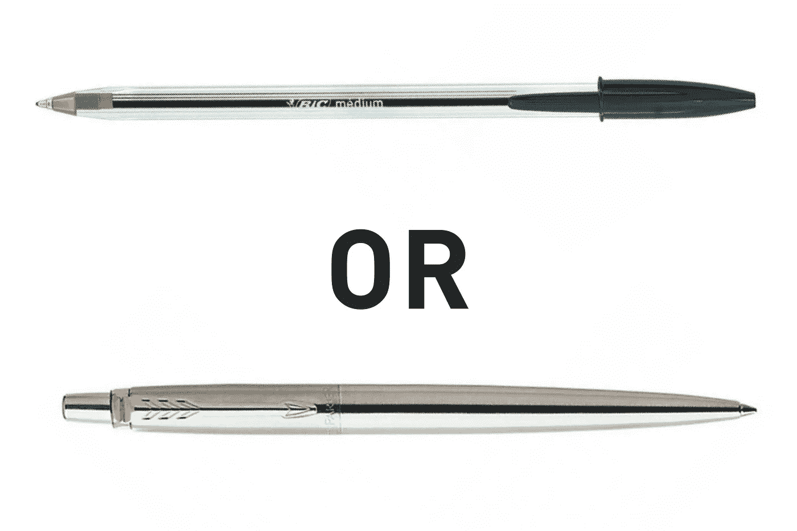
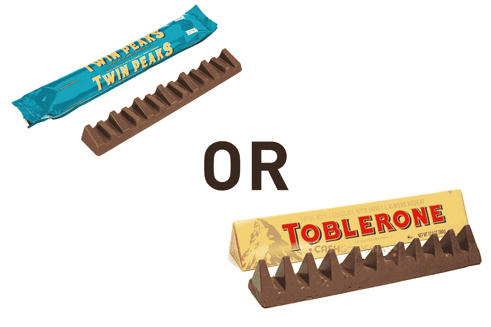
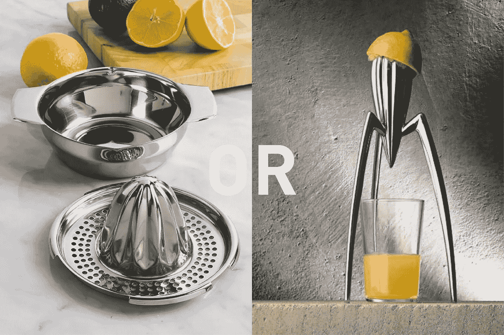
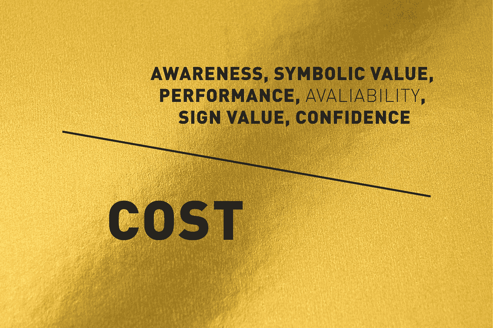
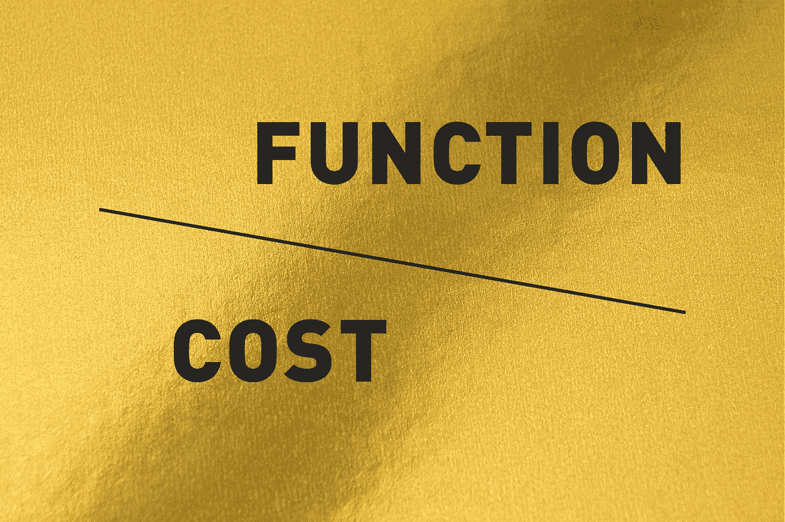
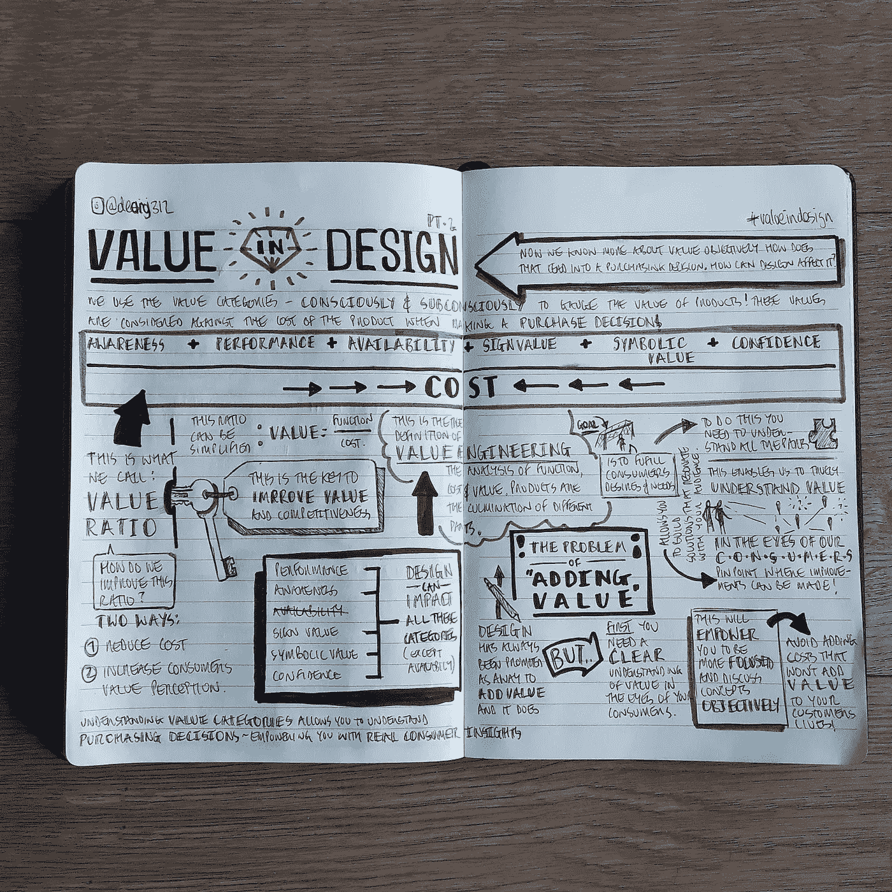

# 设计的价值:第一部分

> 原文：<https://medium.com/swlh/value-in-design-part-e8f416ab6ce>

## 我们需要谈论价值…

*Image courtesy of @sharonmccutcheon via Unsplash.*

作为创意专业人士，我们在设计过程中经常谈论价值，有时甚至不知道它。

对于什么是价值，如何获得价值，每个人都有不同的视角。

我们都知道视角是主观的，而主观可能是一个好的、快乐的设计过程的敌人。

更重要的是，价值观是消费者的情感钩子，正如道格拉斯·戴维斯(Douglas Davis)在他的书《创意策略与设计的商业 》中所说，

> “价值观的核心是情感——而情感会激发行为。价值观有价值。价值观远不止有用，它还有情感意义。它们因人而异，所以价值观是个人的。价值观回答了这个问题:我为什么要在乎？”

价值观是创造你的产品的独特卖点，吸引消费者购买的关键。

# **那么，我们如何从价值的讨论中去除主观性呢？**

首先，我们定义什么值*是*。

这是这篇博客文章的重点，这将是两部分系列的第一部分。

第一部分的重点是建立价值信息的基础，将主观信息分解为客观的、易于理解的部分，为您提供定义、价值类别以及如何通过建立价值比率与消费者的购买决策相关联，以及设计时“增加价值”一词的重大问题。

这个博客的主要目标是让你能够更客观地谈论价值。

先说价值的真正定义。

许多人认为价值就是便宜，让你的钱得到最大的回报，然而这是一个关于设计价值的常见误解。

> **价值的真正定义是你的客户认为你的产品值多少钱，而不是它的实际价值。**

*Image courtesy of @alvaroreyes via Unsplash.*

作为消费者，我们在购买产品时总是会做出“基于价值”的决定。

为什么我们选择一种产品而不是另一种？

两大智能手机巨头三星和苹果就是一个很好的例子。

当你客观的分解产品，基于纸面上的事实和数字，十有八九是三星赢！

几十年来，他们一直是技术领域的市场领导者——最近，苹果甚至从三星购买了他们 iPhone X 的有机发光二极管屏幕。

那么为什么还有人选择苹果呢？

价值可以分为六类:意识、性能、可用性、符号价值、象征价值和信心。

在消费者心中，这种推理可以是有意识的，也可以是潜意识的。

理解这六个类别是理解为什么消费者选择一种产品而不是另一种产品的关键。

因此，让我们将它们分解开来，以便更好地理解它们是如何工作的:

# **意识**

消费者只能评价他们意识到的产品，这就是我们有营销的原因。

我们可以找到比以前更多的产品信息，而且这些信息对很多人来说都是随时可用的，因为我们随时都有智能手机。

通常情况下，低成本商品或短期购买是从已知的产品选择中选择的，如巧克力棒，而高成本商品或长期购买通常是事先彻底研究以确认选择。

想想你最近一次买笔记本电脑或电脑——你花了多长时间得出这个结论，你做了多少研究？

在现代市场中，广告仍然是提高知名度的最佳方式，但这种情况正在发生变化，因为我们变得越来越相互联系，越来越注重个人主义——旧的“口口相传”模式变得越来越突出。

这种广告的一个很好的例子是网飞，它变得越来越依赖于群体间的“口碑”推荐。

想一想——你还记得看到过正式的广告吗? *Bird Box* 、*与玛丽·近藤*一起整理房间，或者*与黑仔:泰德·邦迪磁带系列的对话？*

我不知道。

但是有多少你的朋友向你推荐了这些节目，它们出现在你的脸书和搞笑视频中的频率有多高？

诚然，网飞最初在他们自己的社交媒体渠道上引发了相当多的热议，但一旦最初的几个人开始观看，这些模因就像野火一样蔓延开来。

病毒式传播仅仅是口头传播的一种技术手段，也是在审视你的产品对消费者的价值时需要考虑的一点。

# **性能**

这个范畴是最客观的范畴之一。

消费者可以根据可靠性、耐用性、强度、有效性、重量、速度、噪音、效率和舒适度等信息来衡量产品的性能(此列表当然不是详尽无遗的，产品/服务特性会因行业和产品而异)。

对消费者来说，利用性能价值的一个很好的例子是家用电子产品，如冰箱和洗衣机。

他们试图通过提供他们知道的消费者想要的信息来影响消费者的购买决定，如能量等级或一次完整洗涤需要多长时间。

# **可用性**

有时，消费者会推迟购买，以等待某些产品或功能。

一个很好的例子就是买一辆新车。

您可能会决定等待经销商按照您的具体要求交付汽车，这些要求可能是油漆颜色、内饰、车轮装饰、发动机尺寸或电子配件。

然而，小吃和饮料等不太重要和成本较低的产品是基于即时可用性和短期收益，如解渴或推迟饥饿。

有时，你可以做出的选择可能是有限的，例如如果你在飞机上，你的选择仅限于手推车上提供的东西。

这类产品的受众被称为垄断市场。

选择非常有限，而且这些产品通常会涨价。

# **信心**

我们都更喜欢自己有信心的产品，而建立信心的关键是品牌。

信心可以通过各种品牌价值来传达:质量、传统，甚至声誉。

通过品牌树立信心对于消费者做出购买决定至关重要。

# **标志值**

每件产品的设计都使用了一系列既定的标志和符号。

这些有时是微妙的线索，用来赋予物体意义和价值。

这可能是主观的，也可能因文化和流行趋势而异。

这些赋予了我们的设计地位和意义。

现代文化是由我们如何解释这些标志和符号来驱动的，亚文化是由我们与品牌和产品的关系来定义的。

不同的文化设定了自己的价值界限，理解这些界限可能是生产畅销产品的关键。

这方面的一个很好的例子是香水和古龙水公司是如何运作的，它们依赖于名人合作、精心包装和电视上飘渺的“移动滑板”广告。

这些广告可能看起来像废话，但它们确实有效——香水行业价值约 920 亿美元！

# **符号值**

这是一个非常简单的问题:象征价值是由公认的权威机构赋予一件物品的价值。

一个很好的例子是艺术——看看像班克斯这样的艺术家的受欢迎程度和价值的上升。

另一个例子可能是消费者希望拥有名人使用的相同产品。

这可以是任何东西，从化妆品、服装甚至电子产品。

现在，我们对构成价值的类别有了更多的了解，请思考下面的同类产品。

你认为哪个更有价值，他们如何利用这些不同类别的产品？

Which Ballpoint Pen has more value? and why?

Which Chocolate has more value? and why?

Which Lemon Juicer has more value? and why?

我们每天都在不假思索地做出这些决定。

我们衡量所有的价值，然后决定产品是否值其指定的价格。

这给了你一个我们称之为**的价值比率**，一种客观看待主观的方式。

它可以用来开发更有竞争力的产品，提高在消费者心目中的价值。

提高这个比例有两个途径:第一是降低产品的成本，第二是增加消费者对产品的价值感知。

从设计师的角度来看，设计可以影响六个价值类别中的五个(可用性除外)。

对功能、成本和价值的分析和开发称为**价值工程**。

研究设计的每一部分，以查看该组件如何根据这些组件的成本为整体消费者需求和愿望提供价值。

这些研究使我们能够真正了解产品对消费者的当前和潜在价值，最重要的是，我们可以指出设计可以改进的地方。

**Expanded Value Ratio**

**Simplified Value Ratio**

对许多人来说，设计被视为“增加价值”的一种方式，事实也确实如此，但为了有效和高效地做到这一点，你需要了解你的消费者对价值的看法。

如果没有，你会发现你的设计缺乏焦点，你会陷入主观开发循环的深渊，做出可能不会给你的设计增加价值的决定。

为了理解消费者对价值的看法，你需要尽可能多的了解谁是你的顾客——这是设计和营销开始融合的地方。

希望现在你能开始看到贯穿这篇文章的一条线索——详细了解与你自己的设计相关的价值类别，如何让你理解购买决策，这与消费者如何看待你的设计中的价值的真实见解有关。

因此，您现在应该能够提高在设计中讨论和操纵价值的能力，专注于与消费者产生共鸣的价值。

和往常一样，如果不展示我的研究成果，这就不算是我的博客，所以下面就是:

如果你有任何问题，请在评论中写下来，我会尽可能多的回答。

我还想对我所有的灵感来源说一声非常感谢:**未来团队**、**packagingsense.com**，这是**拉斯·G·瓦伦汀**写的一个很棒的包装博客。另外，在过去的几年里，我读了无数的书，尤其是道格拉斯·戴维斯的《创意策略和设计商业》。

别忘了我以前在大学的商业设计讲座。

在本系列的第二部分中，我将探讨一些可能的策略，您可以使用这些策略来操纵价值，使其有利于您的客户——请看:

 [## 设计的价值:第二部分

### 这是我深入挖掘价值的第二部分。我建议你在此之前阅读《设计的价值》的第一部分，这样你就可以…

medium.com](/@deanocallaghan/value-in-design-part-2-f90707c26337) 

**想要更多这样的？**
然后去 Instagram 关注我 [**@deanoj312**](https://www.instagram.com/deanoj312/?hl=en&source=post_page---------------------------) 。
或前往[**nightskycreative.org**](https://www.nightskycreative.org/?source=post_page---------------------------)**查看 nudenotes 世界上的每周更新！**