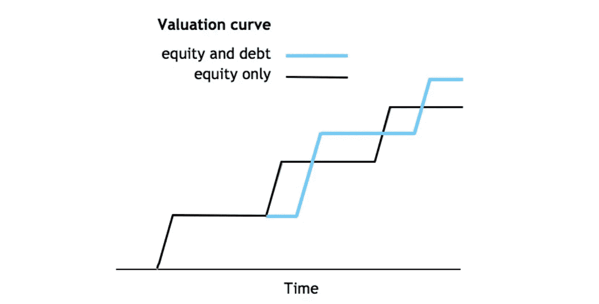
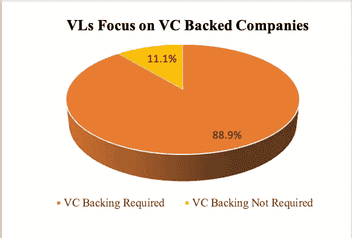
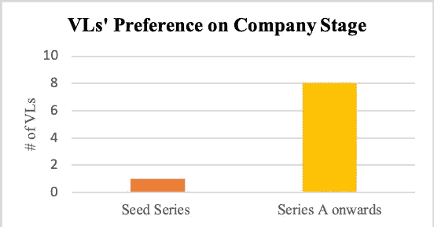
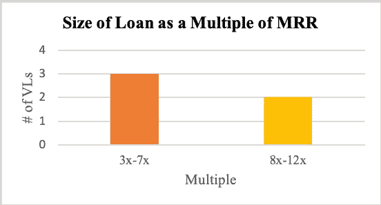
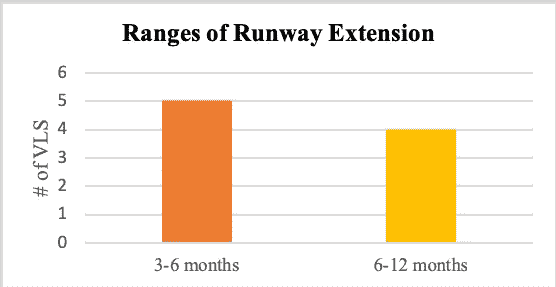
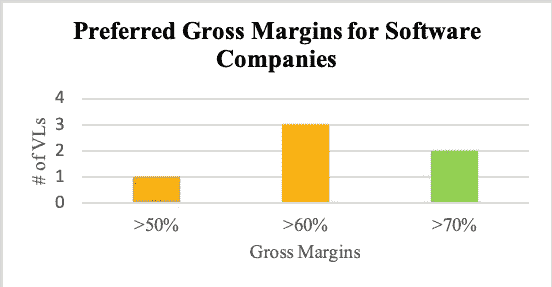

# 风险债务，专家的见解

> 原文：<https://medium.com/swlh/venture-debt-insights-from-experts-1922e8f6ae0f>

Source: [Kauffman Fellows](https://www.kauffmanfellows.org/journal_posts/venture-debt-a-capital-idea-for-startups)

我最近偶然发现了“风险债务”(也称为风险贷款)这个术语。我是做风险投资的，知道债是什么，但是没听说过风险债。当我在我的网络中询问从事早期和晚期风险投资的企业家时，似乎没有人熟悉这个概念。同样，风投对这个领域也没有太多的洞察力。我做了一些研究，了解到风险债务是一种为初创公司量身定制的贷款。风险债务通常被用来推动增长、扩大跑道、提高流动性或为公司盈利提供资金。它也可以作为一种保险政策，保护公司免受潜在的延误或紧急情况的影响。初创公司可能会选择风险债务，而不是额外的风险投资，以尽量减少进一步稀释。

听起来不错。那么，筹集风险债务有什么要求呢？在筹集风险资本方面，有大量的数字墨水溢出。每个加速器都会有至少一个关于筹集风险投资资金的研讨会，即使你从未通过加速器，网上也有大量的建议。然而，我很快了解到，关于风险债务要求的信息很少。因此，我决定向这一领域的专家寻求帮助，了解风险贷款人在评估一家初创企业的潜在风险贷款时会考虑哪些因素。

# **从与银行风险贷款人、非银行风险贷款人和风险债务顾问的交谈中获得的见解**

为了更好地了解风险贷款行业，我采访了位于美国和加拿大的 5 家非银行 VLs(基金)和 4 家银行 VLs。我还采访了一位风险债务顾问，他帮助初创公司根据其业绩和要求选择最相关的 VL。该顾问提供了该行业的概况，与下图中的数据相对应。

1.  **大多数 VLs 更喜欢至少融资过 A 轮的初创公司**

在接受采访的 9 家虚拟企业中，只有 1 家非银行 VL 公司表示，他们之前向非风险投资支持的初创企业发行过债务。剩下的 8 家 VLs 表示，除非初创公司至少经历了一轮 VC 融资，否则他们不会发行风险债务。

同样是这 8 家需要风投支持的 VLs 表示，A 轮融资足以让一家公司获得风险债务。不需要风投支持的 VL 表示，他的公司发行债务的最早时间点是在种子系列之后，最晚时间点是在 A 轮之后。其余的 VLs 表示，他们主要在 A 轮-c 轮期间或之间发行债务。大多数 VLs 表示，他们更喜欢在风投轮次的同时或之后不久发行债务，在这种情况下，他们非常依赖风投进行的尽职调查。

**2。许多 VLs 并不关注贷款与企业价值比率** 受访的 VLs 中没有一家有严格的贷款与企业价值比率。比率从 10%-40%不等，但是大多数 VLs 指定他们更关注贷款作为 MRR 的倍数(或 ARR 的%)。

**3。贷款与 MRR 比率是 VLs 考虑的第一个指标** 受访的 4 家银行 VLs 中有 3 家选择不披露其贷款与 MRR 比率，VL 的一家银行确定平均贷款在 2-4 倍 MRR 之间。3 家非银行虚拟公司确定其平均贷款额在 MRR 的 3-7 倍之间，2 家在 MRR 的 8-12 倍之间。例如，一家拥有 10 万美元 MRR 的公司可能获得 30 万至 120 万美元的贷款

在陈述了这些范围之后，大多数 VLs 都明确说明了贷款的规模很大程度上取决于公司的需求和贷款的目的。2 非银行 VLs 指出，虽然大多数贷款都在图表所示的范围内，但如果一家公司需要一笔收购贷款，贷款规模可能会远远大于 12 倍 MRR。

**4。VLs 希望了解初创企业获得贷款的目的** 为了决定贷款的规模，VLs 希望了解贷款的目的。贷款能帮助创业公司实现盈利吗？这有助于进入下一轮吗？会用来给供应商还钱吗？还是租赁设备？在每一种情况下，这是一个需要多长时间和多少钱来实现下一个里程碑的问题。

由于贷款是 MRR 范围的倍数，VLs 没有确定跑道延伸的严格范围，相反，他们再次强调，这更多地取决于公司的要求。5 VLs 表示，他们提供的大多数贷款通常会将 runway 延长 3-6 个月。4 家虚拟运营商表示，他们大多将跑道延长 6-12 个月，其中 2 家提到他们有跑道延长超过 12 个月的案例。

**5。与风险投资不同，大多数风险投资不关注市场** 9 个风险投资中有 8 个不关注市场规模或竞争格局，相反，他们关注单位经济，强调毛利率、月增长率和年增长率，以评估收回贷款和利息的可能性。

**6。毛利润，一个非常重要的指标** 所有 9 家 VL 都认为毛利润是他们在考虑贷款时考虑的主要指标之一。6%的 VLs 表示，他们主要关注软件公司，因此图表中显示的百分比是针对软件初创公司的。VLs 还发现，根据公司所处的阶段，他们可能会对利润率宽容一些。与种子期和首轮融资阶段相比，风险资本家通常希望公司在后期阶段有更高的增长利润。

当被问及向有硬件组成部分的软件公司提供贷款时，VLs 表示，他们通常会看到利润率下降 20-30%。类似的情况也适用于消费品初创公司，然而利润率在很大程度上取决于产品类型和商业模式。

**7。VLs 希望看到同比增长%&** VLs 强调增长。他们希望看到公司在其整个生命周期中持续增长，并将继续增长。如果公司没有增长，VLs 希望了解原因，以及如何改变这种情况。VLs 不愿意提供增长最小值或范围，因为这些指标取决于许多因素，包括但不限于公司所处的阶段、产品、行业、盈利能力(或缺乏盈利能力)和商业模式。VLs 意识到在早期阶段比在后期阶段更容易获得更高的 MoM%增长率。VLs 也明白，不管公司处于哪个阶段，对未来增长和增长利润的预测都是不精确的，并且在现实中会有所不同。VLs 只是希望看到未来增长的潜力，因为他们通常不希望贷款给一家停滞不前的公司。

**8。共同结构&风险贷款期限** VLs 确定了两种共同结构。一种是前 3-12 个月的纯利息(IO ),随后是本金加利息。第二，整个贷款期间的 IO，通常是 2-4 年，然后是大额支付。

**9。银行 VLs 通常会提供较低的利率** 银行 VLs 通常要求公司在发行债券的银行持有资本。由于这一点，大多数银行可以并确实提供较低的利率(IRs ),因为银行从贷款中获得其他利益，而不仅仅是累计利息。银行 VLs 通常在当前最优惠利率的基础上给予 1-3%的 IRs。2 家银行 VLs 规定，如果一家公司具有出色的单位经济效益(通常在多家 VLs 竞争同一家公司的情况下)，VL 甚至可以以优惠利率提供贷款。

只有一个非银行 VL 参考了最优惠利率，指出他的贷款利率比最优惠利率高 5-7%。其他非银行 VLs 规定的 IR 范围在 7–16%之间。

**10。VLs 不想处理清算问题虽然没有哪个 VL 会为了让一家公司违约和收回一家公司的资产而发放贷款，但每个 VL 都需要明白，万一情况变糟，它至少可以收回一部分资金。大多数 VLs 会将速动比率视为公司短期流动性的指标，以及贷款与流动资产的比率。**

**其他有趣的发现**

11.VLs 不看创始人的信用评分。

12.除非一家公司盈利(在大多数情况下，这些公司并不盈利),否则 VLs 不会考虑 EBITDA 或任何与之相关的比率，而这是典型的非风险贷款机构会考虑的。

13.VLs 表示倾向于成为高级贷款人。大多数 VLs 也更愿意成为该公司债务的第一发行人。

14.VLs 希望了解公司客户的构成，以及多少客户产生了多大比例的经常性收入。

15.VLs 更喜欢向有粘性产品的公司发债。

值得注意的是，每个接受采访的 VL 都强调没有一个数字是一成不变的。仅仅因为 VL 没有向某个行业贷款的历史，或者以前没有提供过本报告范围之外的贷款，并不意味着他们不会考虑这样做。每家公司都是独一无二的，VLs 明白，在风险贷款方面，没有放之四海而皆准的规则。这篇文章旨在揭示整个行业，而不是阻止一家公司寻求风险贷款，只是因为他们没有勾选每一个方框。

让我知道你的想法，特别是如果你是一个风险贷款人或者一个已经获得风险贷款的企业家。