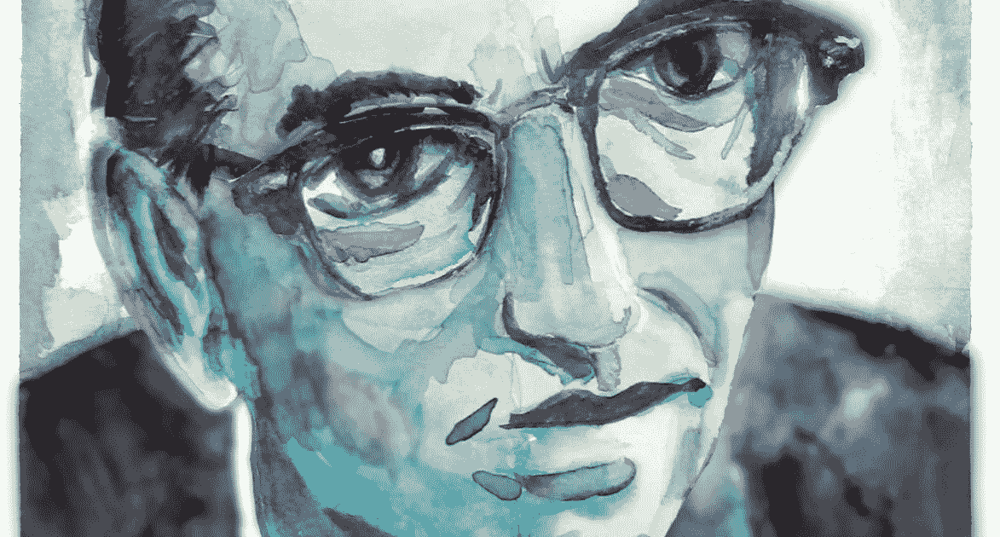

# 维克多·弗兰克尔谈意义，以及为什么他的观点很重要。

> 原文：<https://medium.com/swlh/viktor-frankl-on-meaning-and-why-his-ideas-matter-9ee108677ac0>

[Viktor E. Frankl](http://1.bp.blogspot.com/_I6CSJrJ0Cx0/S5VdBoVTpLI/AAAAAAAAMZ4/VEtvHM82PYk/w1200-h630-p-k-no-nu/Frankl2.jpg)

> “挑战生命的意义，是做人状态最真实的表达。”维克多·弗兰克

自从 1946 年《人类对意义的探索》一书出版以来，心理学家们就开始关注哲学家们思考了几个世纪的问题；意义。