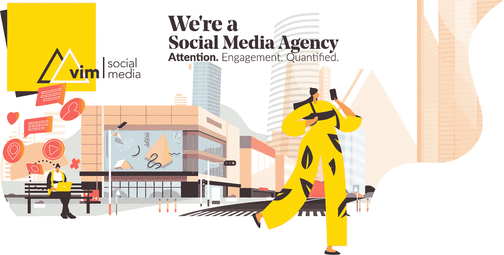

# 2019 年的数字媒体战略

> 原文：<https://medium.com/swlh/vision-for-digital-media-marketing-in-2019-2e7940dcc685>

Visit VIM Social Media at [https://vimsocialmedia.com](https://vimsocialmedia.com)

我最近推出了一个新的社交媒体机构 VIM Social Media，为我的设计工作室和技术实验室 VIM Labs 建立数字营销基础。接下来是我对 2019 年我们作为数字广告商所扮演的角色的愿景，以及我们必须向观众做出的承诺。

当我还是个孩子的时候，我对任何科学/技术相关的东西都着迷。我自学线性代数，8 岁开始编程。11 岁时，我开始为 AOL 测试和调试软件，那时 AOL 还是第一批互联网提供商之一。

在大学里，我很难决定是主修机械工程还是计算机科学——我喜欢这两个学科，但在那时，我的热情引导我走向了音乐创作。从 2000 年到 2008 年，我靠广播和电视制作谋生。在广播媒体时代的巅峰，贝尔音乐制作公司成为全国最成功的广告制作团队之一。这是我扎根的地方，也是我学会生产和销售的地方。

2008 年的经济危机让我们公司雪上加霜。像许多其他人一样，我们感到很难过。我转向网页设计。从 2010 年到 2018 年，我为需要网络作品集的当地艺术家和音乐家开辟了一个创意工作室。我开始专注于开发新的方法来帮助品牌建立他们的数字身份。

一路走来，我在美学设计、功能代码和构建视觉叙事方面发展了强大的技能。我学会了如何倾听，如何放大信息。我创办这家公司是我毕生致力于研究技术、艺术和人文之间的交集的一部分。寻求更好的方式为他人提供机会，并分享在此过程中所学到的知识，这导致了社交媒体公司的诞生。我对 VIM 的最终愿景是扩展到微平台创建领域。

> *“我知道我们可以为我们的社区提供巨大的价值，但在我们这样做之前，我们首先必须抓住他们的注意力，并赢得他们的言论自由。”*

# 你准备好用有效的社交媒体营销策略来转变你的业务了吗？我们开始吧！

我们正处于媒体消费的巨大转型期，自上而下的大规模生产的预定节目的残余被大众生产的自下而上的点播内容所取代。如果你未能校准你的心理模型，了解 2019 年有效的广告宣传策略是什么样的，并且你继续用商业中断和侵入性的横幅广告轰炸你的观众，而不是以媒体制作人的心态来处理这种情况，你将会失败。如果你的广告看起来更像商业广告而不是表演，你将会浪费你的钱。

这是一个沉睡的巨人将倒下的时代，因为明天的新创业帝国是建立在以积极的步伐生产的坚如磐石的内容的基础上的。我们必须衡量自己的步伐，并在地面移动时迅速做出反应。

电视广告的时代已经过去了。新游戏是由活跃的、分析驱动的内容+参与来玩的。

# 广告位置很便宜。有机媒体在真正的消费者手中的再分配是无价的。

分享内容和公开参与数字媒体、品牌和公众人物已经成为一种与同龄人交流以及与朋友和家人联系的方式。当一个人点击一条内容旁边的**按钮或者使用**评论**按钮来宣传他们的想法时，他们独特的身份和兴趣就被传达出来了。这种行动的可见性有助于团结志同道合的社区。**

在一个人们积极寻找互动内容作为自我表达形式的社会环境中，至关重要的是，你的营销活动要避免推广告，而是专注于促进这些有意义的人际关系，一次一个短暂的时刻。

理想的内容交付策略使无摩擦媒体消费能够通过模块化原生内容的并行分发模式，不断创造新的发现和参与机会。换句话说，通过重视在各种平台上感觉自然的高质量长篇内容，品牌可以吸引观众注意力的任何地方的可见性，无论是设备、媒体还是意图。

# 有效的社交媒体活动管理有 5 个核心原则。

**真实性**:为了防止你的媒体混进来，突出自己。通过展示你的品牌的真实性来赢得并保持你的观众的注意力&展示你独特的精神。

**背景**:每个网络的工具集捕捉了不同的心态和一系列的个性特征。当您的媒体与受众和当前对话保持一致时，参与的机会会更多。

**意图**:在网络上，给予者总是比自私的行为者获得更多。向你的观众提供一些有实用价值的东西的明确意图会有很大的帮助。

**一致性**:这不是短跑或马拉松，而是一系列超级马拉松。这是一个保持可见的问题，因为唯一的另一个选择就是变得不可见。

**多态性**:社交媒体内容经过精心构建，呈现出多种形态，并与其他内容相互关联，这使得发现的成本降到了一个极其可承受的价格。

这个游戏是关于质量、坚持和执行速度的。虽然整体战略将保持不变，即专注于优秀内容的价值和优化的交付路线，但每个客户都是独一无二的，每个项目都是不同的。

脸书、Instagram、YouTube、Twitter、Snapchat、LinkedIn 和 Podcast & Voice 是目前大多数公众社交媒体关注的平台。然而，重要的是我们要保持敏捷，紧跟市场。

> *“在这些平台上投放广告永远不会更划算。但是，时间不多了。”*

通过使用对比测试和广告活动分析，我们能够量化针对每个目标人群部署的每个版本的创意营销的触及率和参与率。这些指标就像一个指南针，指引你的广告活动轨迹，并在整个迭代周期中为未来的营销材料和进一步的业务发展提供详细的受众洞察。这种反馈非常有价值，因为它放大了我们的品牌和他们的观众之间的共鸣。与受众匹配的微内容有助于提高参与度，而量化的绩效报告可以优化经常性广告活动。

虽然我们致力于扩大受众群，让他们发现我们信息的真正价值，但我们必须不断做出反应，适应有效的方式。

**每次在线行动后收到的反馈会指引你的下一步行动。它会告诉你什么时候你正朝着正确的方向前进，当你偏离目标时，它会指引你正确的航向。**

> *“为了达到最佳表现，我们必须紧跟文化的脉搏，不断训练我们的眼睛，发现创造性解决方案的新机会。”*

# 获得关注，引导和展示互动，然后通过网络分析+对比测试来实现闭环，从而优化性能。

当你把时间花在帮助社区和社区中的人时，你永远不会浪费时间。你会发现这种策略比任何推销都能打开更多的大门。这是人类历史上第一次，我们有能力跨越巨大的物理边界，与大量个人建立并保持丰富的联系。致力于分享有价值的东西总是会战胜以自我为中心的行为。你必须尽快学会像出版商而不是律师一样思考和行动。

保持您的创意信息在主要数字媒体平台上流动，并继续寻找与您的受众开始新对话的机会，这对于品牌知名度和影响力扩展至关重要。

# 了解你自己和你的立场。

换位思考是你与顾客建立持久关系的方式。请记住，你不是在做销售，而是在做服务和娱乐。一个品牌不再由它展示给顾客的形象或它传达的信息来定义。现在，它被大众的智慧所定义。你的产品不是你创造的令人惊叹的东西，而是它们提供的令人惊叹的体验。(需要记住的是:你和你的客户是站在同一边的。)

不管你的生意卖的是什么，最重要的是它讲述了一个值得分享的故事。您的客户要求一致性和质量。**这就是我们需要交付的东西。**

**微内容** : Flash 简介产品、活动、&服务公告让你的核心受众参与进来，同时持续的信息传达你的创意。标签识别内容相关性，增加品牌发现。

本地视频(Native video):你的媒体格式在每个平台上都是本地的，这一点非常重要。目标为 YouTube 和脸书视频的 1080p(高清)& 4k 60fps (UHD)视频，同时为 Snapchat 和 IGTV 部署 9:16 垂直视频。

**图片&短片**:积极和快乐是一种心态，与外界环境无关。你的形象传达了你对产品的看法。独立的大块多汁的小块内容吸引人们对你的宏观内容的注意。

**长文写作**:在创作长文内容时，我们经常扮演教育者、记录者和数据科学家的角色。它是关于记录真实的旅程，而不是强调细节。这个媒介提供了一个平台来强化你的抱负目标，并向世界展示你的价值和独特视角。

**播客音频&语音**:原生音频是唯一可以在执行其他日常任务时被动消费的媒体形式。当你的观众醒来，开车去上班，或者在健身房，这是保持他们参与的媒体形式。

**积极互动**:通过客户支持和对共同兴趣的评论与你的观众互动，塑造他们对你的产品和文化的形象。积极的体验鼓励自然推荐和潜在客户的产生。

# 为什么下一波数字营销者会与众不同的 4 个原因

1.  他们将成为艺术家和创造者。美学设计原则为内容增加了可观的价值和实用性。从排版的选择到音乐的选择、图像、文案和视频，为了最大化影响和留下最强烈的第一印象和持久印象，努力实现凝聚力、平衡、流动和方向总是符合品牌的最佳利益。美丽就是力量，简单就是成熟。
2.  他们将成为作家和编辑。不是每个人都能看到围绕他们日常经历的几十个故事创意，或者文字将想法转化为行动、将日常生活转化为娱乐和学习材料的潜力。下一波数字媒体营销人员将。
3.  **他们将成为程序员和工程师。**下一波数字营销人员与之互动的平台对他们来说很有意义，因为他们将从根本上理解底层基础设施。他们将是新技术的早期采用者，最重要的是，他们将自己视为创造者。从最强烈的意义上来说，它们将是面向数据的。在工程中，无论理论多么美好或聪明，当结果与实验不符时，你必须用新的解决方案来应对。
4.  **他们将成为积极的终身学习者。**数字媒体的格局在不断变化，每六到十二个月就会有新的工具和趋势出现。此外，这种情况正在加速发生。利用必要的能量来应对和回应这种新思想和框架的巨大流量的唯一方法是保持活跃，保持饥渴，并承担终身学习者的角色。

# 它关乎天赋、激情和努力。

在社交媒体营销中，最糟糕的行动是不行动。如果你没有参与这一全球现象，那么你的品牌对今天的观众来说是无关紧要的&看不见的。

我们都能在一英里外发现推销，但没有人喜欢被推销。如果你真的关心客户的成功，并且我们将这一事实传达给你的观众，你将在这个世界上脱颖而出。

*原载于*[*iryanbell.com*](https://iryanbell.com/vision-for-digital-media-marketing-in-2019)*。*