# 访问者分析评论——分析网站性能的简单直观的方法

> 原文：<https://medium.com/swlh/visitor-analytics-review-easy-and-intuitive-way-to-analyze-website-performance-37f5c8abbffe>

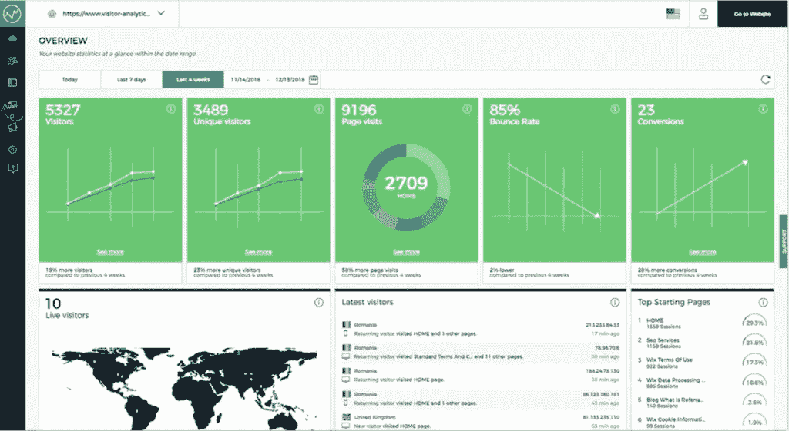

*该资料最初由@Kate Kurzawska 在 pickSaaS.com***发表，我们在这里通过网站、实时聊天&电子邮件研究软件解决方案并提供在线软件咨询。**

*-> [免费试用访客分析](http://www.visitor-analytics.io/?fp_ref=matt73)*

*根据[统计](https://www.vendasta.com/blog/58-spooky-stats-for-websites)、*一个小企业的平均收入是***360 万美元，但是* ***一个拥有网站的小企业的平均收入是 503 万美元*** *。但是还有更多。拥有一个构建良好且运行良好的网站可以扩大企业在市场上的曝光度，并有助于吸引更多的客户、合作伙伴或利益相关者。你的品牌越容易被人们看到，就越好。***

**很难找到一个没有网站的企业家或公司。在线状态增加了接触更多人的机会。有时候这是他们找到你的唯一方法。如果你不能在线访问，就好像你不存在一样。只要想一分钟；如果你在美国经营业务，但想将业务扩展到欧洲，那么向人们介绍你的服务或产品的最佳方式是什么？那就是要有一个网站，让你能够接触到客户，即使是在欧洲最偏远的地方。**

**但是拥有一个网站并不意味着从现在开始你会成功，你的生意只会增长。成功网站的秘密在于**分析**。虽然你的产品或服务(和网站)可能是一流的，但你需要更深入地了解你的网站表现。为什么、如何、何时、多久、在哪里是你应该知道答案的问题。而找到这些答案的唯一方法就是 ***进行网站分析。*****

**你讨厌统计数据，图表，不擅长数字？我有好消息！有一种方法可以通过 [**访客分析**](http://www.visitor-analytics.io/?fp_ref=matt73) 。**

# **访客分析——它是什么以及如何使用它**

**访客分析于 2016 年推出，此后一直在发展。它的创建是为了让那些对 Google Analytics 等工具没有信心，并且觉得它们太复杂的人的生活变得更容易。对于“非技术人员”来说，这是一个易于使用的最佳选择事实上，不管你是 it 专家、初学者还是非技术人员，访客分析对任何人都有帮助。**

**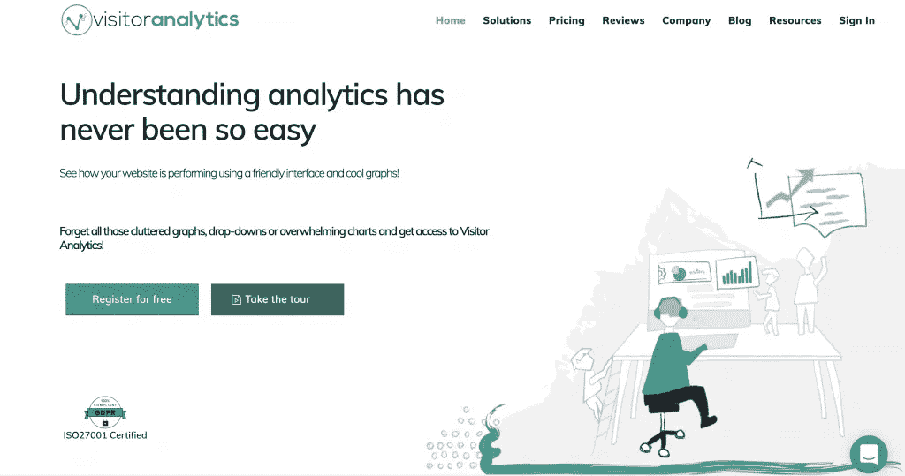**

**What is Visitor Analytics**

**无论您是从分析网站性能开始冒险，还是在处理这类数据方面经验丰富的老手，都没有关系。你在哪个行业工作，你的网站展示什么也不重要。访客分析可以帮助你分析它在各个层面的表现。**

**访客分析到底是如何工作的，它能提供什么？是什么让它在使用中如此毫不费力？让我们来了解一下！**

# **逐步启动你的网站分析**

**注册访问者分析很容易——你输入你的电子邮件、密码、姓名和你的企业/组织的名称。你确认注册，瞧！你已经准备好了。然后，你需要添加你的网站的网址。否则，你将无法获得网站性能的任何数据。**

**即使你仍然担心你会迷失在关于你的网站的所有信息中，访问者分析通过电子邮件向你发送如何阅读和理解任何分析工具的技巧，确保你不会迷失。**

**下一步，我们鼓励您在您的帐户设置中设置您的偏好，在这里您可以管理和更新您的帐户信息— *名称、密码、您想要添加进行分析的网站以及账单信息*。**

**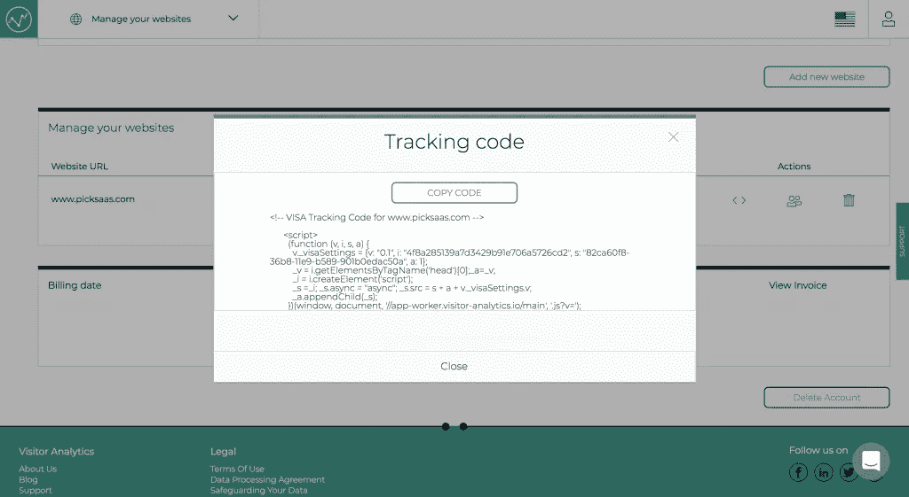**

**Visitor Analytics code installation**

**此外，访客分析有 19 种语言版本，包括英语、西班牙语、俄语、法语、德语、中文等。对于那些不仅不懂技术，而且不擅长英语的人来说，这是一个有益的补充，英语通常是大多数工具的主要语言。**

**此外，在接下来的 30 天里，你可以使用所有的访客分析功能。如果你不确定哪个计划最适合你，继续使用试用版是个好主意。您可以随时根据您的网站性能和您需要的功能来升级和更改计划。**

**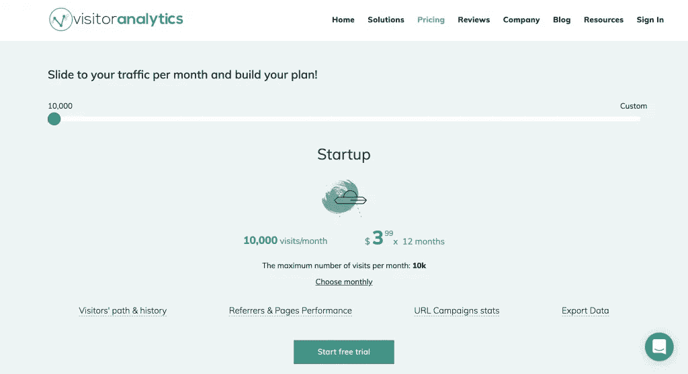**

**Visitor Analytics pricing**

**同样重要的是，你**将你的跟踪代码**添加到你的网站上，这意味着——你必须**在你的网站上安装访客分析。没有它，你将无法分析网站性能。你可以在 Wix、WordPress、Weebly、Blogger、GoDaddy、Shopify、Google Sites、Jimdo、Joomla、BigCommerce、Squarespace、Tumblr Typo3、Volusion 和 Yola 等平台上这样做。****

**但这是一个快速而简单的步骤，您可以在帮助中心找到如何操作，在那里您还可以找到其他有用的信息和指南。**

**这些是最基本的。现在你已经设置了你的帐户，你可以开始分析网站的性能。**

## **仪表板—对分析的简要洞察**

**访问者分析的主视图是一个显示所有数据的仪表板。你可以在一个地方看到所有的网站统计数据。一切都是透明的，容易获取。以下是您在概述中看到的内容:**

1.  **游客**
2.  **独特的访问者**
3.  **页面访问量**
4.  **跳出率**
5.  **转换策略**
6.  **现场游客(带地图)**
7.  **顶部起始页**
8.  **最新访问者**
9.  **按国家划分的游客(附地图)**
10.  **热门推荐人**
11.  **热门访问页面**
12.  **操作系统**
13.  **浏览器**
14.  **显示分辨率**

**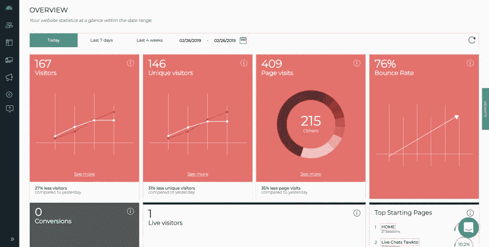**

**Visitor Analytics dashboard**

**It literary 拥有您在统计和分析网站性能时可能需要的一切。此外，每一部分都解释了它的用途和它所呈现的数据。您可以在右上角的小ⓘ符号下找到它，它可以快速方便地帮助您了解每个部分的用途。我发现它非常方便，因为它帮助我理解我在看什么。**

**您可以选择希望该工具显示统计数据的日期，范围从今天*，过去 7 天，过去 4 周*或自定义它。**

**非常酷和有用的东西是**颜色。**它们可以显示*访客、独立访客、页面访问量、跳出率和转换率的下降(**红色**)或上升(**绿色**),让分析统计数据变得更加容易。由于这些是主要的，通常也是最重要的信息，你可以快速简单地将它们形象化。这是一个主要的触发点，它可以帮助你评估你是否需要采取行动来改进你的网站，或者让它保持原样。***

**您可以通过点击位于每个部分底部的“**查看更多**”按钮，了解所有 14 个部分的更多详细信息。这将在一个新窗口中向您显示更多细节。**

## **详细的统计数据帮助你了解访客**

**如果你想发现更多关于你的网站性能的秘密，你可以去左边的面板。有 7 个部分— *概述*(我已经讨论过了)，*访问者、页面、设备、活动、设置、支持。让我们来看看其余的，看看它们能告诉你关于你的访问者和你的网站性能的什么信息。它们是您在*概述中看到的内容的延伸。****

## *访问者—了解谁以及如何访问您的网站*

*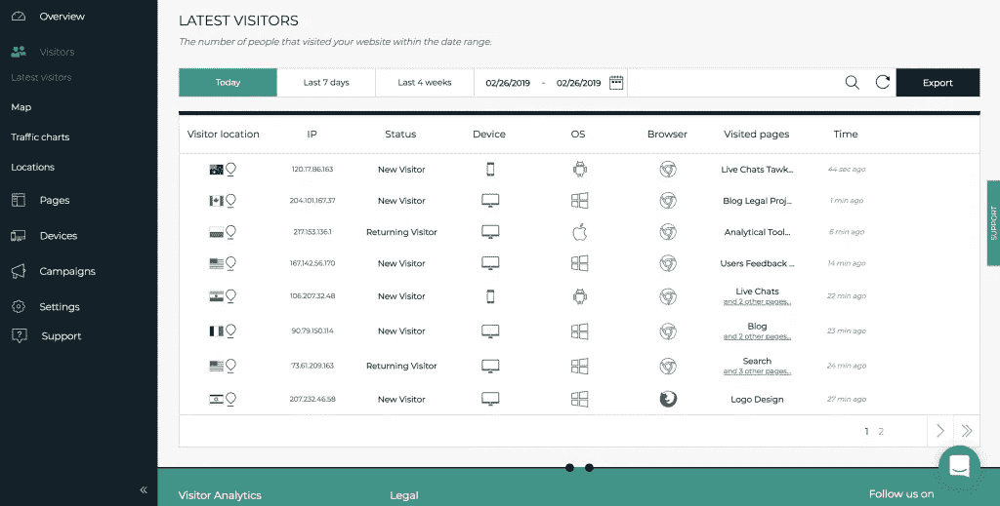*

*Visitor Analytics visitors*

*在这里，你可以看到你的访问者的一切，并找出谁在访问你的网站，什么时候，从哪里。*

***最新访问者**显示在日期范围内访问你的网站的人数。以下是数据访问者分析为您提供的内容:*

*   *访问者位置*
*   *互联网协议(Internet Protocol)*
*   *状态(如果是回头客，转换访客，新访客等，你可以。)*
*   *设备*
*   *操作系统*
*   *浏览器*
*   *已访问的页面*
*   *时间*

*访客分析为你保留所有访客的历史，所以如果你有一个回头客；你可以查看他们的历史来获得更多的信息。这包括他们的位置，他们在你的网站上访问的站点(是主页，博客还是登陆页面？)、设备等。*

*您还可以**导出给定时间范围内的访客数据或访问历史**为 CSV 或 XLSX。*

*然后是**地图**让你看到游客的大概位置。(这是一个不精确的距离，你将无法识别任何人)。*

***访客区的流量图表**可以让你查看每个月、每个工作日甚至每个小时的所有访客和页面负载**。**有了这个功能，你就能知道人们什么时候访问你的网站，他们最常花时间在网站上的时间是什么时候。这些数据以*简单明了的图表*的形式呈现。*

***位置**是另一个部分，您可以看到描述访问者位置数据的透明图表——国家和城市。*

## *页面—发现每个网站的受欢迎程度*

*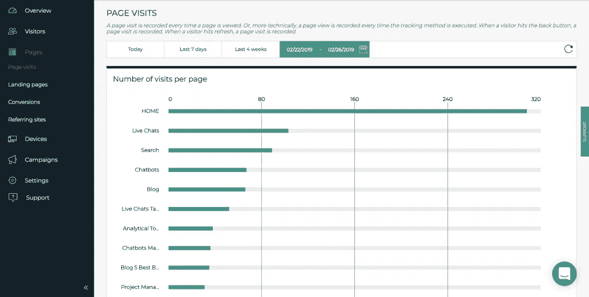*

*Visitor Analytics pages*

*访问者分析记录页面上的每次访问。这就是你在这部分看到的。它有 4 个分支:*

*   ***页面访问量** —显示你的页面被访问了多少次*
*   ***登陆页面** —显示访问者在您的网站上首先看到的页面*
*   ***转换** —显示转换成功的页面*
*   ***推荐站点** —将流量(访问者)重定向到您网站的域名*

*所有的数据都是透明的，你不需要任何特殊的技能来理解它。你只要看一眼就足以得出有效的结论。如果你和其他人合作，例如有影响力的人或专业组织，这尤其有用，因为你可以看到他们给你的网站带来了多少流量。*

*多亏了这一部分，你可以了解每个推荐访问了哪些页面。*

## *设备—优化网站*

*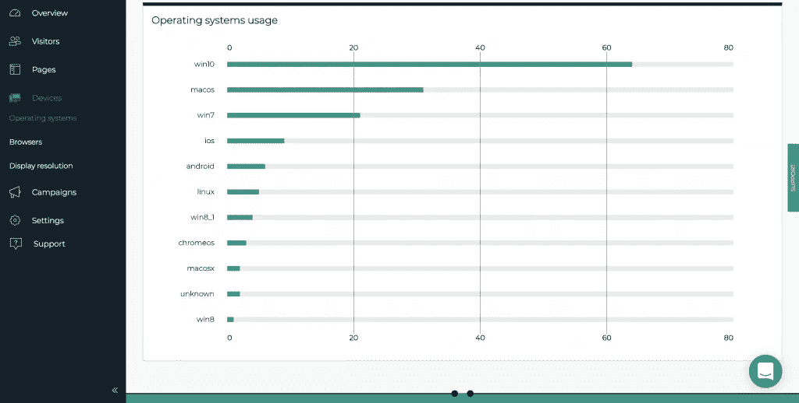*

*Visitor Analytics devices*

*在这里，您可以看到基于**操作系统**、**浏览器或显示分辨率的访客数量。***

*显示分辨率统计对网站设计者特别有帮助。他们更容易理解用户，创建一个用户友好、响应性更好的网站。*

## *活动—了解并提高流量*

*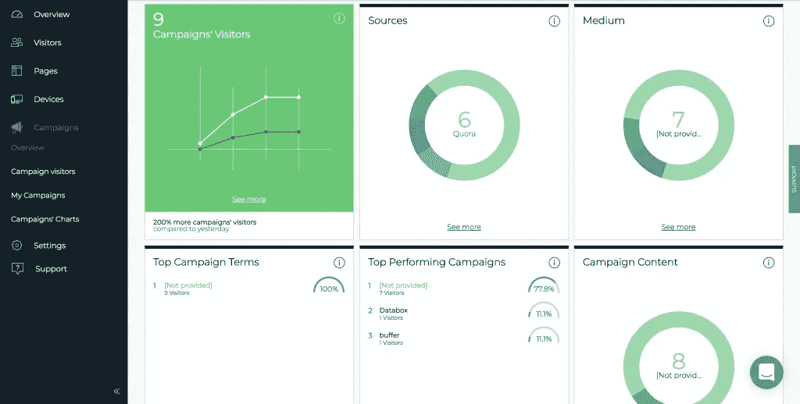*

*Visitor Analytics campaigns*

*如果您正在运行 URL 活动，这一部分应该会让您感兴趣。你必须知道你的活动是成功的，给你带来流量还是不被注意。访客分析可以帮助您改进营销活动，并从数据中吸取经验教训，以构建更好的营销活动。*

*本节中的**概述**已经包含了有价值的信息:*

*   *活动的访问者*
*   *来源*
*   *中等*
*   *热门活动术语*
*   *表现最佳的活动*
*   *活动内容*
*   *最新活动的访问者*
*   *按国家划分的访问者*

*在 **Campaign visitors，**中，您可以以表格的形式访问活动中访问您网站的访问者的所有数据。而且这个表还有一些有趣的信息——*访问者位置、来源、状态、媒体、名称、期限、访问过的页面、时间。**

*假设您正在发送一份包含多个链接的每周简讯。*活动*帮助你决定哪些链接会把你的访问者带到你网站上的特定页面。*

*因此，对于每一个与 UTM(顽童跟踪模块)的运动，你得到所有你需要的信息。分析软件收集数据，让您能够了解流量。*

***我的活动**部分为您提供了所有活动的视图。*

*对于那些喜欢图表的人来说，有 **Campaigns 的图表**显示不同日期甚至小时的各种流量。*

*所以这部分可以让你了解访客的行为。如果他们是常客，你可以分析他们的历史以获得更多信息。尽管访客分析可能是为非技术人员准备的，但有了这些信息，你可能会觉得自己像个技术专家。*

*此外，如果你需要学习如何建立成功的网址运动，访问者分析给你一个全面的教程。*

## *设置—个性化和数据保护*

*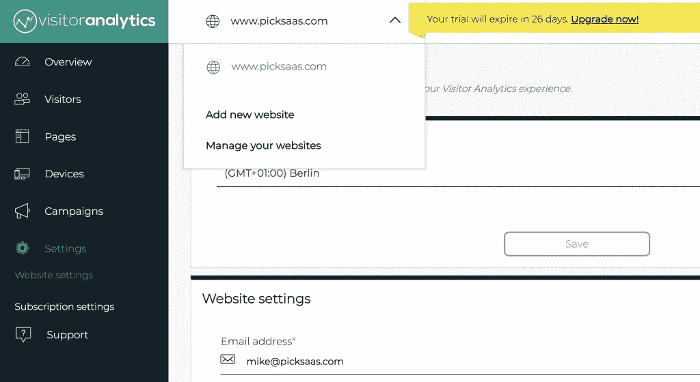*

*Visitor Analytics settings*

*如果你担心数据保护，你不应该担心。虽然访客分析等工具收集了有价值的信息，但使用这款应用不会违反任何有关数据保护的法律。自从引入 GDPR 以来，数据已经成为一个敏感的话题，为了能够合法地运营您的业务，您必须遵守法律规则。这包括使用工具来跟踪访问者在你网站上的活动。*

*在**设置中，**您可以访问**数据保护设置**，这使您无需离开您的家或办公室就可以轻松地**查看和签署数据处理协议**。这是一种轻松快捷的保护数据隐私和安全的方式。*

*在这一部分，您还可以做更多的事情:*

*   *匿名化访问者的 IP 地址，这样他们就不会被存储*
*   *忽略来自特定浏览器的访问*
*   *忽略来自特定 IP 地址或 IP 类别的访问*
*   *更改时区和网站设置*
*   *设置沟通偏好——您希望接收电子邮件报告的频率，您是否希望收到关于提高网站性能和访客分析使用率的定制提示和技巧，以及您是否希望收到访客分析的特别优惠*
*   *永久删除所有数据*

**注意:如果你想知道访客分析是否会交叉追踪，他们不会，不像谷歌那样。因此，有可能获得你的网站访问者的 IP 地址。但是，如果您的国家、组织或隐私政策不允许获取和存储知识产权，您可以完全控制数据，并根据需要进行管理。**

## *支持*

*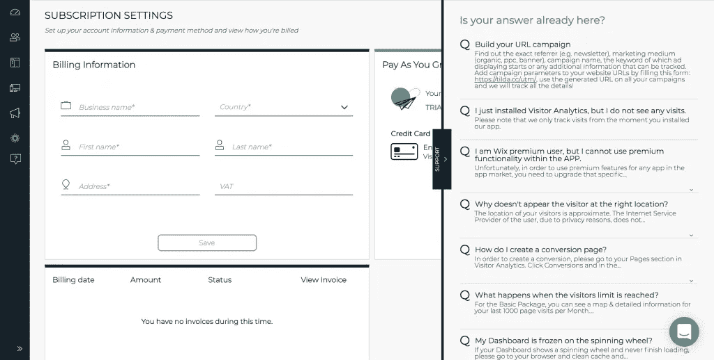*

*Visitor Analytics support*

*如果你发现使用访客分析有问题或有挑战性，你可以随时联系他们或使用他们的帮助中心。如果您不知道如何分析这种类型的数据，请求演示也是一个好主意。*当我参观游客分析时，陪同我的是神奇的科瑞娜，她一步一步地向我展示这个软件。*🙂*

## *访客分析如何帮助您的业务——使用案例*

*访客分析是友好和易于使用的。然而，不要被它的简单所欺骗。这是一个有价值的信息工厂，可以帮助您发展业务。这是您从实施该工具中获益的方式:*

1.  *访客分析可以帮你找出**哪一天哪一小时最适合发布内容**。特别是，如果你使用这些内容作为营销活动的一部分，并且它的目标是吸引更多的客户。这会帮助你接触到更多的人。如果你有一个特定的营销漏斗，那将会非常有益。*
2.  ***地图功能有助于本地化。**您可以分析世界各地有多少人访问您的网站——哪些产品和页面最受欢迎——并根据访问者的地理位置创建活动/产品/服务，以更好地瞄准特定的客户群体。*
3.  ***流量图和页面访问量**有助于了解你的访客行为，优化你的网站。这里有用的是能够看到人们使用哪些设备、操作系统和浏览器。得益于此，您可以为访问您网站的人创造更好的体验，例如，在设计、布局甚至 CTA 按钮上工作。*

## *访客分析还是谷歌分析？*

*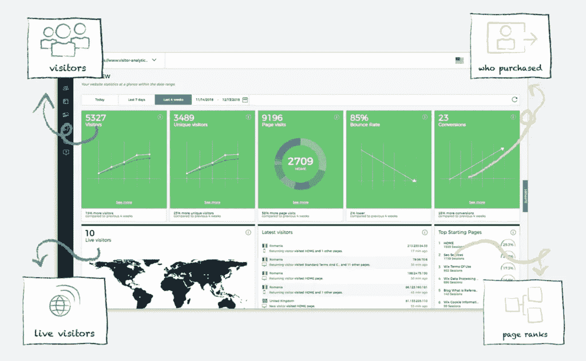*

*Visitor Analytics overview*

*这就是问题所在！无可否认，这两种工具都非常强大。虽然谷歌分析通过所有的图表和数字提供了细致的数据，但我不认为访客分析会更糟。*

*如果你想对你的网站性能有一个总体的了解，你绝对应该选择访问者分析。但是如果你需要尽可能多的分类数据，我会选择谷歌分析。此外，它可能更适合每天优化网站、活动和内容的人。*

*否则，实施谷歌分析这样一个复杂的工具可能会带来更多的困惑，而不是解决疑虑。此外，你可以将访客分析视为更高级应用的入门，并利用它来了解分析的工作原理。*

# *最后的想法*

*我认为访客分析是很棒的软件。而且不管我怎么努力找缺点，都找不到。我个人认为这个工具**直观、有效、有帮助。它不仅有助于了解访问者的行为，还有助于优化网站、个性化产品，以及学习如何渗透到互联网中，让更多人找到你。***

*然而，这个软件可能并不适合拥有复杂网站的大公司。我认为它最适合小企业、初创公司和自由职业者。*

*但未来还会有更多，如果访客分析继续发展，它甚至可能会比谷歌分析更好。以下是你在不久的将来可以期待的:*

*   *为机构精心设计的 PDF 报告*
*   *WordPress 插件，便于在 WP 网站上安装(即使该应用可以安装在任何类型的网站上)*
*   *会话记录*
*   *以及其他一些小的调整和特性*

*为了给你最后的概述，这里是最重要的功能:*

*   *在漂亮的图表中轻松查看您的网站统计数据*
*   *在网站上检查你的访问者的行为和历史*
*   *地理定位您的交通*
*   *查看每月、每天和每小时的所有流量峰值和详细信息*
*   *了解你的网页性能的一切:流量，转换，推荐，你的访问者首先登陆的地方，等等。*
*   *检查访问者的设备、浏览器和分辨率*
*   *全面了解你的 URL 活动:了解你的访问者，活动的表现和所有的 UTM*
*   *遵守 GDPR 协议*

*— —*

*-> [免费试用访客分析](http://www.visitor-analytics.io/?fp_ref=matt73)*

*->【pickSaaS.com 游客分析简介*

**在*[*picks AAS*](https://picksaas.com/)*中，我们提供了一种更快找到最佳软件的方法。**

**我们研究软件解决方案，并通过网站、实时聊天和电子邮件提供在线软件咨询。**

**搜索或开始与我们聊天，找到发展您业务的最佳软件。**

**

## *这篇文章发表在 [The Startup](https://medium.com/swlh) 上，这是 Medium 最大的创业刊物，拥有+432，678 名读者。*

## *在这里订阅接收[我们的头条新闻](https://growthsupply.com/the-startup-newsletter/)。*

**