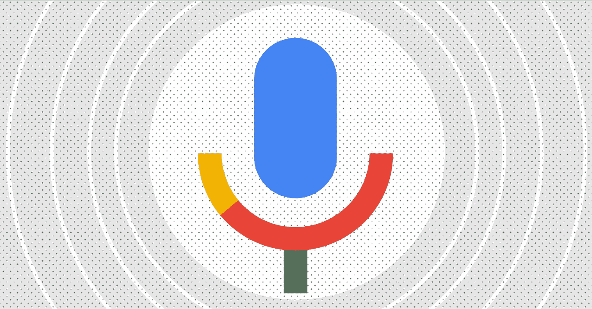
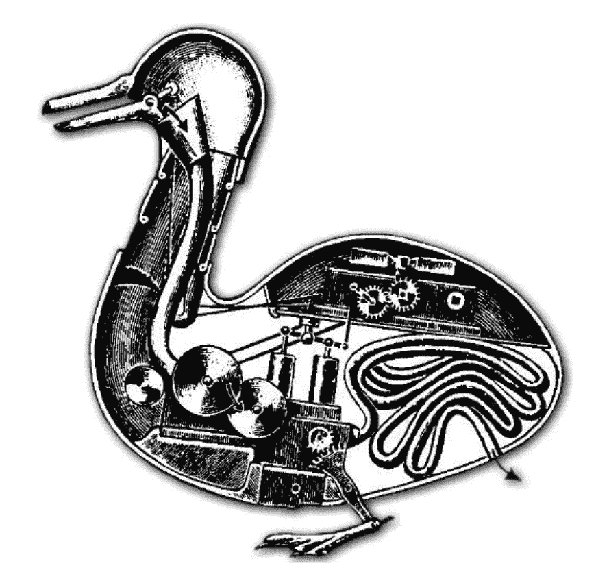
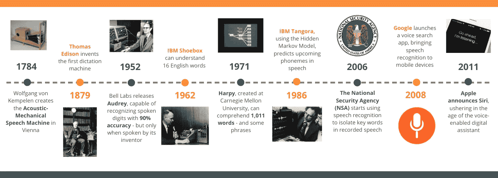
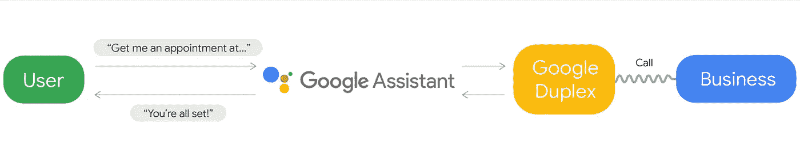
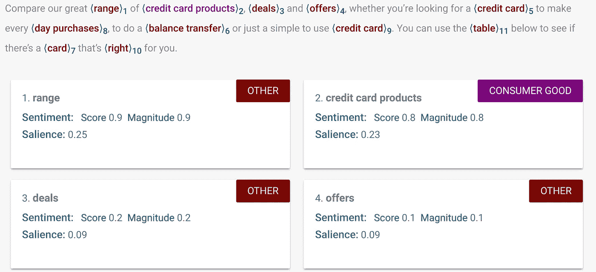
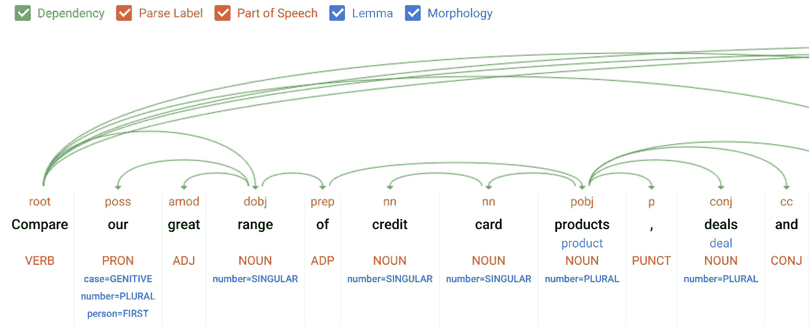
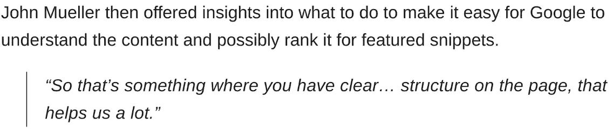
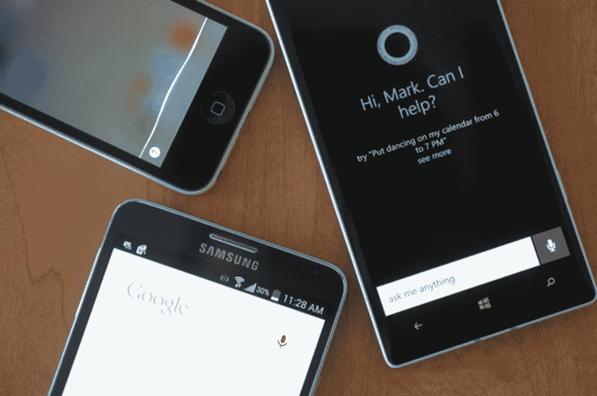

# 语音搜索:语音识别技术的发展

> 原文：<https://medium.com/swlh/voice-search-the-evolution-of-speech-recognition-technology-f3a773f50d11>

## 从消化鸭子到 AI 助手，我们一直被自动机所吸引。

几个世纪以来，人们一直着迷于——有时甚至痴迷于——重建自然世界的尝试。

历史上有很多发明家发明了新的自动机来复制生物体的功能的例子。

1739 年，雅克·德·沃康森向一群开心的观众展示了他的[消化鸭](https://en.wikipedia.org/wiki/Digesting_Duck)(或称鸭消化鸭)。镀铜的“鸭子”可以吞下谷物，然后似乎消化它，然后排泄代谢物质。

[https://machinatorium.wordpress.com/2010/02/27/200-basement-digesting-duck/](https://machinatorium.wordpress.com/2010/02/27/200-basement-digesting-duck/)

快进到自动机的下几个世纪，我们会看到这个领域中许多其他巧妙的进化，如下图所示。

典型地，这些企业分离出一个功能(例如，声音创造或触摸)，然后致力于创造一个行动的工作模拟。

从阿达·洛芙莱斯到托马斯·爱迪生，这些杰出人物在追求更深入了解我们周围世界的驱动下，将他们的智慧应用于这些机器的创造。

随着时间的推移，有一个领域比其他任何领域都更吸引发明家:人类语言。

[*https://medium.com/swlh/the-past-present-and-future-of-speech-recognition-technology-cf13c179aaf*](/swlh/the-past-present-and-future-of-speech-recognition-technology-cf13c179aaf)

我们口头交流的能力是复杂的，充满了科学和文化的内涵。

创造一台可以理解语言细微差别并以同样方式回应的机器，是一项多方面的努力，仍然占据着谷歌、微软和亚马逊等公司最优秀的头脑。

# **今日语音搜索**

所以，现代语音搜索。

搜索引擎的程序是回答问题，但不是让*理解问题。*

这是一个重要的区别，因为我们考虑如何使用这项技术与观众联系。

这项技术现在正处于一个转折点，它将令人信服地超越新奇的领域，进入真正日常有用的领域。

谷歌的超级碗广告提到了这一点，令人印象深刻的是，每天有超过 10 亿个单词通过其翻译服务进行交流。

这引起了人们对语音交互的一个重要方面的注意:任何人都可以使用这项技术。

随着全球越来越多的人开始上网，内容可以用任何语言访问，并被即时大声翻译出来。这消除了许多进入壁垒，并将在未来几年推动大规模语音搜索的采用。

反过来也在发生，因为谷歌[为世界上 5%的重听或失聪者提供即时语音转文本转录](https://www.wired.com/story/google-live-transcribe-sound-amplifier-for-android/)。

然而，我们仍然处在高功能自动机的舞台上，而不是有感知能力的机器。

谷歌 Duplex 的推出，充满了惯常的现场演示，标志着该行业又向前迈出了重要的一步。

这让我们更接近人们世世代代追求的目标，从消化鸭子到 Siri:一台可以复制活生物体功能的机器。

为了利用这一优势，我们需要了解这如何让品牌和消费者都受益。

# **形成清晰的内容结构**

幸运的是，我们可以通过云自然语言 API 获得对谷歌自然语言处理算法内部工作方式的宝贵见解。

可以提取文本并查看它是如何被分解成实体的，如下图所示:

这对品牌很重要，因为它提供了可以直接用于塑造内容创作的发现。

在这种情况下，语法规则比以往任何时候都更重要。

如果我们能够使用约定的结构格式清楚地交流我们的论点，我们就有更好的机会被搜索引擎理解。在这个人们和他们的设备之间的结构化片段和碎片化交流的时代，这对于任何品牌来说都是一个重要的洞察力。

谷歌的约翰·穆勒在最近的一次网络研讨会上也提到了这个因素:

[*https://www.searchenginejournal.com/how-to-rank-featured-snippets/288573/*](https://www.searchenginejournal.com/how-to-rank-featured-snippets/288573/)

在这方面有大量优秀的资源，包括*经济学家风格指南*和*细心的作家。*

我们还可以通过[这个链接](https://cloud.google.com/natural-language/docs/categories)看到谷歌使用的内容类别。

所以在创作一些新的内容时，要有逻辑地规划出小品的结构，明确定义语义场和目标关键词主题。

通过提供简短的文本片段，清楚地回答一个常见的查询，品牌可以帮助搜索引擎提供观众渴望的答案。

# **添加一些样式**

如果每个品牌都遵循这些规则，并以公式化的方式构建它们的内容，我们与消费者的交流将是单调的。此外，消费者将无法区分不同的品牌。

过去，品牌声音被一些 SEO 忽视了。我们的目标是通过我们对搜索引擎内部工作的了解来对目标关键词进行排名。

正如我们在上面看到的，那些内在工作正在改变——所以我们也需要改变。

大卫·奥格威曾经说过，“每一个广告都应该被看作是对品牌形象这一复杂符号的贡献。”

当我们考虑语音搜索时，我们最好记住这一点。当搜索引擎大声读出我们的内容作为与消费者对话的一部分时，这些内容就成为了品牌形象的一部分。

因此，我们应该密切关注我们如何表达这些信息。简单地对目标查询进行排名已经不够了；一旦我们到达那里，我们必须关注我们所产生的影响。在漫长的、以研究为主的消费者旅程中，每一次互动都很重要；语音搜索只是为我们开辟了新的道路。

对于语音搜索，品牌必须超越文本内容。

当数字助理促进对话时，我们正在处理一种不同的感官体验，对于品牌来说，创建自己的音频内容比用谷歌或 Alexa 的声音阅读文本更合适。

毕竟，我们只和我们觉得有趣、有启发性或有趣的人说话。这些规则同样适用于未来的对话式语音搜索。

*在 Twitter 上关注作者:* [*@ClarkBoyd*](https://twitter.com/ClarkBoyd)

## 这篇文章发表在 [The Startup](https://medium.com/swlh) 上，这是 Medium 最大的创业刊物，拥有+426，678 名读者。

## 订阅接收[我们的头条新闻](https://growthsupply.com/the-startup-newsletter/)。

