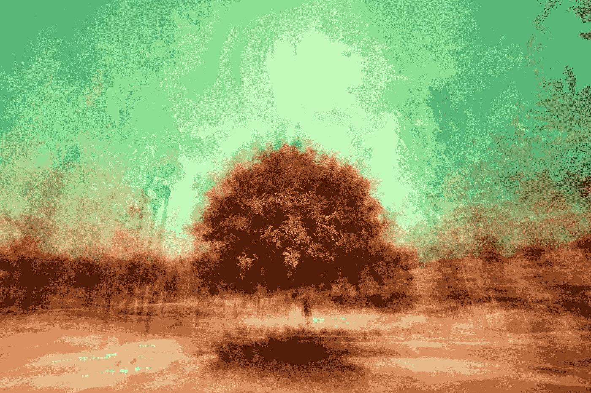

# Wabi-Sabi 与数码摄影

> 原文：<https://medium.com/swlh/wabi-sabi-and-digital-photography-a1bf9612cff3>

Photo by [JR Korpa](https://unsplash.com/@korpa?utm_source=medium&utm_medium=referral) on [Unsplash](https://unsplash.com?utm_source=medium&utm_medium=referral)

## 为不完美留出空间

我爱上摄影的那天，我正带着我的狗查理穿过离我家几英里远的开阔的乡村。我们出发时，是一个阳光明媚的六月早晨。到处都是野花，粉红色、金色、蓝色和紫色的夏日混沌。

然后一场风暴席卷了大西洋。天空迅速变暗，风…