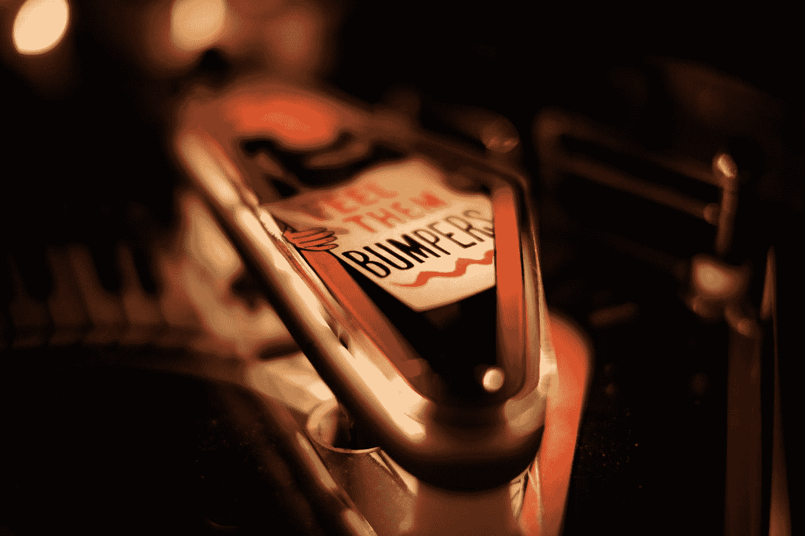

# 想成为弹球巫师吗？别做弹球了。

> 原文：<https://medium.com/swlh/want-to-be-a-pinball-wizard-stop-being-a-pinball-b995af67737f>

Photo by [Thomas Millot](https://unsplash.com/@tomlaudiophile?utm_source=medium&utm_medium=referral) on [Unsplash](https://unsplash.com?utm_source=medium&utm_medium=referral)

你一生中可能犯的最大错误之一就是为别人而活。

帮助别人？是的。为他人提供服务？是的。为社会做贡献？是的。

而是为别人而活？没有。

不是自私，而是自我满足。充满目标，这首先来自你最真实的自我。