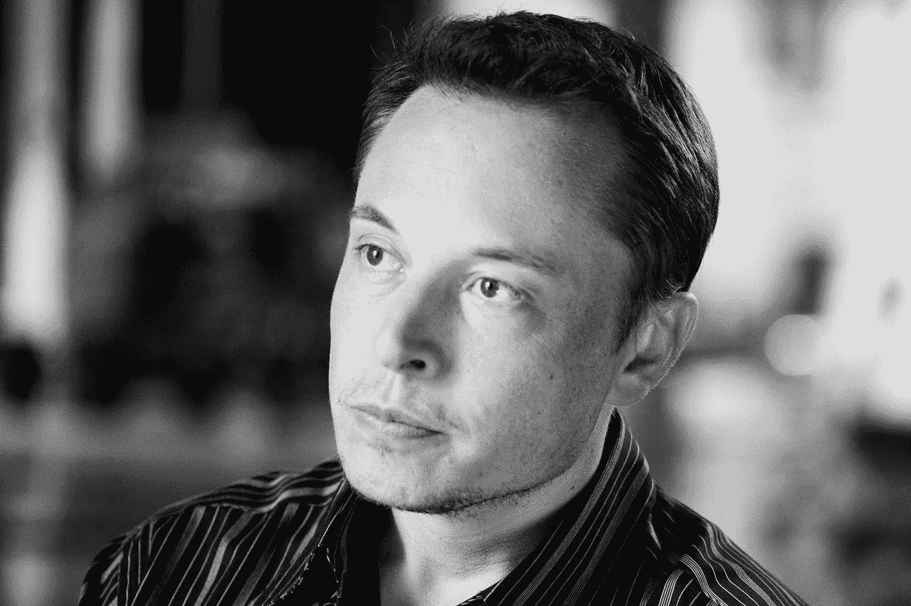
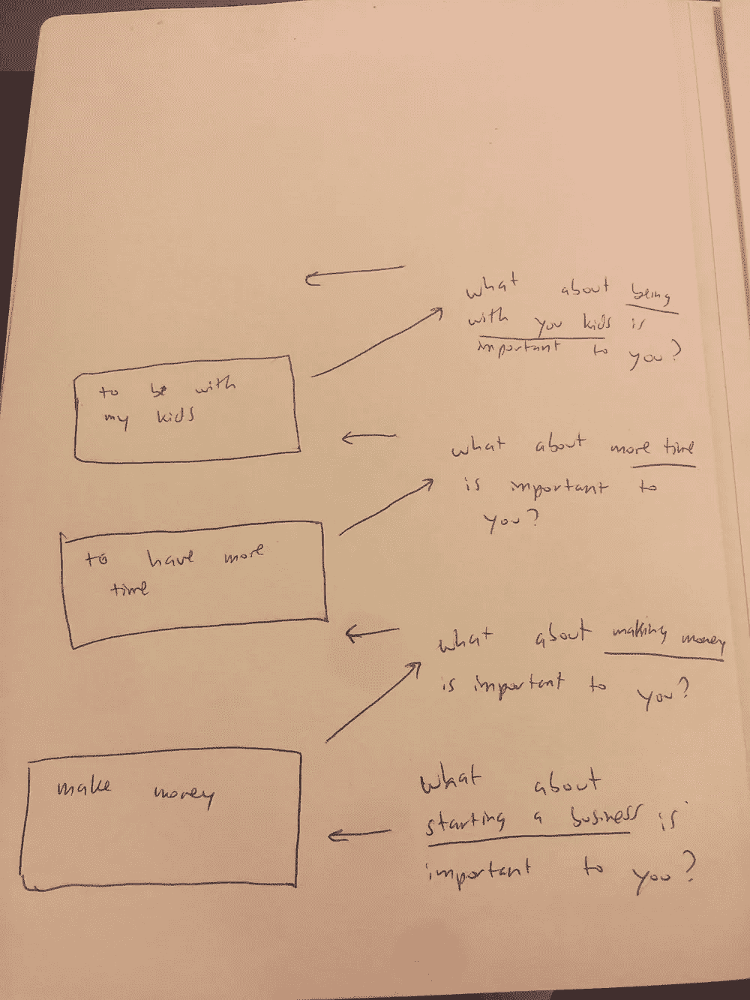

# 想成为千万富翁吗？马上做这 15 件事。

> 原文：<https://medium.com/swlh/want-to-become-a-multi-millionaire-do-these-15-things-immediately-1d820ae569cd>

[Musk](http://s3.amazonaws.com/digitaltrends-uploads-prod/2016/02/Elon-Musk-sassy.jpg)

## “成为百万富翁的最大回报不是你赚了多少钱。它是那种你必须成为百万富翁的人。”—吉米·罗恩

大多数人希望他们的环境会神奇地为他们改变。他们不想让自己变得更好，这样他们就可以主动改善自己的处境。

不像大多数人，他们只是简单地等待和希望运气，你可以寻求成为那种拥有技能和能力去做辉煌事情的人。

你可以成为那种从事高影响力工作的人。你的工作可以解决紧迫的问题，改善人们的生活，并得到重要人士的注意，他们分享你的工作不是为了你，而是为了他们！分享你的作品*让他们看起来很好*，因为它很棒。

你作为一个人的品质，以及你所做的工作，完全在你的掌控之中。但是你不能希望它发生。你必须成为那种自然吸引你所追求的成功的人。

方法如下:

# 1.将至少 10%的收入投资在自己身上

如果你不为某件事付钱，你很少会注意。

大多数人想要免费的东西。但是如果你免费得到某样东西，你很少会珍惜它。你很少把它当真。

你对自己投资多少？

你对自己有多忠诚？

如果你不投资于自己，那么你在自己生活的游戏中就没有任何意义。

如果你没有投资于你的事业，你可能不会做高质量的工作。

如果你没有在你的人际关系上投资，你可能更关注你能得到什么，而不是你能给予什么。

说到自我提升，将收入的 10%投资在自己身上将会获得 100 倍甚至更多的回报。你花在教育、技能和人际关系上的每一美元，都会得到至少 100 美元的回报。

如果你想把某件事做得非常好，你需要身边有合适的导师。你能做好的任何事情都将是高质量指导的结果。如果你做不好某件事，那是因为你在那件事上没有得到高质量的指导。

最好的导师是那些你付钱给导师的人。通常，你付出的越多越好，因为你会更加认真地对待这段关系。你不会独自享受这段关系。你不会纯粹是一个消费者。相反，你会投入进去，因此，你会听得更仔细。你会更在乎。你会更体贴更投入。不成功会有更严重的后果。

我投资了 3000 美元，让一位非常成功的作家帮我写我的第一个书籍提案。那 3000 美元让我花了他 4 到 5 个小时的时间。但在那 4、5 个小时里，他教会了我如何创作一个令人惊叹的书籍提案。他为我提供资源，极大地增强和加快了我的进程。在他的帮助下，我找到了一个文学代理，并最终获得了一份价值六位数的出书合同。

如果我过分担心 3000 美元，我相信直到今天，我也不会写一个出书的建议。最多，我会写一个可怕的。我不会有动力或投入，所以我更有可能拖延必要的行动。

如果你没有很多钱，你当然买得起一本书。你在娱乐、衣服或食物上花了多少钱和时间？这是优先顺序的问题。

只有当你投资一件事时，你才有动力去实现它。

除了导师之外，你应该投资于教育项目，如在线课程、书籍、食品和睡眠等优质产品。

你的成功程度通常可以直接由你的投资水平来衡量。如果你没有得到你想要的结果，那是因为你没有投入足够的精力去得到那些结果。

你的首要投资必须是你自己。

你决定谁:

*   你将拥有的婚姻质量
*   你成为父母的品质
*   你的工作质量
*   你拥有的幸福程度

当你在财务上投资某样东西时，你会发现。你会变得非常投入。经济学家称之为沉没成本偏差。但是你可以利用这一点。如果你想提升你对某件事的个人承诺，那就在那件事上大量投资。

最终会成为一条不归路。

你会变得如此坚定，以至于退缩看起来很可笑。

因此，你需要真正知道你想要什么以及为什么(见下面的第 14 条)。如果你不知道这些事情，那么过度承诺可能是一个巨大而不合理的问题。

然而，如果你确定你是/想成为世卫组织，你想要什么，为什么，那么你需要投资自己。

# 2.将至少 80%的“休息”时间投入到学习中

大多数人是消费者而不是创造者。

他们工作是为了拿薪水，而不是为了有所作为。

当放任自流时，大多数人也会浪费时间。只有通过投资你的时间，你才能得到时间的回报。

几乎花在社交媒体上的每一秒都是被消耗的时间。你不能让时光倒流。这非但没有让你的未来变得更好，反而让你的未来变得更糟。就像吃变质的食物一样，每一分钟的消耗都会让你的情况变得更糟。每一个投入的时刻都会让你过得更好。

娱乐是很好的。但只有当娱乐是对你的人际关系或你自己的投资时。如果娱乐在你的未来不断产生回报，你就会知道这是否是一项投资。这可能包括积极的记忆、转型学习或加深的关系。

尽管如此，生活不仅仅是娱乐。教育和学习也是关键。虽然这两者都很重要，但教育将为你的未来提供更大的回报。

世界上最成功的人都是勤奋的学习者。他们是勤奋的读者。他们知道他们所知道的决定了他们如何看待这个世界。他们知道他们所知道的决定了他们能拥有的关系的质量和他们能做的工作的质量。

如果你一直在消费垃圾媒体，你怎么可能期望创造高价值的作品？你的输入直接转化为你的输出。垃圾进，垃圾出。

# 3.不要为了钱而工作，工作是为了学习

> 年轻的时候，工作是为了学习，而不是为了挣钱。罗伯特·清崎

正如你的大部分休息时间应该用来学习一样，你的大量“工作”时间也应该用来学习。

富有和快乐的人工作是为了学习。不成功和不快乐的人工作主要是为了钱。

只有 20%的精力应该花在实际工作上。剩下的应该用来学习，提升自己，休息。

通过“磨利你的锯子”，你将继续成为一个更好、更有能力的人。因此，当你花大量时间成为一个更好的思考者、沟通者，并且更擅长你的手艺时，你的工作质量将会继续提高。最终，你将能够为你的工作收取非常非常高的费用，因为没有人能像你这样做。

当你优先考虑学习和恢复时，那么在你实际工作的时间里，你将处于一种深度的心流状态。你不会像大多数人工作时那样分心。你要么 100%投入要么 100%退出。工作时，你可以在几个小时内完成比大多数人几天完成的还要多的事情。

你的时间花得很值，因为你的优先事项很清楚，你休息得很好，你的头脑被刺激了。

# 4.不要为了娱乐而学习，要学会创造更多的价值

> *“成功的关键秘密不是过多的专业知识，而是运用这些知识的能力。知识除非应用，否则毫无价值。”——*[马克斯·卢科明斯基](http://thecoffeelicious.com/why-learning-is-a-new-procrastination-104b53107e8b#.zeglohbdt)

在我们的媒体和信息时代，你可以学到无数的东西。但是如果你不把学到的东西立即付诸实践，它就会变成肤浅的信息。

信息和知识是两回事。

知识和智慧也是两个截然不同的东西。

决定你应该学什么，为什么要学，什么时候学，需要智慧。

除非你投入，否则你可能不会以最大化知识所需的强度来学习。

除非你明白你时间的价值，否则你可能不会有足够的洞察力去忽略几乎所有的事情，而去学习那些能带来最高回报的事情。

当你学到一些东西时，你应该得到学习的回报。现在有太多的人读书只是为了说他们已经读了很多书。如果你没有学以致用，你就是在消耗和浪费时间。

# 5.将至少 10%的收入投资到能产生更多收入的工具上

很少有人创造真正的财富。

即使那些高收入的人也不是真正的富人。大多数人的生活方式与收入相匹配。当他们赚得越多，他们消费得就越多。事实上，大多数人赚钱仅仅是为了消费。

很少有人赚钱去投资。

最好把你的生意想成只是你收入等式的 1/2。你有你的生意带来收入。然后，你有你的投资实体把你的收入变成更多的钱。

像任何事情一样，你如何管理你的钱取决于你得到的指导有多好。如果你想在金钱上变得卓越，投资于教育和指导。

种树的最佳时间是 20 年前。开始投资的最佳时机也在过去。如果你还没有开始，不要坐在那里沉浸在后悔中。对于今天不做事的人来说，明天是不存在的。

从今天开始。让自己接受教育。创建一个工具，或者几个工具，把你收入的至少 10%放在里面。最终，你的投资工具甚至可能开始为你创造比实际业务更多的利润。

复利是实实在在的东西。如果你将收入的 10%投入到足够长时间的投资中，你就万事大吉了。与大多数高收入者不同，你可以随时停止工作，因为你的钱已经足够让你舒适地生活了。

# 6.将你的动机从获取转变为给予

> *“世界给予给予者，也从索取者那里索取。”—* 乔·波兰

大多数人只关注他们能从生活中得到什么。

我我我。

然而，一旦你对这个世界变得更加清醒，你的欲望就会从单纯的接受转变为给予。

你会意识到给予比得到更令人满足。此外，你会被你完全相信的事业所驱使。

事实是，你对人(和人生)只有两种取向中的一种。

要么你在关系中作为交易，要么作为转换。

大多数人都有事务性关系。他们只关注他们能从这段关系中得到什么。这都是为了推进他们自己的议程。根源在于稀缺性。太自私了。

这不是你在感情和生活中走得远的方式。

这也是你如何陷入自己的心胸狭窄。

另一方面，转型关系完全集中在给予和感激上——这是富足的标志。在这些关系中，整体不仅仅是部分的总和。在脆弱和信任中，双方都超越了自己的狭隘，变得更有价值。

从根本上说，这需要成为一个给予者，而不是索取者。正如亚当·格兰特在他的书《给予和索取》中解释的那样，当两个给予者走到一起时，结果是天文数字。

给你一个建议:不要让自己周围都是索取者。

当你的动机是给予时，你通常会洞察到如何改善你的人际关系。你脑海中会出现一些随机的想法，向不同的人发送“感谢”短信。

你会对如何改善他人的生活和生意有更多的想法。

你会开始做出更多的贡献，这会带来更多的机会和更深的关系。人们会爱上你，信任你。你的工作会被更高的目标所激励，因此会更有灵感和影响力。

# 7.公开承认你是多么依赖他人

仅仅因为你的主要动机是给予，并不意味着你不会寻求很多帮助。

实际上，你在不断地寻求和接受帮助。

事实是，每个人都高度依赖他人来做他们所做的事情。但是公开承认这种依赖需要智慧和谦逊。不要把它看作一个弱点，要意识到它是一种优势。

除了承认你的依赖，不断向你生活中的人表达你的*感激*。你欣赏的东西会欣赏。关系是资产，可以而且应该随着时间的推移变得更大更好。正如杰出的企业家迈克尔·菲什曼(Michael Fishman)在《T4》中所说，“白手起家是一种幻想。有许多人在你拥有今天的生活中扮演了神圣的角色。一定要让他们知道你有多感激。”

如果你不欣赏和付出你的人际关系，你的人际关系会受到影响。所有的关系就像银行账户，如果一个人不停地存钱，另一个人不停地取钱，最终所有的资源都会耗尽。

在这样的关系中，1+1 =小于 2。

相反，在协同和健康的关系中，1+1=远远大于 2。当两个人不断地给予和接受时，关系型银行账户会继续增长和扩大，提供一些有意和无意的好处。

例如，我最近和我哥哥在健身房。锻炼开始时，他在精神上很挣扎。他没有增加我的能量，帮助我的锻炼变得比我独自一人时更好，相反，他吸走了我的能量，要求我比独自一人时付出更多的能量和努力。

我让他意识到发生了什么，他立刻转移了情绪姿态。他意识到他的情绪对我的影响有多大。他的动机从消费体验转变为创造伟大的东西。

我们共同的精神状态提高了，把我们带进了*团体流。*我们的锻炼变得比我自己创造的任何东西都要好。不仅如此，我们还开始了一场充满灵感的对话。这带来了与我正在写的书相关的精彩见解和联系。

令人惊叹的锻炼是我们协同合作的预期成果。我的书的见解是意想不到的好处。这只有当双方都积极地从关系中给予和接受时才会发生。两者都专注于创造而非消费。双方都有*帮助对方成功的主要动机。*

# 8.创建双赢的战略合作伙伴关系，实现 10 倍或 100 倍的目标

> *“所有失败的公司都是一样的:他们没能逃脱竞争。”* —彼得·泰尔

大多数人处于竞争而非合作的状态。

协作是比竞争高得多的层次。

竞争的焦点是自我。这也是非常低级的思维，因为你自己能做的非常有限。

竞争的人都在磨。他们更注重获胜，而不是创造真正的解决方案。

然而，当你的思维变得开阔时，你会意识到你可以和其他人一起做更多的事情。协作创造了独力工作所不能创造的独特联系。

你拥有的技能和知识在你的领域里是令人敬畏的。不同领域的其他人拥有你目前完全不知道的技能和知识。这些人也有你没有的资产。

如果你想获得本领域其他人 10 倍或 100 倍的成果，你需要发展战略“双赢”伙伴关系。这通常发生在你设计一个计划，将你的技能和资产与其他人的技能和资产融合在一起的时候。

你能做好的事，别人可能会纠结。你奋斗的事情，别人也能做的极其出色。

你可以与谁合作来加快你的进程？

谁有你没有的资产和资源？

你如何帮助这些人？

你可以发展什么类型的伙伴关系，让你更快地实现你的目标，并帮助他们更快地实现他们的目标？

当你与其他人合作时，1+1 =大于 2。整体变得不同于部分的总和。

这就是转变是如何发生的。只有那些参与合作的人才能真正经历真正的转变。那些只靠自己工作得很好的人被困在自己狭隘的世界观和议程中。

当你和别人融合的时候，你的想法和目标就变了。他们变得更大更好。它们变得不同于你自己所能创造的。

拥有这种类型的伙伴关系的唯一方法是长期考虑。你必须在游戏中投入和有皮肤。不可能是事务性的。不可能是这个换那个。一定有更深层的原因。当它到来时，你会在工作中变得更加正直。你会更加感激。你会始终如一地做正确的事，即使那件正确的事很困难、很不舒服。

不要寻求交易关系。只求长期的转型关系。

# 9.设定 10 个目标，直面你的恐惧

看你现在的目标。

为什么这是你衡量“成功”的标准？

为什么那是你的目标？

说真的，如果你把这个目标放大 10 倍，会发生什么？

如果你不是每月挣 3000 美元，而是追求每月 30000 美元呢？

这可能吗？

当然有可能。有几个人在做这件事。

他们和你的唯一区别是他们的教育、关系和策略。

当你设定一个 10 倍的目标时，你需要以非常不同的方式思考你的日常行为。你需要在生活的各个方面更加严肃。你需要消除限制性思维和消耗性分心。

设定 10 倍的目标将是你为自己做过的最好的事情之一。这个目标应该在你处于巅峰状态的时候建立。你通过做一些强有力的事情进入巅峰状态，无论是锻炼、学习还是在一个独特的环境中，比如在国外。你甚至可以通过与某些类型的人在一起而进入巅峰状态，这些人激励你成为最好的自己。

只有你自己知道是什么让你进入巅峰和激情的状态。所以，做任何能让你达到目的的事情，然后写下你的目标。宣布你要做什么。然后写下这个目标，每天都想象它的实现，直到它成为你的现实。

当你思考这个目标的时候，不要偏离随之而来的想法的自然流动。

你不能用你现在正在做的同样的思维和行为来 10 倍提高你的成果。因此，当你思考你的目标时，你也会得到关于你需要做什么的想法，现实地，去实现那个目标。

很有可能，你不知道你不知道的事情。所以你需要开始真正地教育自己如何才能实现你的目标。你需要对你正在做的工作更加大胆。你需要创造更多，失败更多。事实上，一遍又一遍。数量往往是获得质量的最快途径。

不仅如此，当你想到你的 10 倍目标时，你可能会有让你害怕的想法。当你做让你害怕的工作时，你跨越了一个大多数人从未跨越的界限。吓人的工作往往是高利润、有价值的工作。

# 10.变得非常非常擅长营销

市场营销无非是应用心理学。

这是关于与人们联系，说服他们，并帮助他们。

许多人认为营销是一件肮脏或不道德的事情。

很多“艺人”不学营销，是因为不想“卖光”。他们希望他们的工作是纯洁的。

学术也不是更好。他们的作品一般人是看不懂的。

营销无非是让你的作品更容易、更好的找到和使用。

人们不会神奇地出现并购买你的东西。

人们不会神奇地出现并阅读你的作品。

即使是现在:你是如何登陆这个页面的？看这篇文章的标题。我也可以很容易地称之为“成功的建议”

但是你会点击那篇文章吗？

大概不会。

但是你点击了这个。

你为什么点这个？

你是怎么走到这一步的？

想想体验吧。

营销是你做任何事情的“方法”。

大多数人不成功的原因是他们害怕或避免营销。出于同样的原因，大多数人都不是好老师。他们更关注内容，而不是内容的交付和设计。

但是交付——如何交付——即使不比你在做什么或为什么做更重要，也同样重要。

你可能有治愈癌症的方法。但是如果你没有很好地推销它，你将永远不会得到你的解药。

你可以拥有世界上最重要的信息或最伟大的故事，但如果你不明智地推广和包装，没人会看到。

# 11.不要专注于时间和努力，而是专注于结果

独家创业教练平台“战略蔻驰”的创始人丹·苏利文(Dan Sullivan)区分了那些处于“时间和精力经济”的人和那些处于“结果经济”的人

如果你在时间和精力经济中，你会专注于忙碌。你真的相信你投入的时间和精力值得表扬。相反，当你处于结果经济中时，你只专注于实现一个特定的结果。

底线才是最重要的，因此，找到最有效的方法来达到这一点变得非常重要。这是企业家和员工的一个关键区别。正如沙利文所说:

> 企业家已经跨越了“风险线”，从“时间和精力经济”到“结果经济”。对他们来说，没有固定的收入，没有人每两周给他们写一份薪水支票。他们通过为客户创造价值来创造机会。有时候，他们——还有你——会投入大量的时间和精力，却得不到任何结果。其他时候，他们没有投入太多的时间和精力，却得到了一个大的结果。企业家总是关注结果，否则就没有收入。如果你为一个企业家工作，你猜怎么着！对你来说也是如此。虽然你可能有固定收入，但重要的是要明白你工作的行业存在于结果经济中，即使你看不到这一点。我说这些不是让你感到不安全，而是告诉你如何在这种环境中取得成功:最大化你的结果，同时最小化获得结果所需的时间和努力。

大多数人不考虑结果，因为他们的安全感在薪水里。然而，当你把注意力从你能做的少转移到你能做的多的时候，你就改变了你的工作方式。

你开始学习更快完成更多事情的方法。你承担了更大的责任。你改变你的环境。你也会意识到睡眠和休息对于达到最佳效果是多么重要。因此，你开始花越来越多的时间休息。

当你把 80%的精力用于休息和自我提升时，那么在你实际工作的时候，你就有了大量的饲料和一把非常锋利的锯子。

你的思维比其他人大 10 倍。你在短时间和高压力下工作。当你工作的时候，你会把自己累到极点，因为你要花很多很多时间休息和准备。

# 12.定期改变你的环境

你工作的环境应该反映你正在做的工作。

在同一个环境里做几个类型的工作是无效的。但是人们总是这样做。他们坐在同一个座位上，精神上从一个任务转移到另一个任务。

一个好得多的方法是批量处理你的活动，并在相关的环境中进行这些活动。

例如，当我写博客时，我在一个安静的图书馆工作，在那里我没有任何杂念。因为我的环境有利于高质量的写作，也因为我知道那天我会写作，所以我写了很多。一次写 2-5 篇博客文章比一次写一篇文章更容易。

作家兼企业家 Ari Meisel 将他的活动分批进行，并变换他的环境以匹配他正在做的工作。在录制播客的日子里，他会去录音室，一次录制大约 5 集播客。

在其他日子里，他整天都在开会或打电话。他在朋友的公寓里做这项工作，因为那里的环境更吸引人。

他也写很多东西，而且是在纽约市的 SOHO 之家，因为那里环境安静，网络连接不好。由于信号不好，连接中断使他无法上网，甚至无法使用手机。

# 13.给自己定义一下“财富”和“成功”

成功和财富不全是金钱。

有很多人有钱，但在他们生活的其他关键领域却没有什么“资本”。

显然，钱是非常重要的。它解决了很多问题。它加快了进程。

但是钱是工具。这是达到目的的手段。对于那些从事他们真正相信的工作的人来说，金钱只是做更多工作的工具。

# 14.从你内心最深处的“为什么”开始了解和操作

你正在做或追求的事情的原因是什么？

你怎么可能知道你的原因？

更重要的是，你怎么知道你真正的原因？

其实挺简单的。

但这需要一些激进的诚实。

我会带你做一个练习来找到你的原因。更重要的是，一旦你知道你所做的事情的最深层原因，你就应该从那种状态出发，而不是从你较低的和基础的原因出发。

当试图理解你为什么做某事时，问“是什么”比问“为什么”更好，因为“为什么”问题往往会使人处于守势。

你可以问自己一个可靠的问题来理解为什么。

**对于你来说，______________ 的哪些方面很重要？**

假设你想创业，或者买一部新手机，或者去健身房…

可大可小。

但是把那东西放进去。

**那“去健身房”对你来说重要吗？**

然后，你只要写下你想到的第一件事:**因为我喜欢感觉良好。**

然后你拿着你的答案，放在同一个问题里:**关于 _ _ _ _ _ _ _ _ _ _ _ _ _ _ _ _ _ 什么对你很重要？**

那么，鉴于之前的回答:**“感觉良好”对你来说重要的是什么？**

下面的图片显示了一种简单的方法来组织这个练习。

所以，你要试着深入 7 层。一旦你到了第 5 层、第 6 层和第 7 层，你就必须对自己诚实。

通常可以用脑袋回答 1-4 层。然而，如果你真的对自己诚实，我的意思是真的诚实，你需要发自内心地回答第 5-7 层。

在最深处，你会发现你所做的事情的真正原因。即使是像买一部新手机或者去健身房这样简单的事情。

但是当你在做某件事的时候，你想提醒自己最深层的原因。你想从那个层次开始运作，因为在你最深的层次，你会从你的心开始运作，而不是你的头。因此，你的表演将会更加深刻、真实和有力。

赌注会更高。

突然间，你去健身房不仅仅是为了“感觉良好”，而是因为你有更高的使命要履行，并且需要尽可能健康地实现它(或者不管你最深层的原因是什么)。

你内心最深处的“为什么”几乎总是会暴露出一些关于你个人的东西，以及你对生活的基本信念。

你需要意识到这些事情，以及它们如何/为什么驱使你去做你正在做的事情。

如果你真的以一种真诚的方式完成了这个练习，你会在精神和情感上有所突破。

你应该发现一些关于你自己的东西，为什么你是你现在的样子，为什么你在追求你现在的特定的东西。

知道你的原因。

然后从你内心最深处和最强有力的原因开始行动。

你会在你所做的事情上更加出色。

# 15.立场坚定，它会成为你的品牌

为了成功，你必须有所信仰。

你必须有立场。

所有成功的人和品牌都有明确的原因。正如西蒙·西内克在他的书中解释的那样，*从为什么*开始，人们不买你卖的东西，他们买你卖它的原因。

苹果就是一个很好的例子。在他们所有的营销中，他们不解释他们产品的技术细节，他们定义并分享他们的核心价值。他们认为技术应该既好用又酷。

如果你想变得引人注目和有趣，你必须真正相信一些事情。你必须立场明确。这种立场成为你的品牌。它成为你的商标。它成为你区别于他人的方式。

当你有一个清晰的立场和品牌，你就会脱颖而出。你不再中立。你相信一些事情，并努力做出具体的改变。

结果，人们要么爱你，要么恨你。这就是你想要的。不冷不热意味着你无话可说。不冷不热意味着你试图吸引每个人。

财富在壁龛里。你的利基是你的观众。他们是一小群同意你的立场的人。他们是你的传道者。

如果你试图吸引所有人，你的信息、营销和产品将会很糟糕。你不会清楚自己的原因，其他人也不会。因此，你会像其他人一样普通，你的工作不会突出。

只有立场坚定的人才能真正真正擅长营销。他们非常关心他们的信息，并把它传播出去。他们意识到如何做和为什么做同样重要。

# 结论

你在做这 15 件事吗？

你做的有多积极？

你想成为千万富翁吗？

你准备好思考和行动了吗？

你能行的。

# 你准备好升级了吗？

[点击这里下载我的免费晨间清单，让自己每天都处于最佳状态。](https://peakstatechecklist.com/checklist)