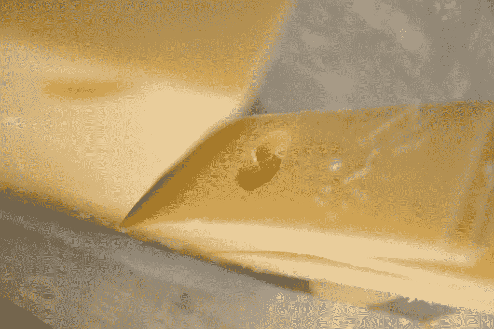
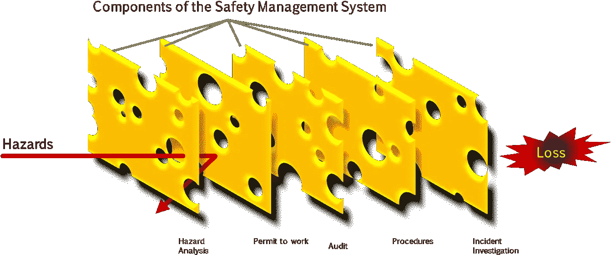
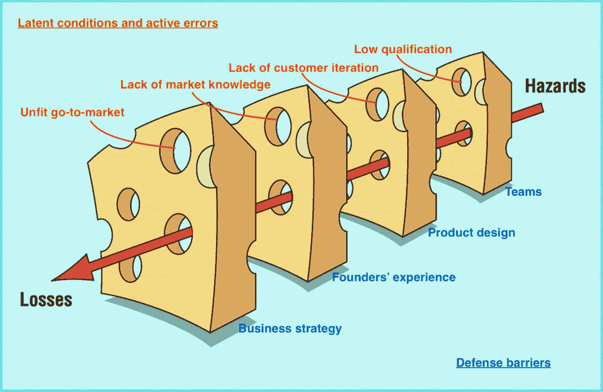

# 想了解创业失败？看看飞机失事

> 原文：<https://medium.com/swlh/want-to-understand-start-up-failures-look-at-airplane-crashes-9d73c901bfd3>

Photo by [Benjamin Child](https://unsplash.com/@bchild311?utm_source=medium&utm_medium=referral) on [Unsplash](https://unsplash.com?utm_source=medium&utm_medium=referral)

“我很难相信。看起来像是飞机坠毁”。

在那天的许多洞见中，这是我不会忘记的一个。当所有联合创始人开会决定公司的未来时，机器仍在工作间隆隆作响。生产团队——在最初裁员 50%后剩下 5 名员工——仍对好转抱有希望。但是，我们刚刚做出的决定将使我们冷冻食品创业的最后时刻。

在连续几周的负面结果之后——我们被拒绝了另一轮流动资金贷款，销售合同停滞不前，投资者对额外资金缺乏信心——我们得出结论，我们不能再这样做了。我们应该停下来，解雇剩下的员工，清算公司。我们刚刚庆祝了我们的第一年，然后进入了初创企业早逝的统计数据。

在那一刻，飞机失事的比喻只是将事实转化为我脑海中的图像的一种形式。就像普通航班一样，我们已经提前计划好了我们的行动和资源。我们知道我们将面临动荡的时代，但对我们的产品、我们的战略和我们的市场适应性充满信心。根据我们在其他初创项目中的经验，我们知道大多数可能出错的地方，陷阱在哪里，更重要的是，如果出现陷阱，如何避免或克服它们。

在接下来的几个月里，我会定期坐下来反思刚刚发生的事情。哪里出了问题？为什么我们在这次冒险中没有成功？为什么我们没有实现我们的计划？我想像剥洋葱一样处理这个案子，深入一切的核心。在这样做的时候，我觉得我需要一些工具来帮助我，一些方法来引导我找到我们刚刚经历的失败的核心。

我发现的最好的工具是与事故评估相关的工具，主要用于航空航天、健康和企业安全等领域。他们帮助我找到了我们失败的根本原因，它们何时以及如何出现，它们来自哪里，等等。

# 介绍瑞士奶酪模型

[*“Say cheese”*](https://www.flickr.com/photos/53326337@N00/10879974806) *by* [*quinn.anya*](https://www.flickr.com/photos/53326337@N00)

这是我偶然发现的**瑞士奶酪事故模型**，一个简单而有趣的工具，用于评估高度复杂系统中事件的发生，如**空中交通管理(ATM)** 。有趣的是，事实证明对飞机坠毁动力学的理解与我想象的完全不同。事故是一系列错误事件的副产品，这种过时的观点是不准确的。很久以前就这样了，但是相对新的工具目前已经到位，可以更好地掌握这些事件是如何发生的，而**瑞士奶酪模型**就是其中之一。

该模型旨在 [*传达当一个复杂的* ***防御良好的*** *系统遭受灾难性崩溃时发生的相互作用和串联。它声称，没有任何一个***故障，无论是人为的还是技术的，都足以造成事故。确切地说，它涉及到由**](https://www.researchgate.net/publication/285486777_Revisiting_the_Swiss_Cheese_Model_of_Accidents)***不同层次的* *几个促成因素的* ***关联。*****

****

**A case illustration of the original Swiss Cheese Model. From [www.nicepng.com](http://www.nicepng.com)**

**虽然该模型最初是为了事故分析，但将这种理解外推到公司失败是一件容易的事。我们将面临的不是飞机坠毁，而是公司坠毁。例如，我们应该用安全机制来防止商业失败，而不是防止空难。为了更容易理解，让我们把上面的定义分成几个部分:**

## **“防御良好的系统”**

**在这种模式下，公司应该有适当的防御机制——并保持最佳状态——这将保护他们免受事故的影响。与初创企业类似，这些防御机制将成为防止一般业务失败的屏障。这些防御措施由垂直平面图来表示，它作为屏障来避免危险变成损失。然而，这些计划并不完美，这就引出了下一点:**

## **“失败”**

**在这种情况下，故障被理解为“潜在条件”和“主动错误”。这样的条件和误差将是垂直平面上的洞，产生一片瑞士奶酪的类似图像，**因此模型名为**。潜在条件"*早在特定事件触发之前，组织中就已存在。其中大部分是组织本身的产品，是其设计的结果或管理决策的结果。主动错误(或故障)被视为短期违规，可能由一线操作人员的错误和违规造成。根据该模型，这些洞大小不同，不是静态的，它们在同一平面上漫游，并重新定位，直到被即将到来的威胁破坏该计划。***

## **“几个促成因素的结合”**

**当这些计划中的漏洞排成一条线，让危险变成损失时，我们的系统就出现了重大故障。直到这些计划中的许多被同样的威胁束穿过，系统才失败。作为一个正常的动态，这样的光束不断地攻击这些计划，但由于许多计划中的几个漏洞之间的错位，系统采取行动，以推开威胁。当一个或多个防御机制失效时，仍然有几层其他类型的防御来防止威胁变成损失。**

## **“系统的不同层次”**

**这是理解一系列故障中的薄弱点可能在不同级别的重要注释。一个操作上的错误——也就是一个主动的错误——很可能引发世界末日的场景，这种场景是从一个潜在的条件开始的，甚至是一个更高层次的主动错误，比如战略错误。**

# **你并不孤单**

**在试图理解我自己上一次失败的同时，我开始对初创企业的总体失败感到好奇，尤其是创始人和联合创始人在多大程度上真正理解他们在业务失败时经历了什么。简而言之:“**初创企业为什么会失败？**”。或者更好的是，创业者真的知道他们失败的原因吗？他们真的对创业过程中所做决策的多种原因和后果挖掘得足够深入吗？**创始人和联合创始人真的能从经历中学到很多东西吗**？**

****

**Photo by [Ken Treloar](https://unsplash.com/@kentreloar?utm_source=medium&utm_medium=referral) on [Unsplash](https://unsplash.com?utm_source=medium&utm_medium=referral)**

## **关于启动失败数据的搜索**

**除了有人列出的“头等大事”清单，我在互联网上找不到任何关于初创企业生死细节的可靠数据集。事实证明，找到有关初创企业失败的数据并不容易。即使有，它们也不是标准化的，也不是结构化的，而且大多难以理解。我找到的最大数据库来自 [CB Insights](https://www.cbinsights.com) ，它收集了大约 100 份失败初创企业前创始人和前联合创始人的事后陈述。从这个样本中，他们构建了一个创业失败的 20 大原因。很明显，从非标准化的数据中建立这样的统计数据不是一件容易的事情，但是他们的研究中提出的许多失败的原因看起来更像是结果，而不是原因。举个例子，“资金告罄”似乎是创始人列举的第二大创业失败原因。**

> **但是现金耗尽是(许多)其他事情出错的副作用，而不是原因。就好比说病人是因为停止呼吸而死的。**

**你可能因为未能发放新贷款或获得更多投资而耗尽了现金，这反过来又可能是因为你的销售停滞不前，而且你没有达到可以引发新一轮投资或贷款的销量里程碑。你的销售可能因为许多原因而停滞不前，从激烈的市场竞争到你[高估了你的产品在你需要保持可持续利润的价格范围内的市场接受度](/@gustavorego/a-good-prototype-may-be-bad-for-your-start-up-5dd8f3ad473)。原因可能会一遍又一遍，但这需要前创始人和联合创始人付出时间和努力才能真正找到原因。**

**验尸员提供的信息的详细程度绝对不允许我们触及每个案例的核心，主要是因为即使是创始人和联合创始人也可能没有做过这种“剥洋葱”的练习。但是，可以认识到导致故障的错误存在于这些域中的一个或多个域中，不一定按照以下顺序:**

1.  **创始人的经验(或缺乏经验)**
2.  **产品/服务设计**
3.  **组**
4.  **商业策略**
5.  **生产过程**
6.  **商业计划**

**其中一些主题可能看起来模糊且过于开放(即“业务战略”)，而其他一些主题可能看起来像是另一个主题的子集(即生产流程和业务战略)。这大致也是因为所提供的信息缺乏细节。然而，如果我们将瑞士奶酪模式应用于企业家世界，勾勒出“奶酪切片”是有价值和重要的。**

****

**Swiss Cheese Model adapted to Start-ups environment. Limited sample. Original image from [BMJ](https://www.bmj.com/content/320/7237/768)**

**但是，一旦我们对创业型瑞士奶酪模型中的奶酪切片有所了解，那么违规行为会是什么也很有趣。由于缺乏已经提到的详细信息，我与您分享我自己从我们最近的失败中得到的一些发现。这个列表并不广泛，但是为了使文章简短，我把它缩短了。我保留了“潜在条件”和“主动错误”框架来说明模型的使用。**

## **潜在条件:**

*   **对产品和产品历史的依恋——那些从零开始创造产品或服务的人知道不持有偏见是多么困难。**创始人可能过度依恋自己的产品**，很难察觉市场的反应和投入；**
*   **过度乐观——尽管乐观是企业家的天性，就像生活中的一切一样，企业家应该留意**适度的乐观。可能会蒙蔽他们看不到现实，就像产品依恋一样；****
*   **缺乏企业家精神——许多企业家未能从员工心态转变为企业家心态。自我激励是企业家精神的关键；**勇气和动力**是忍受艰难创业之路的原材料。**好奇心和创造力**为任何企业家的引擎提供燃料，所有这些都构成了企业家的动力。缺少这些技能中的一项或多项可能会让你远离成功。**
*   **“不把生意看做优先事项”——把创业作为副业可能是企业家世界中最常见的情景。我手头没有关于它的任何数据，但我会这样猜测。虽然传统的朝九晚五的工作可能会给你所需要的稳定和经济保障，但可能会有一段时间，你应该把自己奉献给创业之路，把它作为优先事项，冒着失败的风险。**
*   **创始人之间的(不)一致:这分为两个子项目:**

**-首先，尽管看起来很明显，创始人的**技能应该与公司需要的**100%匹配(接近)。**动力、激情、勇气和好奇心**构成了创始人的基本技能。作为创始人，问问你们自己，你们每个人加入公司的时机是否合适。或者你们都应该扮演创始人。也许你们中的一些人更适合做投资者，提供精明的资金，拥有关键的战略技能，但没有日常管理。但是，一旦联合创始人相互加入，他们的技能组合应该互补，对公司的当下有用。**

**-第二，期望值(无论是不是财务上的)应该持平。**不均衡的期望水平带来不均衡的压力**当事情开始与计划不同时，这可能会成为一个雪球，给已经混乱的环境带来更多压力。**

## **活动错误:**

*   **强调财务状况:就资源而言，初创企业天生极其不可预测。虽然在你最初的(和不断修正的)财务计划上走弯路是很常见的，但是**阈值应该被尊重**。这种主动错误可能与“过度乐观”的潜在条件携手并进，让它们保持一致是对业务连续性的严重破坏。**
*   **根据有缺陷的市场认知做出决策:开始在一个不同的领域进行投资需要很多时间的学习和对该领域运作方式的深刻理解。关于**消费习惯**有哪些具体情况；谁是**最强的玩家**；有哪些走向市场的策略；最近还有谁在这个市场起步；**谁失败了，谁成功了**？所有这些问题都值得在你的创业之旅之前或之中寻找答案；不这样做，你作为企业家的行为会对你的创业之旅造成伤害；**
*   **忽略业务复杂性:不管你的初创企业是为火箭燃烧器开发新的传感器，还是生产狗饼干，所有业务都有其深层的复杂性。如果不是在生产上，可能是在发行上；如果不是在分销，可能是在营销；不是营销，那可能是售后；但是**永远不要认为任何业务的复杂性是理所当然的**，尽管它们的核心活动可能非常简单；**
*   **雇佣低素质的劳动力:初创企业天生预算紧张，可能无力雇佣高技能的劳动力。虽然大部分活动可能由创始人和联合创始人处理，但**有时你可能需要委派(部分)自己的工作，尤其是在扩大规模的时候**。尽管可能没有太多其他解决方案，但考虑到初创企业的脆弱性，接触资质较低的团队——希望他们能向你学习——可能是一个棘手的举措。**

**正如你所见，**主动错误不断源自对你的企业潜在条件的误解**。有了这样一个模糊的观点，你试图修复这些潜在条件的行动可能会导致你做出错误的决定，这反过来又会变成积极的错误，在一个试图修复导致更多损害的无休止的循环中。**

**最后，重要的是要把瑞士奶酪模型视为一种工具，帮助你**建立一个健康的初创企业**，而不仅仅是事后诸葛亮。它用于评估事件，这些事件本质上是防御机制失败的结果，没有太多其他事情可做。但是当你理解了这个模型并且在经营你的业务时使用它会有很大的价值。考虑什么是你的飞机，它们有多坚固——考虑到初创企业的性质，开始时脆弱是可以的——以及如何维护它们。学会识别你的初创企业可能存在的潜在条件，并朝着这些条件努力。学习如何预见主动错误并避免它们。但是永远不要放弃尝试。永远不要让平面上的孔对齐。**