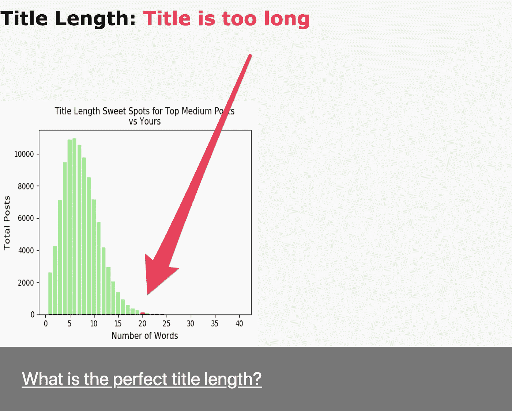
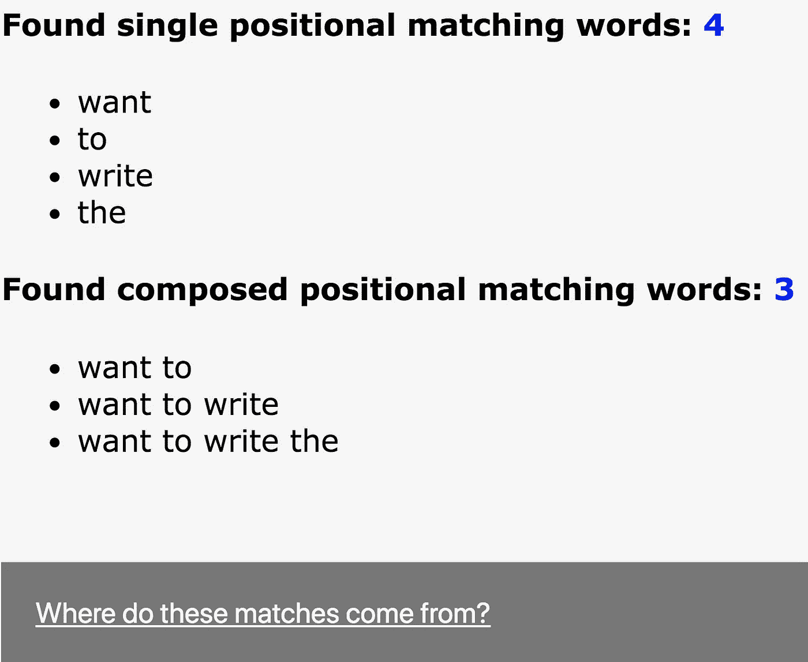

# 想写出最好的标题？然后将其与亚马逊和 Medium 的最佳产品进行对比

> 原文：<https://medium.com/swlh/want-to-write-the-best-title-stack-it-up-against-the-best-of-the-best-on-amazon-and-medium-69f8d433408f>

Source: Lucas Amunategui

> 如何开始完美的标题？从“如何”这几个字开始！

根据 [Kaggle 的开放数据源](https://www.kaggle.com/harrisonjansma/medium-stories)“从 Medium 收集的 140 万个故事”，大约有 4 万个标题以“How to”开头。

不写“如何做”的文章？它更像是一篇“是什么”还是“我如何”的文章？别担心，这些是接下来最流行的起始词。以下是前 30 名的首发组合:

*   如何
*   什么是…
*   我如何
*   为什么我
*   为什么是你
*   这是
*   你是…
*   什么我
*   最好的
*   为什么我们
*   如何
*   你是否
*   今后
*   建筑 a
*   我是
*   权力
*   我们如何
*   《如果你》
*   什么是
*   5 种方式
*   怎么了
*   认识一下
*   最
*   为什么呢
*   为什么
*   艺术
*   5 件事
*   想
*   去哪

前 30 名的三人组:

*   如何制作
*   如何获得
*   如何创造
*   如何构建
*   为什么你应该
*   的力量
*   如何使用
*   如何成为
*   的未来
*   我学到了什么
*   的艺术
*   的重要性
*   什么是
*   5 种方式
*   你怎么
*   开始使用
*   怎么写
*   一封公开信
*   如何成为
*   如何找到
*   如何购买
*   做什么
*   什么是
*   如何开始
*   给...的信
*   3 种方式
*   这是如何
*   对…的介绍
*   本周在

是的，这些话最能引起媒体读者的共鸣，让他们拍手叫好。很明显，我们渴望学习新的东西，并欢迎提高自己的技巧和窍门。注意:我并不是说你一定要以那种方式开始你的游戏才能成功，我只是在报告数据。

我在过去做过类似的事情，使用了大约 400 万本亚马逊畅销书(这里是和这里是)，发现亚马逊书籍标题偏好与中等标题相当一致。

# 标题的理想长度

亚马逊畅销书和媒体最受欢迎文章的理想标题长度在 5 到 10 个单词之间。

# 为你的下一个冠军打分的数据科学工具

所以我将所有这些课程整合到一个简单的网络应用程序中，为新的标题打分。它对所有人开放，而且是免费的。这是一项正在进行中的工作，可能会有错误(如果你看到一些奇怪的东西，请告诉我)。

我试了试这篇文章的标题“想写最好的标题吗？然后将其与亚马逊和 Medium 的最佳产品进行对比”。它给了我 90%的分数。是啊，我！以下是网络应用的截图:

## 标题倾斜

## 标题长度

## 起始词分析

去 http://www.viralml.com/title-analyzer[看看吧](http://www.viralml.com/title-analyzer)

感谢阅读，非常感谢 [harrisonj](https://www.kaggle.com/harrisonjansma) 收集这些数据并在 Kaggle 上发布。

查看我的新电子书，并在 ViralML.com[注册订阅我的时事通讯](http://www.viralml.com/signup.html)

Find my new eBook on [Amazon](https://www.amazon.com/Brand-Visibility-Traffic-Organically-amunategui-github-io-ebook/dp/B07KVQHVK7).

**曼努埃尔·阿穆纳特吉**

amunategui@gmail.com

在推特上连接:@amunategui

*作者* [货币化机器学习](https://www.amazon.com/s/ref=nb_sb_noss_2?url=search-alias%3Daps&field-keywords=manuel+amunategui)，[用在线课程创造收入流](https://www.amazon.com/s/ref=nb_sb_noss_2?url=search-alias%3Daps&field-keywords=manuel+amunategui)和[有机地发展你的网络品牌、知名度&流量](https://www.amazon.com/s/ref=nb_sb_noss_2?url=search-alias%3Daps&field-keywords=manuel+amunategui)。*amunategui . github . io 和 [ViralML](http://www.viralml.com/) 的策展人*

## 这篇文章发表在 [The Startup](https://medium.com/swlh) 上，这是 Medium 最大的创业刊物，拥有+409714 人关注。

## 在这里订阅接收[我们的头条新闻](http://growthsupply.com/the-startup-newsletter/)。

