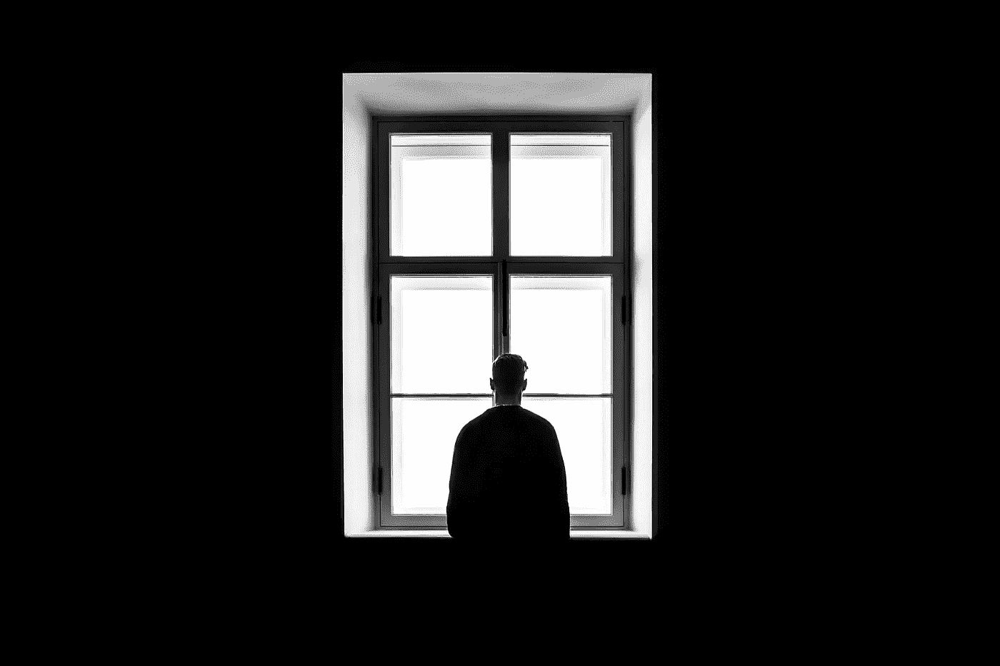

# 想成为一名作家是你的第一个错误

> 原文：<https://medium.com/swlh/wanting-to-be-a-writer-was-your-first-mistake-44edad10d4c0>

Photo by [Sasha Freemind](https://unsplash.com/@sashafreemind?utm_source=unsplash&utm_medium=referral&utm_content=creditCopyText) on [Unsplash](https://unsplash.com/search/photos/alone?utm_source=unsplash&utm_medium=referral&utm_content=creditCopyText)

当有人问*“你是做什么的？”，*我经常不得不停下来，努力应对我的现实处境——这也是许多业余作家面临的难题。一方面，我的职业头衔是“内容营销团队领导”，显然暗示我是作为营销人员来创造内容的。与此同时，我在广告，公共关系，平面设计和其他几个学科的平均水平…