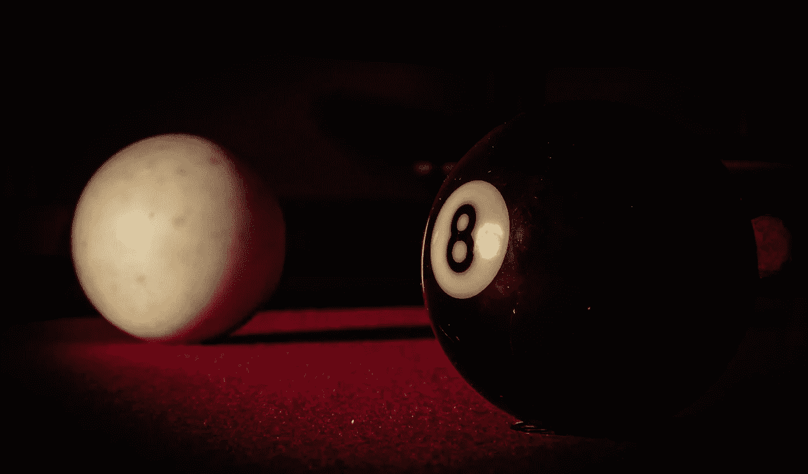
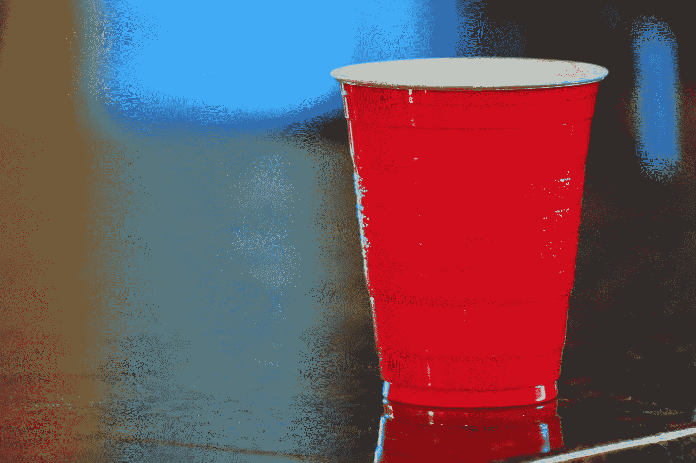

# 稻草之战:演变中的全球塑料思想和政策

> 原文：<https://medium.com/swlh/war-of-the-straws-evolving-global-thoughts-and-policies-on-plastics-5fc2e10985a>

塑料曾经被认为是当代生活的基石，打破了自然资源带来的一些限制，使大众更容易获得消费品。为什么几十年后，他们从英雄变成了恶棍？本文简要介绍了围绕塑料的心态和政治决策是如何随着时间的推移而演变的，到目前为止，全球呼吁禁止塑料吸管达到了高潮，这可能会朝着禁止大多数一次性塑料的方向发展。

Source: morguefile.com

**塑料英雄**

1863 年，台球公司 Phelan and Collender[【1】](#_ftn1)设立了价值 1 万美元的奖金，这一价值在 2019 年大致相当于 20 万美元。它的目标是找到一种替代象牙制造球的方法，因为这种材料非常昂贵，而且一根象牙只能用来生产 4 或 5 个球，从长远来看，这既造成了后勤问题，也造成了生态问题。与此同时，报纸开始公开质疑继续使用这种材料的可持续性。

受这一挑战的启发，出生于美国的发明家约翰·卫斯理·凯悦花了数年时间试图生产一种可以替代象牙的材料，经过多次迭代，直到他和他的兄弟命名为“赛璐珞”的成分，这是第一种人造塑料。事实证明，这种材料足以制造出类似象牙的球，并且成本较低，但它并不理想，特别是因为它具有挥发性，这也将导致它在游戏中两个球相撞时产生枪声。

然而，赛璐珞是替代其他一些动物产品的理想材料，比如以前由象牙或龟壳制成的梳子。在他最终成立的公司的营销中，凯悦宣称“电影让大象、乌龟和珊瑚虫在它们的栖息地得到了喘息的机会；不再需要在地球上搜寻越来越稀缺的物质。”[【2】](#_ftn2)

是的，塑料的出现对环境是一个福音。它为依赖动物生产的材料提供了一种替代选择，这一趋势随着 20 世纪 20 年代胶木的出现而继续，胶木是一种人造塑料，可用于组装几乎任何产品，为消费品的真正革命铺平了道路。用塑料生产的产品越多，它们就会变得越便宜，大众化和扩大了许多商品的供应。

Source: morguefile.com

**塑料反派**

随着材料生产的规模化和成本的降低，将塑料组装成一次性产品变得更加普遍。这颠覆了早期对塑料的思考方式，例如，更专注于生产一种可以像玻璃杯子一样长期使用的塑料杯。取而代之的是，为了方便消费者，更薄的杯子开始大规模生产，这种杯子可以一次性盛放饮料，并且可以丢弃。

这种垃圾在公共场所的积累在 20 世纪 60 年代首次变得引人注目，随着环保运动在全球北方以显著的方式形成，20 世纪 70 年代和 80 年代出现了许多关于海洋生物群落污染的研究，特别是关于塑料对动物的影响。因此，塑料行业率先采用回收来帮助缓解这个问题。虽然在某种程度上取得了成功，但研究表明，一连串的管理不善仍然导致大约 80%的废物堆积在自然环境中[【4】](#_ftn4)。

经过一段时间的兴趣降低，可能与回收努力的希望有关，在 21 世纪初，随着海洋中“垃圾带”的记录，这一主题再次出现。虽然这些碎片并不像通常描述的那样是固体碎片，但这些碎片仍然很危险，因为它们含有大量更小的、不断分裂的塑料颗粒。其中最引人注目的存在于太平洋北部，主要由来自亚洲的碎片组成。

随着这个主题再次升温，塑料袋成为环保主义者的优先目标，因为关于它们对地球造成潜在危害的报告越来越多。以塑料袋为目标的一个优势是，即使是在回收链的末端，它们也是不可取的，因为使它们适用于日常使用的薄度也使它们成为回收的麻烦。尽管如此，塑料行业仍在努力保持塑料袋的流通，并且出现了与塑料袋使用相关的禁令、限制和税收。截至 2019 年，15 个国家颁布了禁令，而几个州和城市也以独立的方式这样做[【6】](#_ftn6)。

Source: morguefile.com

**销毁所有吸管**

一次性塑料有必要吗？其中一些可能是可取的。这种情况的根本原因是它们便宜、可靠且卫生，通常减轻了对卫生和维护的担忧，并且这对于商品的销售者来说成本很低。这包括这些讨论发生时没有想到的部门，如卫生和医院。另一方面，也可以说这些成本只是外在化了，而对自然的破坏带来了大量看不见的成本。尽管如此，一次性塑料对世界各地的各种人都有好处，需要在围绕它们的决策努力中实现平衡，而这不一定是在这场辩论中实现的。

根除目标清单上的下一项是塑料吸管，它仅占全球塑料垃圾总量的 8%。这些物品对于促进发展中国家的液体卫生消费很重要，但在发达国家却被贴上了奢侈品的标签，因为这些国家受益于更严格的卫生法规和更可靠的商品储存和消费手段。影响口腔协调的残疾人团体和代表已经确认，餐馆中提供塑料吸管对他们来说是最理想的，而不是一些“自带”政策，但公司和立法者对此的反应不一致[【7】](#_ftn7)。

彻底禁止或严格限制塑料吸管的运动继续获得动力，但它来自哪里？一个名叫米洛·克里斯的男孩因在 9 岁时开始倡导只有在消费者提出要求时才能提供吸管而声名狼藉，他提出的一个关键论点是，他估计美国每天使用 5 亿根吸管，尽管受到无数演员的质疑，这一名言还是被媒体广泛使用[【8】](#_ftn8)。然而，大多数消息来源更有说服力地指向 2015 年的一个病毒视频，截至 2019 年，该视频的浏览量已超过 3500 万次，描述了一只鼻孔插着吸管的海龟以及随后痛苦的移除过程；与早前塑料救乌龟相反。这导致围绕这一问题的敏感性增加，环保主义者利用这一点，使其成为反对一次性塑料运动的下一个优先事项。

转折点出现在 2017 年左右，当时活动人士团体就这个问题向机构和立法者施压，以推动消除塑料的对话。尼尔·德格拉斯·泰森、拉塞尔·克罗、汤姆·布拉迪和汤姆·费尔顿等名人在他们的社交媒体上承诺“#停止吮吸”，并放大了这个问题的可见度，帮助建立了不使用吸管作为采取[【9】](#_ftn9)的良性立场。

这导致了一个相对便宜的提议，以改善光学性能，并被视为对环境有利，导致了有趣的情况，如星巴克取消了他们的塑料吸管，并用一个盖子取代它们，直接从杯子里喝水，使用更多的塑料；该公司确认其优势在于盖子实际上是可回收的，而不是大多数吸管[【10】](#_ftn10)。

传统上更环保的欧盟不想被认为是宽容的，因此进一步推动了这一问题，在 2021 年前颁布了一项禁令，禁止所有在其他材料中有替代品的一次性塑料，那些没有替代品的塑料需要在 2025 年前减少 25%，这一动议得到了强有力的政治支持[【11】](#_ftn11)。塑料行业本身也行动起来，成立了“终结塑料垃圾联盟”，初期投资 10 亿美元，并承诺迅速采取行动解决这一问题。

从经济角度考虑，不难勾勒出这一过程中的一些赢家和输家。随着塑料行业可信度的降低，最容易收拾残局的行业是纸制品行业，其次是金属和玻璃行业。一些生产更多可降解塑料吸管的公司在 2018 年及以后需求激增，但这些公司也带来了自己的问题。它们种类繁多，必然会引起人们的困惑，不知道应该用什么方法来分解它们，再加上这样一个事实，即如果与其他塑料一起回收，最终材料的质量会很差，因此价值会降低。

在这一切的核心，一个更显而易见、不那么飘渺的事情避开了头条新闻:由于新的“国家剑”政策，中国在 2018 年几乎停止进口再生塑料。该国曾经是世界上许多可回收物品的最终目的地，但突然提高了接受这些物品所需的标准，这样一来，对于许多回收行业的人来说，利润变得太薄，不值得做这笔生意。中国现在只吸收了前几年的 10%的塑料，这就提出了另外 90%该怎么办的问题。政策的改变已经导致东南亚海洋废弃物的观测水平增加。

随着塑料回收成为一种不太可行的经济选择，玩家们有理由进入抑制该行业，并在不那么耻辱的行业中寻找其他可行的收入来源。稻草之战确实有社会变革力量的支持，但最后的推动力来自中国的变量，使塑料行业变得比以前更混乱，更没有吸引力。向非塑料材料的转移将推动该行业，创造和破坏就业机会，最终将产生自己未知的问题，就像人造塑料曾经做过的那样。

*更多我的写作请访问:*[*www . markwd . website*](http://www.markwd.website)*。*

[【1】](#_ftnref1)[https://invention.si.edu/imitation-ivory-and-power-play](https://invention.si.edu/imitation-ivory-and-power-play)

[【2】](#_ftnref2)[https://www . scientific American . com/article/a-brief-history-of-plastic-world-conquest/](https://www.scientificamerican.com/article/a-brief-history-of-plastic-world-conquest/)

[【3】](#_ftnref3)[https://link . springer . com/chapter/10.1007/978-3-319-16510-3 _ 1](https://link.springer.com/chapter/10.1007/978-3-319-16510-3_1)

[【4】](#_ftnref4)[https://www.ncbi.nlm.nih.gov/pmc/articles/PMC5517107/](https://www.ncbi.nlm.nih.gov/pmc/articles/PMC5517107/)

[【5】](#_ftnref5)【https://science.sciencemag.org/content/347/6223/768】T2

[【6】](#_ftnref6)[https://www . new scientist . com/article/2176417-新西兰成为最新禁止塑料袋的国家/](https://www.newscientist.com/article/2176417-new-zealand-becomes-the-latest-country-to-ban-plastic-bags/)

[【7】](#_ftnref7)[https://www . the guardian . com/us-news/2018/aug/25/plastic-straw-ban-California-people-disabilities](https://www.theguardian.com/us-news/2018/aug/25/plastic-straw-ban-california-people-with-disabilities)

[【8】](#_ftnref8)[https://www . nytimes . com/2018/07/19/business/plastic-straws-ban-fact-check-nyt . html](https://www.nytimes.com/2018/07/19/business/plastic-straws-ban-fact-check-nyt.html)

[【9】](#_ftnref9)[https://www . vox . com/2018/6/25/17488336/plastic-straw-ban-ocean-pollution](https://www.vox.com/2018/6/25/17488336/plastic-straw-ban-ocean-pollution)

[【10】](#_ftnref10)[https://stories . Starbucks . com/stories/2018/Starbucks-announces-environmental-milestone/](https://stories.starbucks.com/stories/2018/starbucks-announces-environmental-milestone/)

[【11】](#_ftnref11)[https://www . europarl . Europa . eu/news/en/press-room/2018 10 18 IPR 16524/plastic-oceans-MEPs-back-eu-ban-on-throwl-plastics-by-2021](https://www.europarl.europa.eu/news/en/press-room/20181018IPR16524/plastic-oceans-meps-back-eu-ban-on-throwaway-plastics-by-2021)

[【12】](#_ftnref12)[https://www . national geographic . com/environment/2019/01/partner-content-global-alliance-to-end-plastic-waste-environment/](https://www.nationalgeographic.com/environment/2019/01/partner-content-global-alliance-to-end-plastic-waste-environment/)

[【13】](#_ftnref13)[https://www . ft . com/content/360 e 2524-d71a-11e 8-a854-33d 6 f 82 e 62 f 8](https://www.ft.com/content/360e2524-d71a-11e8-a854-33d6f82e62f8)