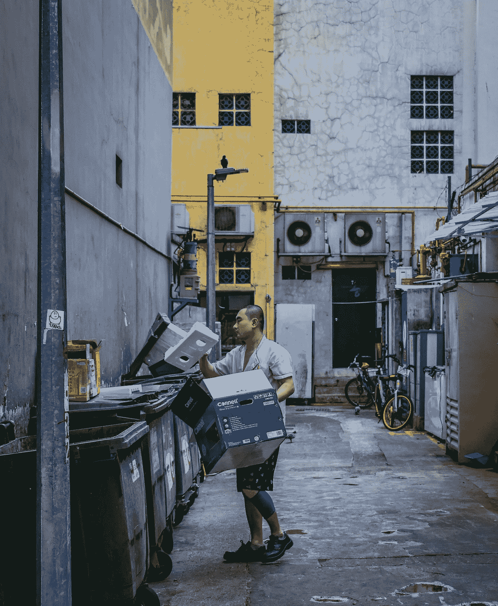

# 在 YouTube 上看翻垃圾视频

> 原文：<https://medium.com/swlh/watching-dumpster-diving-videos-on-youtube-bdc39d4e42bb>

浪费时间还是新的挣钱方式？

Photo by [Gervyn Louis](https://unsplash.com/@lordvyn?utm_source=unsplash&utm_medium=referral&utm_content=creditCopyText) on [Unsplash](https://unsplash.com/search/photos/dumpster?utm_source=unsplash&utm_medium=referral&utm_content=creditCopyText)

我刚刚花了大约四十分钟看了两个 You Tube 视频。题目？捡垃圾赚钱。

我以前没有看到过这个话题，虽然我并不感到惊讶。众所周知，我时不时会从垃圾箱里找出“好东西”。当然，我拯救的东西已经…