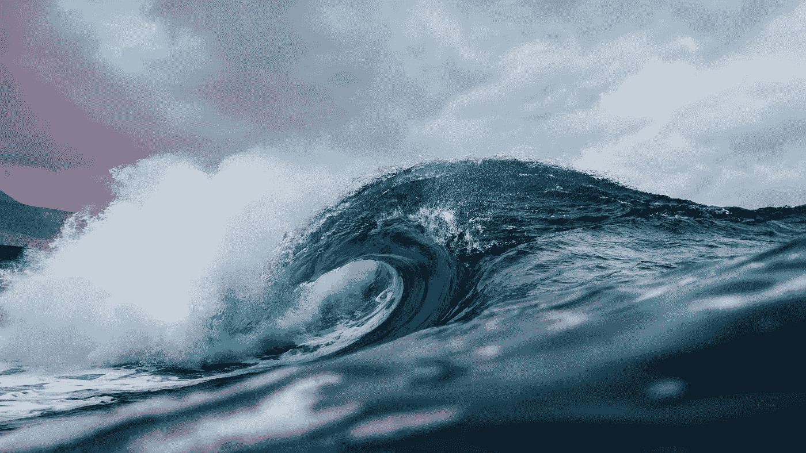

# 如何坚持，以及失败的波澜

> 原文：<https://medium.com/swlh/waves-of-failure-and-key-to-persistence-6ac39be99031>

## 半程马拉松教会我如何超越自己的极限

五周内的半马拉松，我跑的最远距离是 6 公里。显然，这是我第一次接受真正超出我极限的挑战。

*我踏上跑步机，希望能完成人生中第二次 10 公里跑。我以为独自运行它会像运行*一样容易…