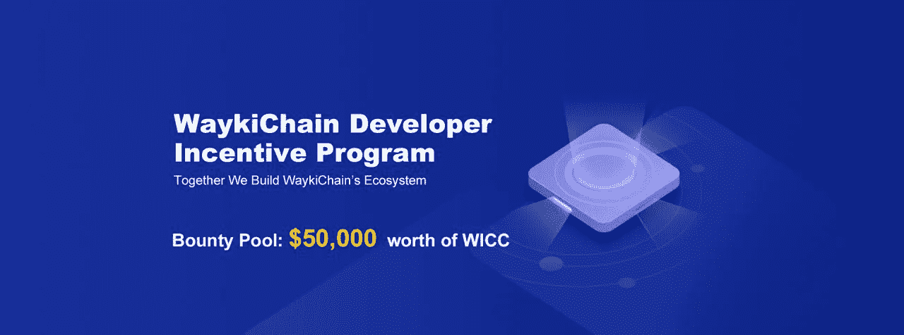

# WaykiChain (WICC)推出一项奖励 50，000 美元的开发人员计划！

> 原文：<https://medium.com/swlh/waykichain-wicc-launches-a-developer-program-with-50-000-in-rewards-d81d5a09e636>

> 想马上开始吗？WaykiChain 开发者门户，包括参与规则，可以在[这里](https://wicc.me/gb3)找到！

**关于 WaykiChain**
WaykiChain(WICC)是基于 DPoS 共识算法的第三代区块链，支持图灵完全智能合约。它能够维持每秒超过 1000 个事务的事务吞吐量。从长远来看，WaykiChain (WICC)的目标是提供一个安全、可靠和高性能的区块链技术平台，为预测市场、分散资产交易所和分散外汇交易所等多个行业提供动力。

**开发者门户** 2019 年 2 月 15 日，WaykiChain 英语开发者门户正式面向全球开发者开放。该计划旨在促进 WaykiChain 的公共区块链生态系统的发展。这些活动围绕 4 项任务展开。总共价值 50，000 美元的 WICC 代币将被送出。

**Timeline of WaykiChain Developer Program**

通过使用我们的 API，你可以了解 WaykiChain 的产品开发。您也可以为文档做出贡献，并与其他开发人员共享。[阅读更多](https://www.wiccdev.org/book/en/Introduction/introduction.html)

你可以找到 WaykiChain 提供的丰富的开发资源和工具来提高开发效率。[阅读更多](https://www.wiccdev.org/book/en/DeveloperHelper/developertool.html)

邀请您的开发人员朋友和同事加入 WaykiChain 的开发人员门户网站，赢取奖金！每成功一次邀请可获得 66 WICC。[阅读更多](https://www.wiccdev.org/book/en/Introduction/invite.html)

加入 WaykiChain 开发者激励计划，共建 WaykiChain 生态系统，获得奖金。优秀作品将有机会在 WaykiChain 社区展示。[阅读更多](https://www.wiccdev.org/book/en/Introduction/incentive.html)

> WaykiChain 开发者门户可以在[这里](https://wicc.me/gb3)找到！

# 激励任务列表

1.  [开发者志愿者招募](https://docs.google.com/forms/d/e/1FAIpQLSfsxQcbzK66-9-t3LlHOw-U1i7FMfgSBu8EupORuL-7XPaflA/viewform) : *$50 — $500 每周；*
2.  [节点部署](https://goo.gl/forms/EOdjifXAvQ51o2hC2) : *每个参与者 20WICC*
3.  [智能合约开发工具](https://docs.google.com/forms/d/e/1FAIpQLSdh6HLI3uKNEla0wKtF19ElfJ41MGqHRISMiouSFT4HmqBCjQ/viewform):*$ 600—$ 6500；*
4.  [创意 DApp 发展](https://goo.gl/forms/ZCcfBHuTWV91sfR63):*$ 800—$ 25000。*

> 以后会发布更多的任务！

# 为什么选择 WaykiChain 进行 DApp 开发？

*   通过 WaykiChain DApp 平台即服务快速开发和部署；
*   通过 WaykiChain 混合解决方案架构提高用户友好性；
*   与 POW 区块链相比，TPS 更高。

# 关注 WaykiChain 官方渠道获取最新更新:

*   [网站](https://www.waykichain.com/)
*   [开发商电报组](https://wicc.me/g3)
*   [英文电报组](https://wicc.me/pr9)
*   [推特](https://twitter.com/wayki_chain)

> 如有疑问，请联系:琳达—[marketing@waykichainhk.com](mailto:marketing@waykichainhk.com)
> 
> 电报技术支持 [@BlockchainWater18](https://t.me/BlockchainWater18)
> 
> 事件咨询 [@JessicaFang23](https://t.me/jessicafang23) 上电

## 这篇文章发表在 [The Startup](https://medium.com/swlh) 上，这是 Medium 最大的创业刊物，拥有+429，678 名读者。

## 在这里订阅接收[我们的头条新闻](https://growthsupply.com/the-startup-newsletter/)。

