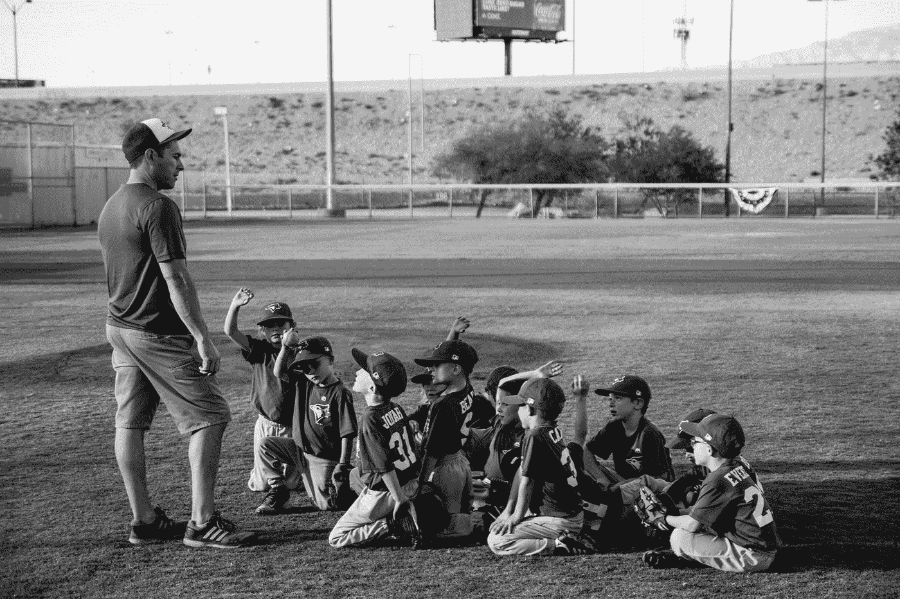

# 我们都需要一个蔻驰

> 原文：<https://medium.com/swlh/we-all-need-a-coach-8f4d79e90fc4>

## 找到你的老师并成为一名老师

Photo by [NeONBRAND](https://unsplash.com/@neonbrand?utm_source=medium&utm_medium=referral) on [Unsplash](https://unsplash.com?utm_source=medium&utm_medium=referral)

有些人可能不同意我们在生活中都需要一个教练的观点。为什么世界上最好的人需要教练？如果他们是最好的，其他人应该模仿他们。

如果我是世界上最好的网球运动员，为什么我需要一个教练？毕竟，我可以在一场网球比赛中击败那个“教练”。他们能给我带来什么好处？