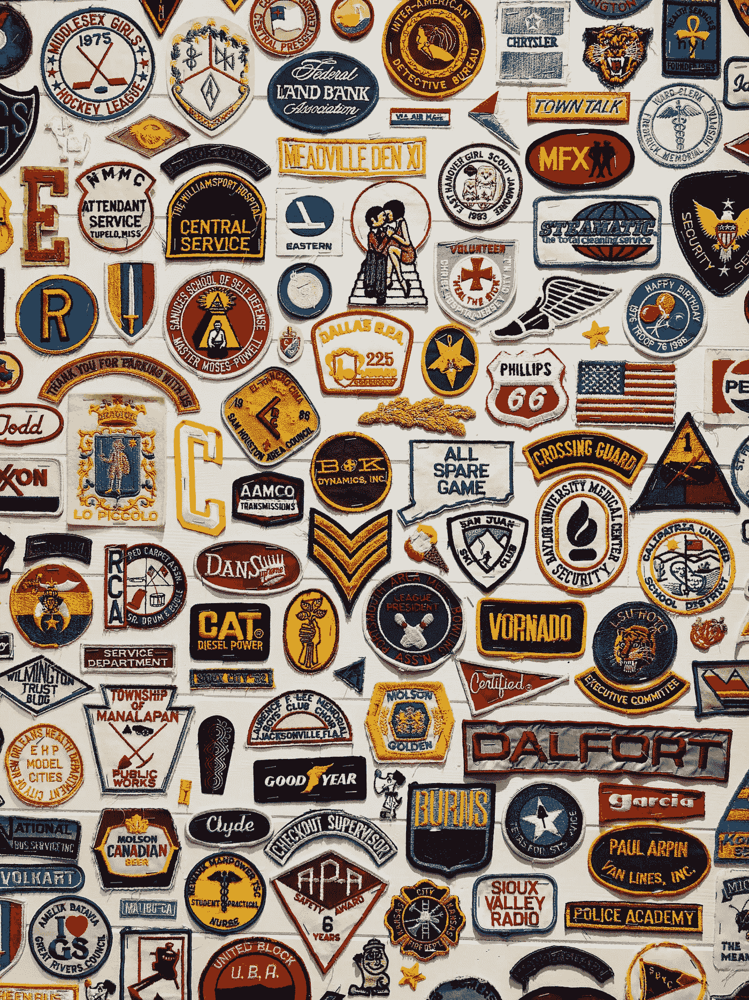

# 我们生活在一个垄断的时代

> 原文：<https://medium.com/swlh/we-are-living-in-a-monopoly-moment-67f7bbaf4a72>

Photo by [Joao Tzanno](https://unsplash.com/@jtzanno?utm_source=unsplash&utm_medium=referral&utm_content=creditCopyText) on [Unsplash](https://unsplash.com/search/photos/brands?utm_source=unsplash&utm_medium=referral&utm_content=creditCopyText)

想想看:在任何一个特定的市场领域，你最终都会发现只有三家公司占据主导地位。在航空业:联合航空、达美航空和美国航空控制了大约 70%的市场份额。其余 30%由所有其他运营商持有。在电信业:美国电话电报公司、Sprint/T-Mobile 和威瑞森几乎控制了 100%的市场！我可以继续…好的，我会的:

*   高端零售:诺德斯特龙，布鲁明戴尔…