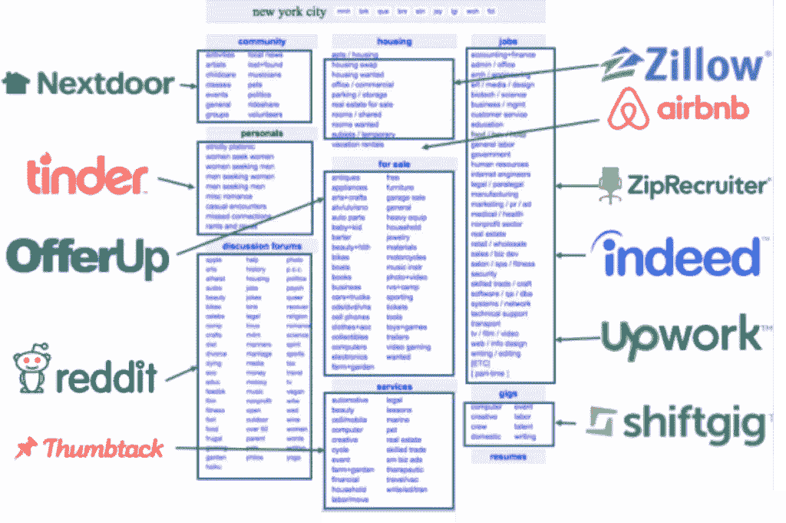

# 释放 1 万亿美元的机会。高价值服务市场的下一步。

> 原文：<https://medium.com/swlh/we-discovered-a-1-trillion-opportunity-and-we-took-it-bb969f70dcfe>

Photo by [Bill Jelen](https://unsplash.com/@billjelen?utm_source=medium&utm_medium=referral) on [Unsplash](https://unsplash.com?utm_source=medium&utm_medium=referral)

> “科技烂透了。我不明白！”
> 
> “为什么更改我的网站布局如此困难。不应该很容易吗？”
> 
> “哦该死的！？我需要为此与技术团队沟通吗？”

这是我采访非技术人士时，他们对技术的看法。

在过去的三年里，我们一直在以一个使命打造 Indiez。使技术大众化。今天，我们正在颠覆 4000 亿美元的庞大 IT 外包产业。

诚然，软件正在改变我们周围的一切。但是，大多数组织仍然使用传统技术。他们仍在将基础设施转移到云端，或者使用 2005 年建立的网站。有人可能会认为技术不是他们的关注点。那是错误的。2019 年，每个企业都需要驾驭数字化的力量。

2018 年 5 月，我度过了无数个不眠之夜。我一直难以回答的问题是——为什么科技对非科技公司来说如此困难。那时，我已经花了将近 10 年时间建立科技公司。对我来说，很容易将技术视为解决问题的工具。但是，我找不到为什么互联网上 90%的技术都很烂的答案！

*Website of United Healthcare, a public company:*

所以我决定环游世界，采访 100 名非技术领导者。我的发现改变了我的生活。

最重要的是——非技术领域的领导者工作出色！他们想用自己的方式改变世界。虽然身在硅谷，想用科技改变世界是很平常的事。但是世界上有一些了不起的人正在改变世界。迪拜的房地产开发商 Ahmed Faloudi 向我解释说，他的建筑启发了其他人。他打算通过树立新的榜样来改变世界。

像我这样的硅谷极客很难想象非技术世界。非技术世界有一个真正的问题——“技术恐吓”。

IT 外包是一个显而易见的解决方案。这个行业已经存在了大约 40 年。在此期间，网飞扰乱了娱乐业。两次。我们从 A 点到 B 点的旅行方式已经改变了。我们买东西的方式变了。

# 但是有一个行业还是老样子——IT 外包。

有 100 家网络平台尝试过。Upwork，Toptal，都是对一个行业的不同看法。他们的方法很好。但对于非技术型买家来说，则无关紧要。

Craigslist 在过去是一个很好的解决方案。当我们都在拥抱互联网的开放性时。我们已经看到不同的公司在这里分一杯羹:

注意这里没有提到软件。

当你在构建复杂且高价值的东西时，很难相信你在网上找到的供应商。你不会相信一家机构会外包你 50 万美元的项目。

这种情况正在改变。而且变化很快。感谢科技和市场的力量。今天，优步给你一种安全和信任的感觉。看到技术如何使你成为信任的代理，这难道不令人惊奇吗？

[据 A16Z 的合伙人陈楚翔](https://andrewchen.co/how-marketplaces-will-reinvent-the-service-economy/)报道，市场的下一步是托管市场。

这是陈楚翔的图表，它很好地描述了市场的历史

这里是 Indiez 适合的地方:

# Indiez 是世界上第一个软件托管市场。

与同行相比，托管市场提供了出色的客户体验。他们通过拥有价值链的主要部分来做到这一点。他们承担风险，并使用技术来减轻风险。例如——open door 购买房屋，然后出售。Opendoor 现在是一个 30 亿美元的风险投资。另一个例子是，Honor 雇佣护理人员作为 W2 员工，并对他们进行培训。还有更多——真的

Opendoor 为房地产行业所做的，我们是通过软件来做的。

先来了解一下软件外包的现状流程。

以下是寻找技术供应商的几种方式

*   DIY 工具——Wix 和 Square space 为建立一个基本的网站提供了很好的工具。但是，对于一个拥有数百万美元资产、网站上有大量内容的组织来说，Wix 是失败的。
*   推荐——古老的方式。在你的关系网中寻找能帮你找到好供应商的人。这里有很大的偶然性。如果你找不到合适的技术供应商，如果他们没有足够的带宽来承接更多项目，那该怎么办？
*   在谷歌上搜索——截至今天，大约有 30 万家技术供应商。鉴于技术的多样性，每个供应商都会专注于几个利基市场。例如——sales force、移动应用程序、Wordpress 网站、Kentico 网站以及数以千计的其他网站。即使我们能够找到 20-30 家可能非常适合这个项目的代理机构，开始的流程也应该是:

第一步:去他们的网站并填写表格。实际上，去 20 个网站填写同样的信息。

第二步:然后等他们回复，安排一个电话。

第三步:20 人中有 10 人会回复并接到电话。愉快地重复介绍，一遍又一遍地回答。10 个里面有 4 个是合适的，你可以从他们那里得到建议。

第四步:在四个人中，你只喜欢一对，并选择和他们一起工作。

## 今天的过程是如此令人生畏，它需要 3 个月，令人沮丧。我们与数百名客户交谈过，他们都有共鸣——“这令人沮丧。”

这个令人沮丧的过程是一些非技术组织落后的主要原因。

> 事实上，糟糕的是，大约 70%的技术项目没有达到预期的目标。这是每年大约 1100 亿美元的损失。这就像每年都在建设和抹去南佛罗里达。

我们想改变这种状况！Indiez 是软件行业的信托机构。雇用我们，我们将解决您的软件需求。保证。

不，我们不是代理商。我们是一个代理网络。优步是一个怎样的司机网络。你雇佣我们，我们为你雇佣代理，根据你的需要。

# 为什么我们比与代理商合作更好:

*   不再有电话和邮件。告别令人沮丧的过程。客户回答几个基本问题，我们就能为他们找到完美的代理。我们通过 120 多项标准对他们进行审查，请放心我们机构的质量。我们检查他们的代码、流程、沟通、招聘流程，甚至文化。截至今天，我们的网络中有来自 32 个国家的 180 多家机构。
*   通过利用数据的力量，我们确实接近完美的供应商项目匹配。例如，想象一下，你必须建立一个多语言、内容丰富的网站，并提供特定地理位置的内容。Indiez 可以为你找到一家过去做过这类工作的代理公司。风险低，没有麻烦。
*   我们通过与客户签订合同来承担风险。这意味着我们有责任交货。这为客户建立了大量的信任。
*   Indiez 客户经理通过观察软件开发过程中使用的工具中的数据来监督项目。例如，阿萨纳、吉拉、吉图布。这向我们的客户保证了质量。
*   请注意我们如何使用技术的力量。几个月前，我们的客户经理一次只能处理两个项目。今天，他们通过查看包含代码质量、状态等数据的自动化报告来处理 10。将来，他们将能够处理 100 个。
*   业内没有人做到过这一点。

# 我们的时机再好不过了。

服务全球化正在兴起。几乎每个国家都变得越来越习惯于利用他们没有的专业知识。此外，40%的美国员工表示他们更喜欢远程工作。我们实现了 100%远程的无缝全球协作。

除此之外，美国 95%的企业认为他们在技术上投资不够。每个企业都觉得自己在技术上落后了。但如今，技术购买过程是一场灾难。他们知道这一点。Indiez 是他们的福音。

这是我们从一位客户那里收到的电子邮件:

# 这能有多大？

*   根据美国 90 万家收入超过 100 万美元的组织
*   假设这些企业将收入的 5%用于技术。
*   每年 450 亿美元
*   截至今天，技术外包支出为 1600 亿美元

机会是巨大的！

# 影响:

衡量影响的唯一方法是了解我们如何帮助客户改变世界。因为如果他们成功了，我们也会成功。

贝恩公司想为他们的客户开发一种产品。他们的数字团队无法及时交付一些东西，因此他们雇佣了 Indiez。他们赢得了一笔大生意！

IALD 是一个拥有数百万美元资产的协会，对他们的技术供应商雇佣 Indiez 感到失望。现在，他们与一家英国机构合作推出了一个新网站。

想要帮助人们摆脱物质滥用的 Kenzo Lab 团队发布了他们的移动应用程序。现在他们正在帮助数百人。

当我们用技术赋予这些了不起的人力量时，我们确信我们将改变世界的运作方式。

每一位顾客，请推荐我们。每个客户都继续在几个项目中使用 Indiez。

这就是为什么，到今天为止，我们有这么多的线索，我们无法为他们服务。一些世界上最好的机构信任 Indiez。

软件开发的未来在于小型利基团队。来自世界各地的团队合作。我们致力于建设未来。

# 请登录 www.indiez.io 查看我们的网站