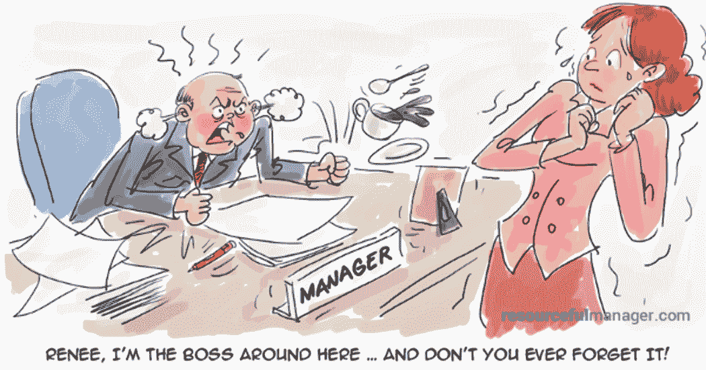

# 我们讨厌坏老板。那么，我们为什么会变成他们呢？这是研究

> 原文：<https://medium.com/swlh/we-hate-bad-bosses-so-why-do-we-become-them-heres-the-research-ac7d44ed56ef>

Credit: Resourceful Manager

“我的前任老板是个彻头彻尾的独裁者。他微观管理一切。”Reddit 上有人说。

此人继续说道，“我试图离开，并申请了我们公司的其他八个职位，他阻止或破坏了每一次尝试。”

> *“她不是一个坏人，但是她只是很难和*一起工作……