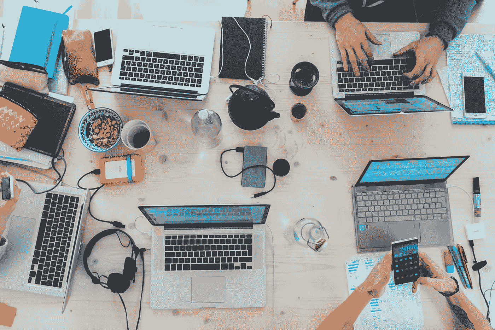

# 我们需要改变我们谈论人工智能和未来工作的方式。

> 原文：<https://medium.com/swlh/we-need-to-change-the-way-we-talk-about-ai-and-the-future-of-work-322346935fcc>

自从五年前我开始在人工智能领域工作以来，我被问到的主要问题是它将如何影响工作。我明白这种担忧源自哪里，而“ [80%的 IT 工作将被 AI 取代”](https://www.techrepublic.com/article/video-vinod-khosla-predicts-80-of-it-jobs-will-be-eliminated-by-software/)这样的统计数据正在帮助传播这种担忧。但是，我们需要将对话从问题陈述转变为机会陈述。而不是…