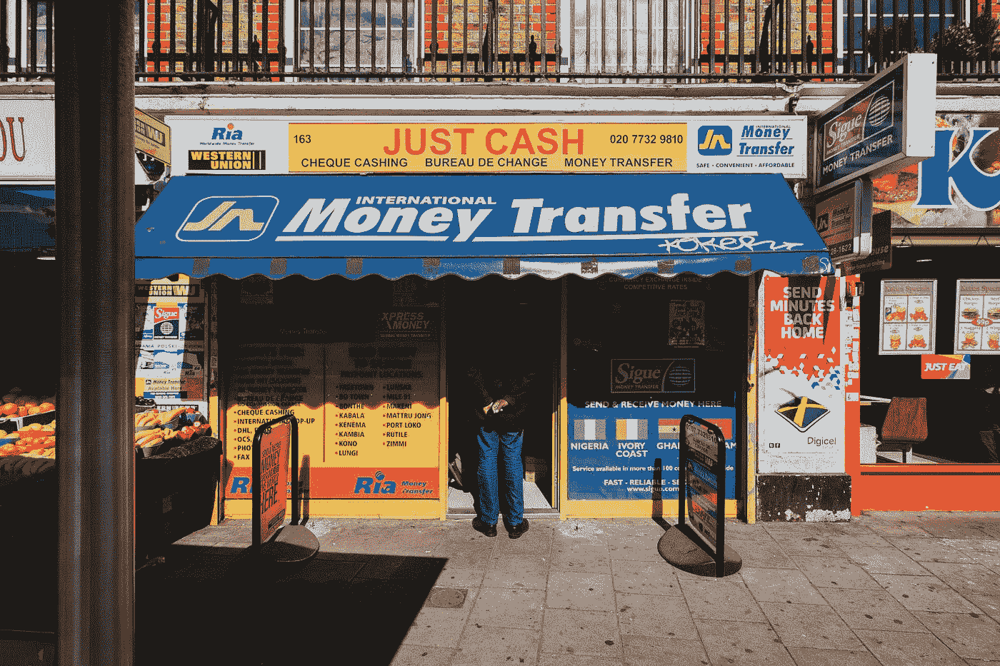

# 我们需要减少美国的收入不平等。钱从哪里来？

> 原文：<https://medium.com/swlh/we-need-to-reduce-income-inequality-in-america-where-will-the-money-come-from-1f5a92424436>

这是收入不平等解决方案的“哪里”部分。

Photo by [Alistair MacRobert](https://unsplash.com/@alistairmacrobert?utm_source=medium&utm_medium=referral) on [Unsplash](https://unsplash.com?utm_source=medium&utm_medium=referral)

# 什么是“财富的再分配？”

表面上看，答案是显而易见的；收入和财富将从富人那里转移到那些不那么幸运的人身上。人们可以称之为…的“再分配”