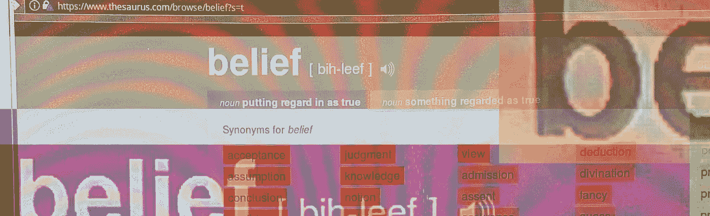

# 我们需要停止相信“信仰”

> 原文：<https://medium.com/swlh/we-need-to-stop-believing-in-belief-bc852f121a4b>

## 寻求真实性

Photo & collaging by the Author

> *“我不相信信仰。我认为信仰是一种非常愚蠢的力量。我感兴趣的是自由，我很早就注意到，一种信仰绝对排除了坚持其对立面的可能性，因此，如果你相信某种东西，你就……限制了自己。”*
> 
> *——特伦斯·麦肯纳(* [*《在教学树下》，1985 年*](https://www.asktmk.com/talks/The+Invisible+Landscape+%28Peer+Review%29) *)*