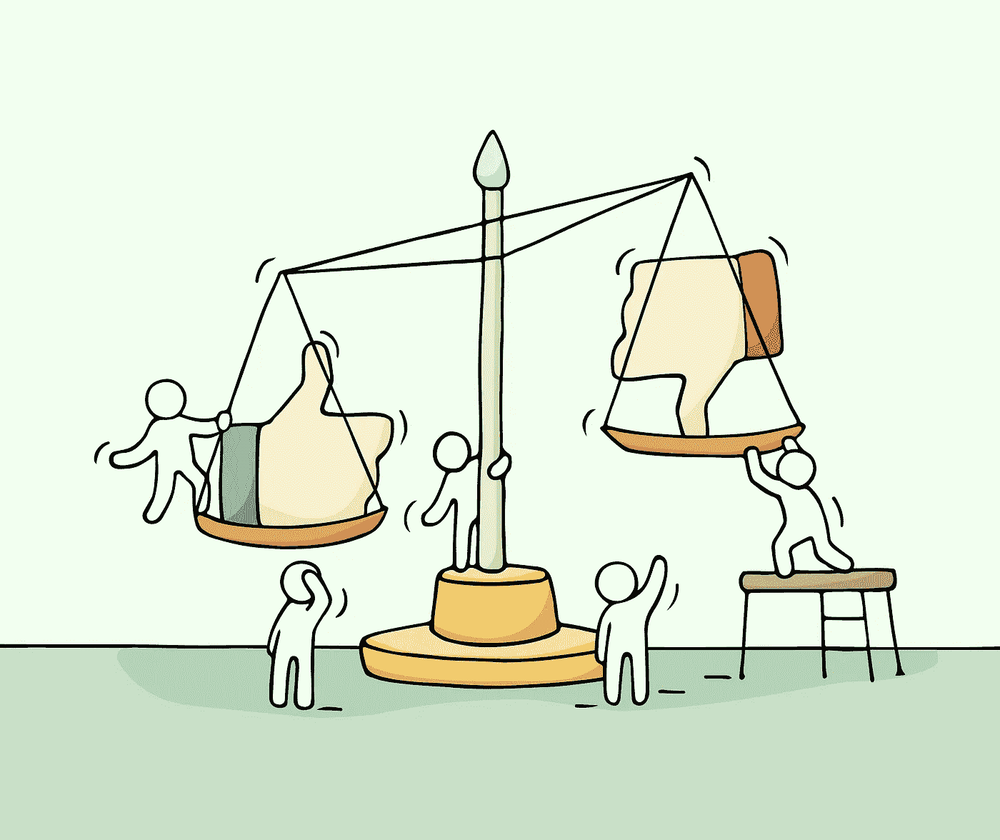
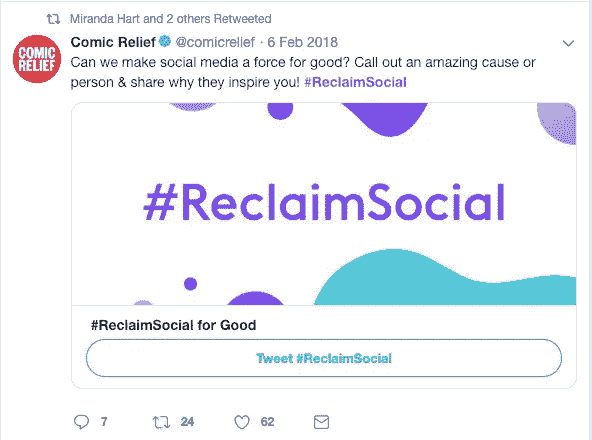
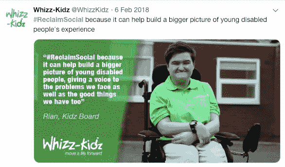
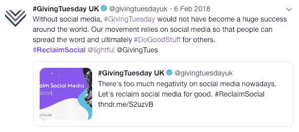

# 我们需要停止助长社交媒体的负面影响

> 原文：<https://medium.com/swlh/we-need-to-stop-fuelling-the-negative-side-of-social-media-6b462bb10b30>

## 我们如何改变自己对社交媒体的看法？让我们试着让社交媒体更鼓舞人心。一次一个帖子。

如果你搜索“社交媒体”，你很可能会找到关于假新闻、网络流氓、黑客、选举丑闻和仇恨攻击的帖子。

社交媒体已经赢得了一个有争议的名声，这是肯定的。有很多事情需要改变。

越来越多的研究表明它会对我们的健康产生负面影响。甚至有更多的研究表明，人们正在失去对社交媒体的信任。

问题是，我们实际上为所有这些做了什么？就像所有我们不喜欢的事情一样，**为什么我们不试着让它变得更好呢**？

据估计，T2 大约有 39 亿互联网用户。如果他们中的一半人发布了更多积极的信息呢？

> 如果数百万人在一天之内至少发布一条积极的信息会怎样？

我们的数字世界将会完全不同。

我们被负面新闻和虚假故事所包围。不管我们是否意识到，这些帖子甚至在我们没有意识到的情况下影响着我们。

当我们登录网站，在我们的新闻源上看到一个有压力或消极的故事和一个积极的故事时，会有不同的感觉和反应。我说的是真正积极和鼓舞人心的故事，而不仅仅是虚假幸福的图像。

当你看到巨魔接管一个帖子时，你会有回复的冲动。当你看到一个病毒式传播的故事时，如果你的朋友看到了，你就有更多的机会分享它。当有人上传一张在海滩上的快乐照片时，我们会觉得有必要喜欢这张照片。

但我们往往会忘记，社交媒体并不是一个替代现实。它应该被当作我们自己生活的另一部分，而不是一个人造的生命。

# 假快乐大卖

这就是我们容易做错的事情。我们认为快乐在社交媒体上“销售”,我们最终构建了一个虚假的社会身份，我们只分享快乐和新闻，让我们吹嘘自己的成就。

然而，我们真正需要的是真正鼓舞人心的故事。从上班路上一个随意的善举到一条让你开心的好消息。

我们倾向于在社交网站上强调我们生活中的重要时刻，而忘记了小事情是如何产生影响的。

庆祝让你快乐的最微小的时刻是一种解放。它激励更多的人发布类似的消息。幸运的是，这样的帖子仍然很受欢迎。

这就是我们如何在一个真正鼓舞人心的新闻反馈中结束的，人们变得更开放、更积极、更真实。

# 为什么#ReclaimSocial 能引起这么多人的共鸣

2017 年 12 月，我们在 Lightful 开展了#ReclaimSocial 活动。

我们希望发起一场与我们的价值观和我们的信念相一致的活动，我们相信社交媒体可以真正鼓舞人心。我们只是容易忘记突出这样的时刻。

这个信息很简单，*“外面有太多的消极，让我们#永远回收社交网络吧。”*

2018 年 2 月 6 日，#ReclaimSocial 达到了 1000 万人，给了我们一个积极乐观的全新视角。

人们分享各种鼓舞人心的信息，说他们终于可以找到谈论重要事情的鼓励。

但是一天是不够的。这就是为什么我们要把这个活动变成一个年度提醒，提醒人们社交媒体可以更积极。

## # 2019 年回收社交

人们在推特上谈论激励他们的积极活动或者非营利组织如何对他们的工作产生影响，这是非常令人兴奋的。出版商可能认为这些故事不会成为头条新闻，但我们实际上需要更多这样的帖子。

他们真的很鼓舞人心，他们帮助我们看到了社交媒体的另一面，人们聚集在一起，同意并非一切都是负面的。

今年，我们专注于积极的信息传递。我们希望在一天中看到尽可能多的积极信息。

> 让我们停止助长社交媒体的负面影响。让我们#永远回收社会。

如果你想看到社交媒体的另一面，请关注 2 月 6 日的 [#ReclaimSocial](https://twitter.com/hashtag/reclaimsocial?f=tweets&vertical=default&src=hash) 。

# 如何改善你的社交媒体体验

就像每一次改变一样，说你不能独自改变世界是很容易的。但是，如果我们都开始监控我们的上网习惯，以改善它们呢？

*   **更加注意**:关注你的数字福祉和心理健康。分析你的上网习惯，消除让你紧张的因素。
*   **把网上对话当成你现实生活中的对话**:许多人使用他们的网上“匿名”(如果它仍然被这样对待的话)以一种不同于他们在日常生活中的方式交谈。如果我们都开始应用这一点，社交媒体将会大不相同。
*   更加谨慎:一个需要访问你的数据的有趣的小测验不再那么“无辜”了。同样的情况也发生在电子邮件上，这封邮件据称来自你的银行，要求你回复你的银行的登录信息。
*   关注重要的事情:很容易与巨魔或愤怒的人展开对话，试图改变他们的想法。虽然参与健康的谈话是个好主意，但你不想太投入。同样的情况也发生在你可能在 Instagram 上关注的人身上，让你对自己的生活或身体感到糟糕。让我们把注意力放在重要的事情上。
*   **过滤信息**:假新闻无处不在。而且我们并不总能判断它是否准确。我们仍然可以在分享之前过滤信息。
*   **更加积极:**社交媒体上的负面太多了。还有大量虚假的快乐。如果我们开始用真正积极的故事来改变这种叙事，让我们的生活变得美好，会怎么样？

现在你可能在想，这些东西会让一切变得完美吗？肯定不是。但是我们可以试着改善我们的在线体验，让它变得更加专注和有弹性。

我真的相信社交媒体可以更鼓舞人心。令人兴奋的是，看到# ReclaimSocial 的信息与我们每天交谈的许多人产生了共鸣。

一步一步来。乐观的一瞥。庆祝一个小小的胜利。

## 在 [Reclaim Social 播客](https://open.spotify.com/show/38Mn902Mz8D67vqgVPzXTM)中聆听更多鼓舞人心的故事🙌🏼

## 这篇文章发表在[《创业](https://medium.com/swlh)》上，这是 Medium 最大的创业刊物，有+419，678 人关注。

## 在这里订阅接收[我们的头条新闻](http://growthsupply.com/the-startup-newsletter/)。

