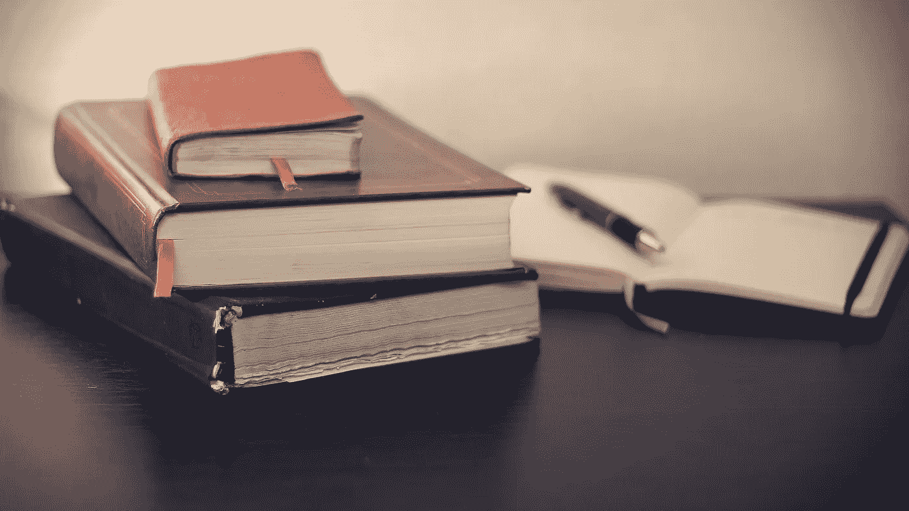

# 我们需要谈谈阅读

> 原文：<https://medium.com/swlh/we-need-to-talk-about-reading-900ea82a57e1>

## 重新定义一个作家能为他们的行业做的最重要的事情

Image by [Free-Photos](https://pixabay.com/users/Free-Photos-242387/?utm_source=link-attribution&utm_medium=referral&utm_campaign=image&utm_content=690219) from [Pixabay](https://pixabay.com/?utm_source=link-attribution&utm_medium=referral&utm_campaign=image&utm_content=690219)

> 如果你想成为一名作家，你必须首先做两件事:大量阅读和大量写作——*斯蒂芬·金，在写作上*

如果作家有一个戒律清单，“读”可能是数字 1，3，8 和 17。

> **“他对他读的东西很小心，因为那个** …