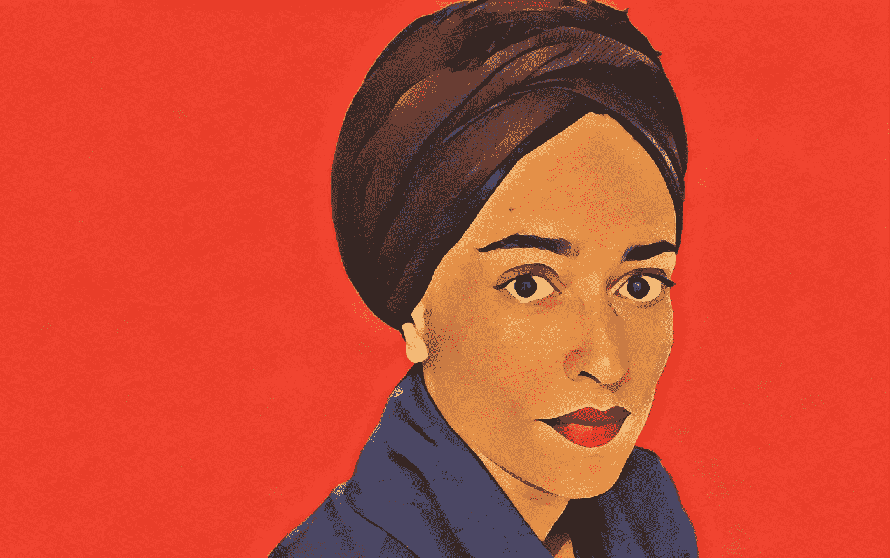

# 我们需要谈谈査蒂·史密斯:为什么整整一代人放弃写作

> 原文：<https://medium.com/swlh/we-need-to-talk-about-zadie-smith-why-an-entire-generation-quit-writing-855b03a6e61e>

Portrait by Inez & Vinoodh

前几天，我在 Skype 上与另外两位作家会面，他们正在努力创作他们的第一部小说。作为作家，我们每个人都取得了成功。我自己是一个回忆录作者和代笔人。另一个是记者和美食评论家。第三个是创意写作教授和短篇小说作者。然而，我们都快 40 岁了，或者稍微过了一点，却没有达到…