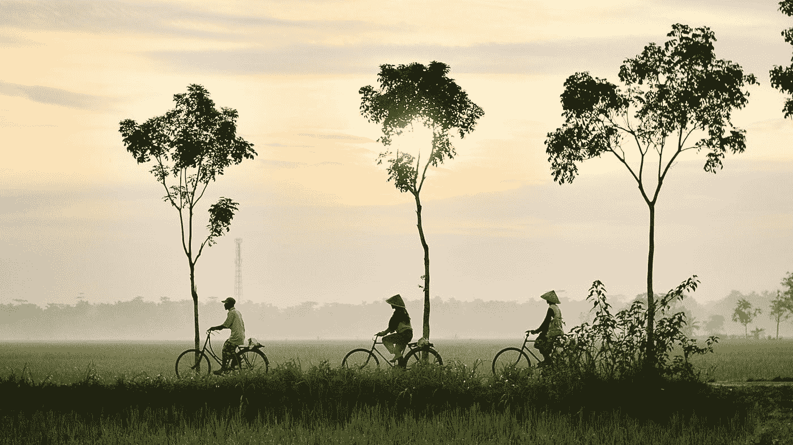

# 从产品到解决方案:如何将你提供的东西重新组织成人们既想要又需要的东西

> 原文：<https://medium.com/swlh/we-sat-around-the-table-all-day-yesterday-surrounded-by-bowls-of-indonesian-soup-and-fish-e332e5663c9d>

Photo by [Dikaseva](https://unsplash.com/@dikaseva?utm_source=medium&utm_medium=referral) on [Unsplash](https://unsplash.com?utm_source=medium&utm_medium=referral)

昨天我们围着桌子坐了一整天，周围都是几碗印尼汤和鱼。天空倾泻在我们身上。这是雨季。在传统的印尼陡峭屋顶下，雨水从我们周围滑落，为我们的谈话营造了一个交响乐的背景。