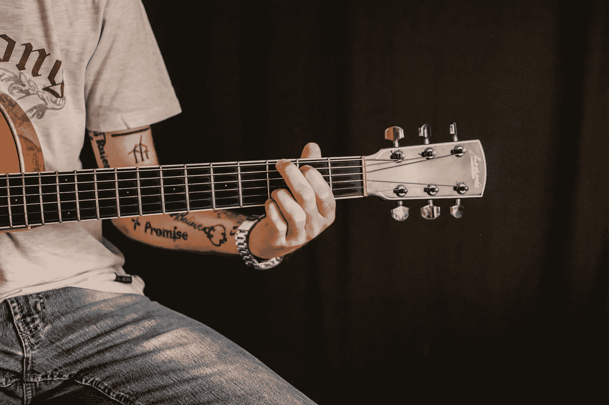

# 我们不应该担心其他的事情

> 原文：<https://medium.com/swlh/we-shouldnt-worry-about-the-other-things-a20c14417952>

## 那些东西是最重要的东西的副产品。

Photo by [Nicole Honeywill](https://unsplash.com/photos/VYLZfRF1ohw?utm_source=unsplash&utm_medium=referral&utm_content=creditCopyText) on [Unsplash](https://unsplash.com/?utm_source=unsplash&utm_medium=referral&utm_content=creditCopyText)

我在 Medium 上的第一篇帖子 [是关于我和其他人在我的第一份事业中成功发展的失败尝试。](/@keithhortn/how-to-fail-as-a-freelancer-139c9fadb8fc)

我年轻(呃)，对我之前应该知道的事情一无所知，而且顽固不化。