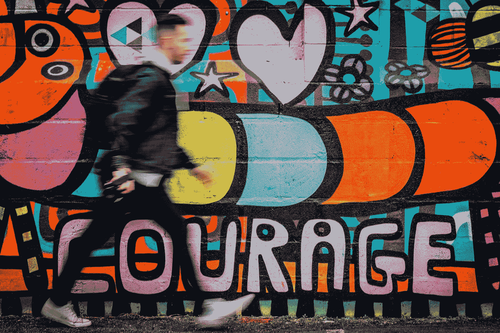

# 我们认为我们需要无所畏惧(我们没有)

> 原文：<https://medium.com/swlh/we-think-we-need-to-be-fearless-we-dont-2b88dd8a414a>

Photo by [Oliver Cole](https://unsplash.com/@oliver_photographer?utm_source=medium&utm_medium=referral) on [Unsplash](https://unsplash.com?utm_source=medium&utm_medium=referral)

我们不需要无所畏惧。我们常常认为我们有，然后我们会因为害怕而感到内疚和羞愧。但是，无所畏惧往往是愚蠢的，没有计算成本或留意警告信号。

> 生活不需要我们的无畏。这需要我们的勇气。