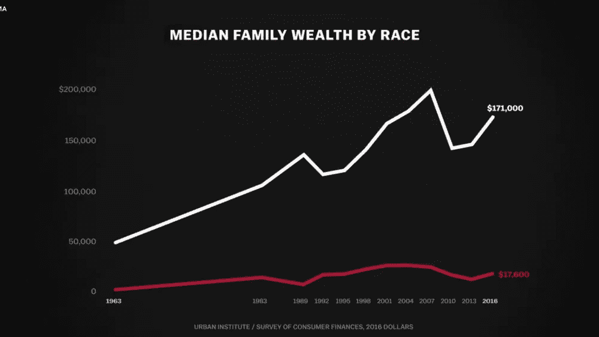

# 蓬勃发展的经济？不是每个人都这样。

> 原文：<https://medium.com/swlh/wealth-is-different-671893bf3488>

贫富差距越来越大。为什么？鸣谢: [*Vox 传媒*](https://www.netflix.com/watch/80243753?trackId=14170289&tctx=0%2C19%2Cefe0a3bf-38a0-4bcd-a50a-812eccac7d40-38398288%2C7498c4d1-a751-47d1-bace-7fad0b06abb7_15853401X3XX1549072550642%2C7498c4d1-a751-47d1-bace-7fad0b06abb7_ROOT)

尽管各行各业的有色人种都成为了总统(嗨，奥巴马！)，以及内阁官员、大公司的首席执行官、法学家、企业家和体育明星，很少有人成为富人。

这种现象被称为种族财富差距，本质上是衡量…