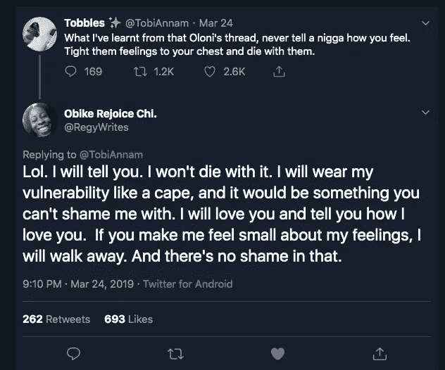
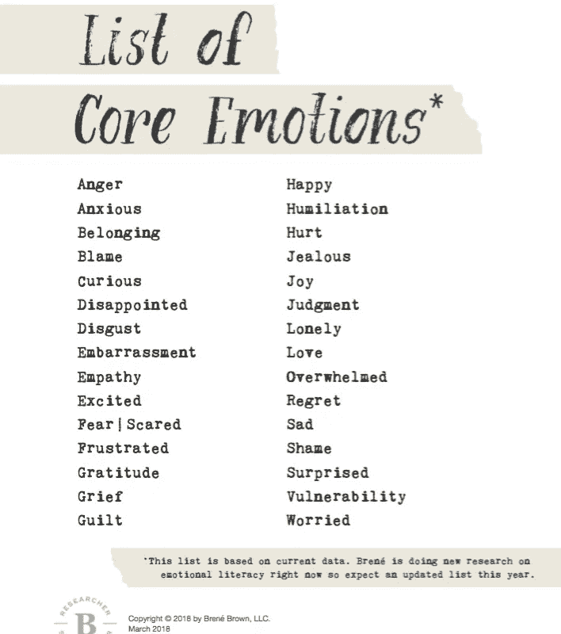
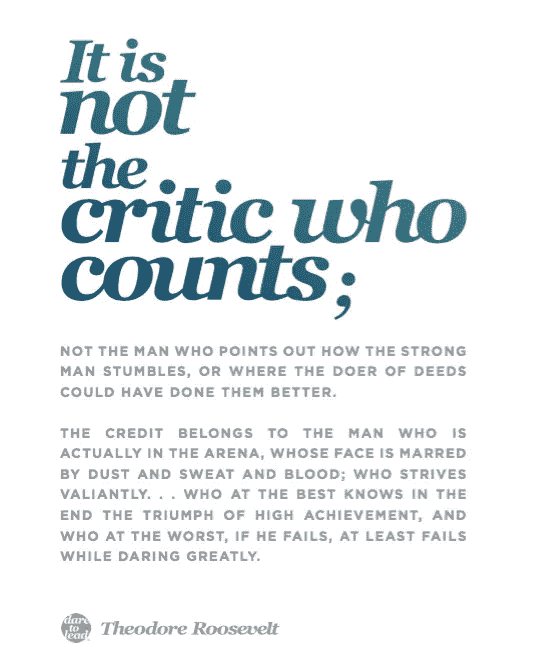

# 像斗篷一样穿着脆弱

> 原文：<https://medium.com/swlh/wearing-vulnerability-like-a-cape-5e66cacd0048>

## 为更有意义的对话和关系干杯🍷

Photo by [TK Hammonds](https://unsplash.com/@tkristin?utm_source=medium&utm_medium=referral) on [Unsplash](https://unsplash.com?utm_source=medium&utm_medium=referral)

在过去的一年里，我一直想去看心理医生。这种欲望从何而来？嗯，我认识的一些人参观过一个，我是这个节目[亿万](https://www.sho.com/billions)的超级粉丝——如果你知道，你就知道。你可以做好最佳表现的准备，这个想法让我很兴奋。虽然我还没见过，但我最近有过一次接近治疗的经历。

我刚刚读了布琳·布朗的新书——[敢于领导](https://www.amazon.com/Dare-Lead-Brave-Conversations-Hearts/dp/0399592520)，读它是一种改变人生的体验(我很少用这个词)。我希望更多的人会读它，这是我今年读过的最好的书之一。

Best response!

就像许多人一样，我多次挣扎于艰难的对话和表达自己，阅读《敢于领导》帮助我去除了所有 BS I 告诉自己的东西，并在表达自己时找到了清晰度。我还没到那一步，但我肯定不是以前的我了。

❤

这里有一些来自布琳·布朗的关于更好的谈话和关系的建议。

## 1.我感觉如何

说出你所感受到的情绪是很重要的。是恐惧、羞耻、快乐、好奇还是悲伤？

In case you’re looking for the right word| Source: [Brené Brown](https://brenebrown.com/downloads/)

识别你所感受到的情绪是一个很好的起点，首先学习情绪的含义可能是值得的。

当然，也有情绪[不那么清晰](https://www.psychologytoday.com/us/blog/theory-knowledge/201701/understanding-emotions-and-how-process-them)或者它们[不仅仅是流行](https://thoughtcatalog.com/brianna-wiest/2016/02/40-words-for-emotions-youve-felt-but-couldnt-explain/)的时候——听说过 Occhiolism、Liberosis 或 Pã ro 吗？

> 帕罗
> 
> *n* 。这种感觉是，无论你做什么，都是错误的——任何让你在这个世界上过得舒服的尝试，最终都只会越过一些看不见的禁忌——就好像有一些明显的出路，除了你，其他人都能看到，他们每个人都靠在椅子上，发出有益的呼喊，冷，冷，冷。

诊断这种情绪需要时间，但是通过练习，你会更快地发现这种情绪。

## 2.为什么我会有这种感觉

情绪往往有触发因素，有些是内在的，有些是外在的。

原因可能不会立即出现，或者有时我们无法追踪到它，直到我们和其他人交谈。

例如，我不信任别人是因为发生在我身上的一些动摇信任的事件，我不耐烦是因为我筋疲力尽。

## 3.我听到你说的话

啊哈！这里变得很有趣，人们很容易说这样的话“你认为我很傻，因为你所做的只是指出我做的错误的事情”或者“我对你来说不重要，因为你忽略了我说的事情或者忽略了我”。

重要的是，在陈述某人所说的话时，你应该表述为“这是我听到你说的”，而不是“你在说这个”

更好的方法是:

我听到你说我很蠢，而你所做的只是指出我做的错事。

当你忽略我说的或忽略的事情时，我听到你说我对你来说不重要。

## 4.我告诉自己的故事是因为我听到你说的话

当我们没有所有相关的事实时，我们会编造故事来试图理解事情。在没有数据的情况下，我们总会编造故事。

***我们编的第一个故事就是我们所说的“傻逼初稿，(SFD)***

让我们更进一步，“当你忽略我说的事情或忽视我时，我听到你说我对你不重要，因此，我告诉自己的故事是我对你不重要。

啊！对于喜欢开门见山的人来说，这可能会让人觉得话太多，但公平地说，这似乎是一种更好的沟通方式。

## 5.**让我们绕回来**

当谈话变得激烈或你不清楚时，选择退出是可以的。

Brené说,“当有困难的对话时，回过头来让我们有机会在有时间充分处理后重新进行对话或互动。我需要考虑一下。我们能一小时后回来吗？

有时候，在一次艰难的谈话中，你会发现自己处于防御状态，或者需要时间思考。在特定的时间段内请求一个带圆圈的暂停是有帮助的。这表明你正在仔细考虑这次谈话，而不是急于安抚或驳回谈话内容。我想我需要休息一下。我们能不能绕回来，几个小时后再结束这次谈话？”

## 还有一点

重要的是你承认自己的错误，道歉，并做出补偿。

Is it that saying **I’m sorry** isn’t enough or is it how we **say** I’m sorry that’s not good enough?

## 谁算数？

✌

我希望你尝试一下这些建议，它会改变你与人交流和联系的方式😊

**有一点需要注意的是，仍然会有这样的情况，即使在应用了这些技巧之后，其他人仍然不会以合理的方式敞开心扉或做出回应。记住，每个人都在进步。**

****感谢阅读，希望你从我的帖子中学到一些东西。你可以在任何平台@danieltadeyemi 访问我的*** [***网站***](http://danieladeyemi.com.ng/) ***在那里你可以注册我的*** [***简讯***](http://danieladeyemi.com.ng/newsletter/) ***来获得我的进展或我正在学习的内容的每月更新。****

**

## *这篇文章发表在 [The Startup](https://medium.com/swlh) 上，这是 Medium 最大的创业刊物，拥有+438，678 读者。*

## *在这里订阅接收[我们的头条新闻](https://growthsupply.com/the-startup-newsletter/)。*

**