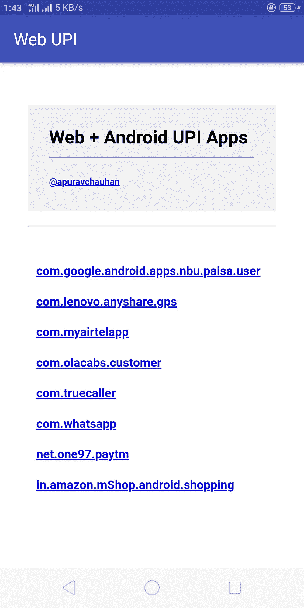
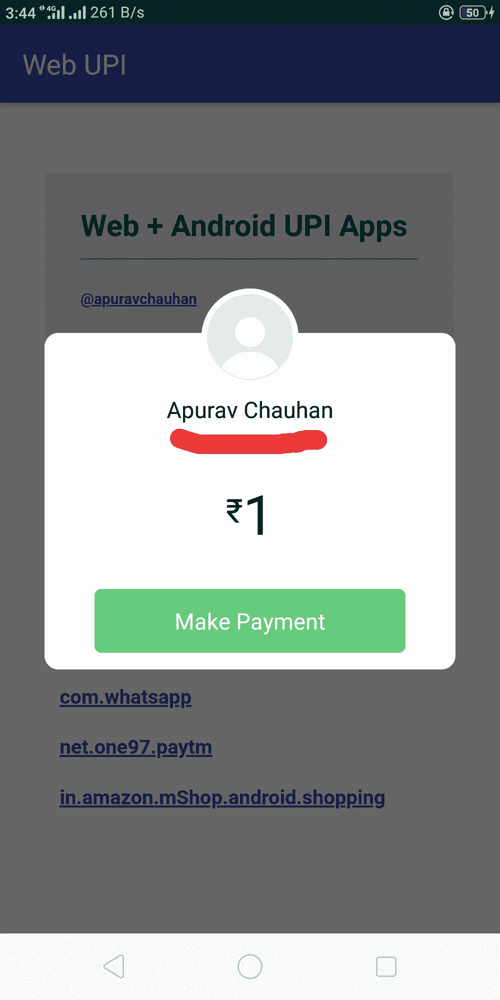

# Web(视图)和 UPI

> 原文：<https://medium.com/swlh/web-view-and-upi-7d3e8c346a2c>

## *这篇文章探讨了手机上的网络和 UPI 应用程序之间的互通。*

*Web UPI*

*TL；DR:这篇文章谈到了在你的 android 设备上，通过运行在 webview 中的网页/混合应用程序来定制 UPI 应用程序选择器。*

[在 playstore 下载演示应用](https://play.google.com/store/apps/details?id=com.apuravchauhan.apuravupi)

[Github 源代码](https://github.com/apuravchauhan/web-upi)

# 背景

**统一支付接口(UPI)** 在金融领域获得了越来越多的关注，随后开发人员和公司正在寻找方法来探索其在 web 上的用例。由于合众国际社要求验证您的手机号码，所以它只在您的手机操作系统上工作，而不是在网页/HTML/JS (android，iOS 等)。

希望将 UPI 整合到其网页中的公司仍然无法围绕 UPI 构建用户体验，因为他们无法在手机/ android 上访问可用于处理 UPI 的应用。

**例如:**假设我们希望在网页(HTML、JS 等)上建立一种体验，允许客户在手机上选择可用的 UPI 应用程序，如 Google Pay、PhonePe、Paytm、Airtel、Whatsapp 等，并通过该应用程序启动支付。

# 解决办法

所有主流的移动操作系统(android、iOS 等)都为你提供了通过 JS 添加一个桥接层的方法，允许你调用用本地语言编写的本地实用程序和函数。对于 android，JS 桥可以在内部将调用路由到本地 Java api 调用。(*这就是* [*科尔多瓦*](https://cordova.apache.org/) *在幕后做的事情*)。

所以在 HTML/JS 方面，可以把它想象成在 javascript 中暴露了一个全局 jquery/angular/React 变量，通过这个变量，你可以调用不同的方法，这些方法在内部调用本地方法。

# 这是如何工作的？

当你在 android 应用程序中通过 webview 打开 HTML JS 网页时，你实际上可以完全控制 webview 内部发生的任何通信。就像你的浏览器上的一个代理，可以跟踪你在网络视图中做的一切，就像一个迷你浏览器，你可以通过编程来操作(**非常小心！**

# 让我们编码

以上是我们的 MainActivity.java。不要担心细节，(代码可在最后的下载部分获得)只要明白当你构建一个混合应用程序时，android 应用程序将在幕后执行以下步骤:

1.  创建网络视图。(第 19 行)
2.  在 webview 中启用 JS 用法。(第 22 行)
3.  注册一个全局 javascript 变量 **"ApuSDK"** 名作为我们的 JS 接口。该变量指向具有方法实现的 Java 对象(WebAppInterface)。参见下面的要点。(第 23 行)
4.  加载你的 html 文件。(第 29 行)

## 下面是 WebAppInterface 的示例实现

> 可以看到用@JavascriptInterface 注释的方法。这些方法可以通过 HTML/JS，通过我们在前面的 gist 中定义的全局变量(“ApuSDK”)来调用。
> 
> 用您的 UPI 句柄替换上面的第 20 行

在上面的代码中， **upiHandlers** 方法将给出一个本地调用，以返回可以处理 UPI 支付的所有 UPI 应用程序的列表

第二个方法 **openUPIHandler** 从 HTML/JS 中获取关于打开哪个应用程序的两个参数，并转发对本地方法的调用以打开实际的应用程序。参见下面的要点(第 33 行和第 48 行)

## 下面的代码用于你的 HTML 网页

> 结帐行 33 和 48 在上述要点。你可以看到我们使用全局变量 **ApuSDK** 来调用 java 方法。虽然这看起来像是一个 JS 调用，但是在内部它将这个调用路由到前面定义的 WebAppInterface.java 要点中定义的 java 方法。

下面是最终目标:

Customised UPI app selection in HTML and JS (web view)

# 引人深思的事

我们刚刚看到如何通过网页做到这一点。你们中的一些人一定想知道它对纯粹在网页上工作的人有什么用。这对于那些通过 Cordova、Ionic、Phonegap 等构建 web 技术(HTML /JS)混合应用程序的人来说很有用。

这些框架允许您添加插件来访问任何本机功能。上面在 WebAppInterface.java 展示的代码可以用在你的插件中，它可以让你直接在你的网页中访问 android 上的 UPI 应用程序。继续把它转换成一个 cordova 插件作为作业:)

如果你需要任何进一步的帮助，请随时发微博给我@apuravchauhan。

# [计] 下载

本教程中使用的源代码是在 [github](https://github.com/apuravchauhan/web-upi) 上开源的。播放、探索并分享您的反馈。

在 [playstore](https://play.google.com/store/apps/details?id=com.apuravchauhan.apuravupi) 上玩 live app。