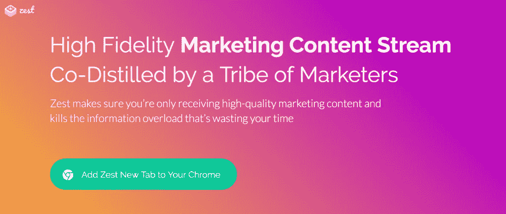
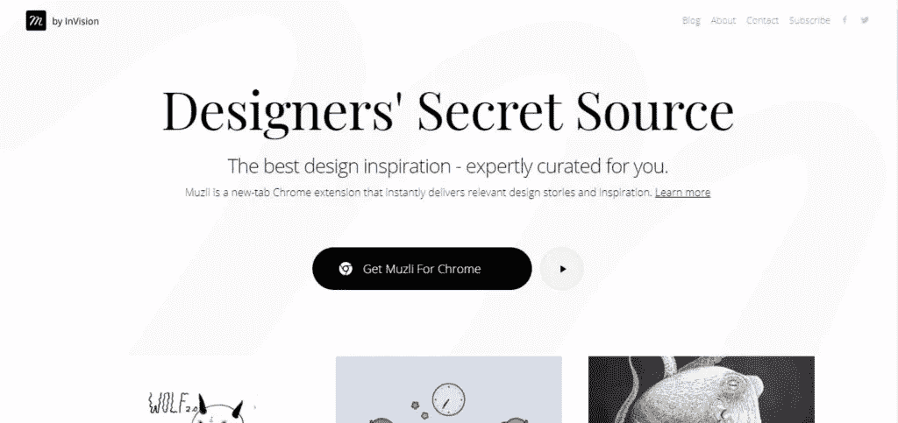
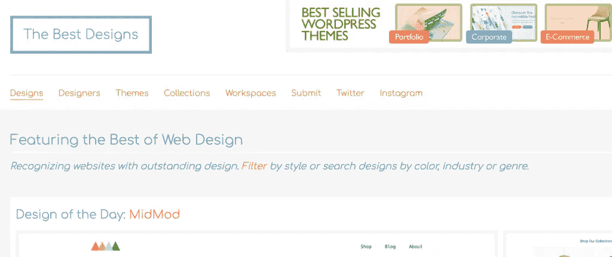
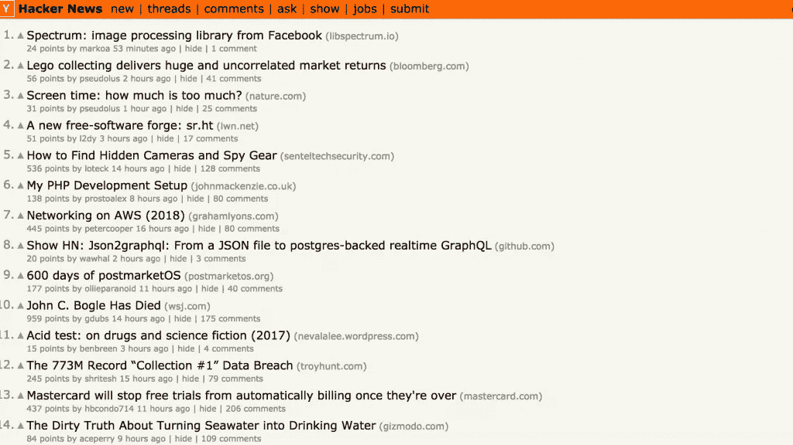
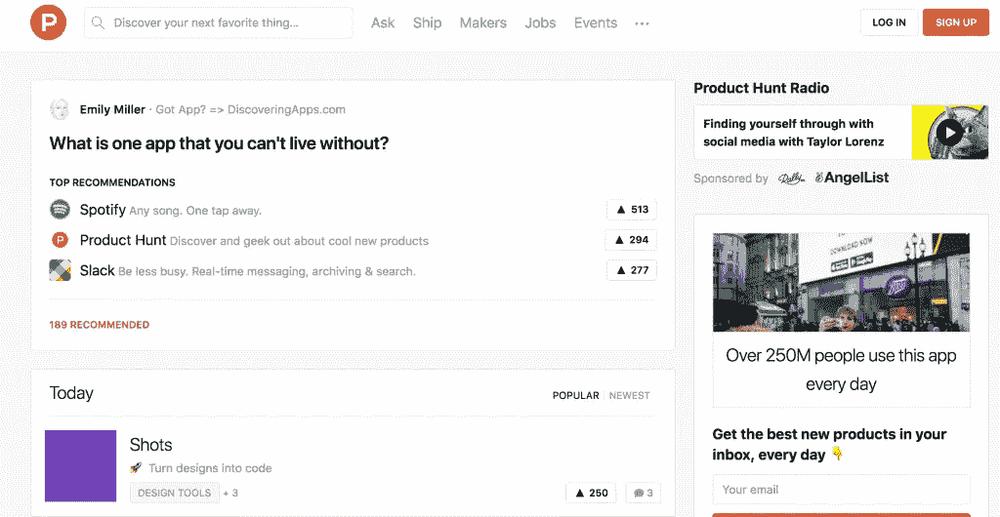
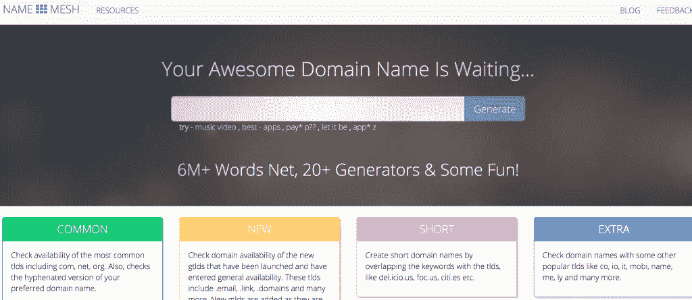
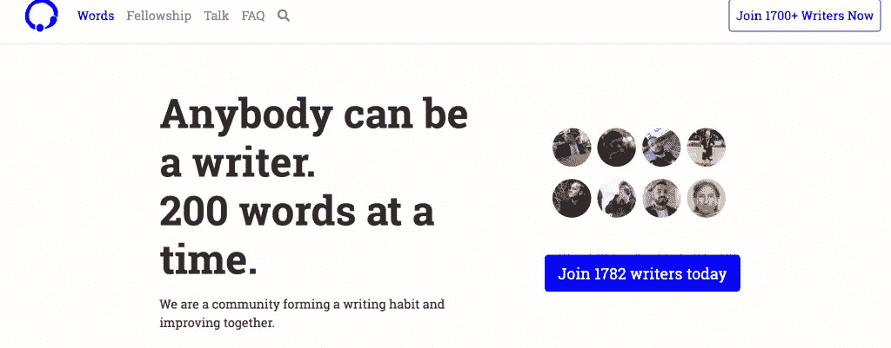
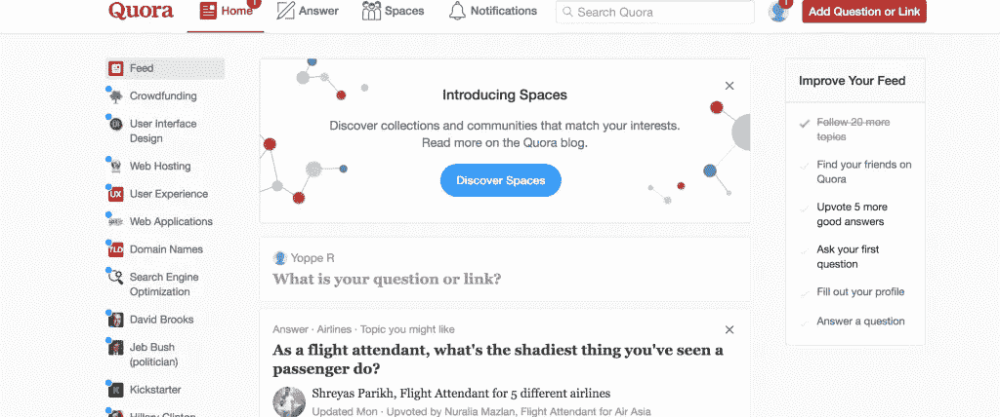

# 专业灵感的网站和资源

> 原文：<https://medium.com/swlh/websites-and-resources-for-professional-inspiration-22794d7db666>

初创公司在早期面临的最大挑战之一与灵感有关。2019 年，创业市场蓬勃发展，但随之而来的是更激烈的竞争。在这种环境下，即使已经取得初步成功，也很难培养出更多的原创想法。

正因为如此，我们决定为您制作这份指南。在本指南中，我们将向您展示最好的网站和资源，以帮助您在新的一年中激发职业灵感。如果你有效地利用了这些东西，你应该可以让那些创造性的汁液再次流动起来。

# SlidesCarnival

使用 [SlidesCarnival](https://www.slidescarnival.com/) 让您的演示更加生动，提升您的作品！SlidesCarnival 是一个伟大的免费资源，为你的演示提供了引人注目的 [Powerpoint 模板](https://startupstash.com/resource/slides-carnival/)，谷歌幻灯片主题和 [Canva 模板](https://www.canva.com/templates/presentations/)。你可以确保你的听众觉得你的演讲很吸引人，很有趣。

使用幻灯片演示主题的演示文稿以清晰、信息丰富的方式展示了所有信息，当您希望使用演示文稿吸引客户时，这一点非常关键。

这个伟大的网站是由一位西班牙自由交互设计师在 2014 年夏天创建的。创业的原因是创始人对目前免费提供的低质量主题感到失望。

目前，他们每个月都会发布一到两个不同的主题。如果你想一想 SlidesCarnival 已经运行了多长时间，你可以在你的演示中使用很多不同的主题。

# 热情.是

Zest 是一家总部位于特拉维夫的初创公司，为其用户提供谷歌 Chrome 扩展。这项服务的灵感来自于营销世界的现状，点击诱饵、虚假文章和错误信息无处不在。随着社交媒体等新媒体的兴起，营销人员发现很难找到可靠的信息。这就是热情的来源。

当您下载 Zest 后，您将获得大量新的相关营销内容，这些内容都是由营销领域的知名人士创建的。事实上，Zest 声称，在一件商品被 Zest 空间接受之前，会有六名营销专家对其进行审核。这使得 Zest 成为营销洞察的一个非常有用的工具，它可以成为找到你的创造力方向的一个好方法。

你也可以在他们的空间里推广你自己的内容，这很有效，因为 Zest 的用户会知道你的内容是高质量的，如果它通过了审核的话。这可以为你的内容带来更高的参与度，从而带来更多的销售。

Zest 的早期受欢迎程度令人震惊，在项目的测试阶段，他们的人数从每周 300 名活跃用户增加到每周 2000 名活跃用户。

访问他们的网站，了解更多关于 Zest 如何将你的营销柠檬变成柠檬水！

# 穆兹利

如果你想要一切可以作为设计灵感的东西，Muzli 绝对适合你。这是一个谷歌浏览器的扩展，你真的可以从中受益。

每当你在浏览器上打开一个新标签页时，Muzli 就会生效。它将立即为您呈现大量与您的偏好相关的高质量设计项目和新闻。因此，你可以接触到各种令人惊叹的插图、视觉艺术、文章和观点专栏，以及时尚网站和摄影相关项目。

Muzli 通过整合著名的信息来源，如 TechCrunch 和 Mashable 以及 120 多个其他来源，使您的灵感搜索变得更容易管理。将这一点与人类发现新事物的本能结合起来，你就不应该再为设计灵感而挣扎了。

访问他们的网站，亲自测试他们的 Chrome 扩展！

# 最好的设计

[最佳设计](https://www.thebestdesigns.com/)是一个非常有价值的网站，无论是对于网页设计师本身，还是对于正在寻找建立自己网站的创业公司。

最佳设计有一个广泛的网站设计库，以及实际上首先创建网站的身份设计师。很多人访问他们的网站是为了让自己跟上网页设计领域的最新趋势，雇佣网页设计师，或者，如果你正在与创意问题作斗争，只是为了一般性的灵感。

如果你正在寻找一个自由网页设计师或一个创意机构来创建你的创业网站，你可以在网站上浏览他们的网页设计师名单。所有这些设计师和机构至少有一个他们的作品登上了最佳设计。然而，如果你想自己动手，他们有一系列由他们的合作伙伴提供的 WordPress 主题。

这个网站上的大量工作一定会给你灵感，因为各个部门差别很大。尽管如此，如果你的雄心超过了你目前的能力，你仍然可以找到其他人来帮助你执行。

访问他们的网站，看看我们在谈论什么！

# 黑客新闻

获得灵感的一个好方法是让你周围的人都参与到智慧的对话中来。谢天谢地，[黑客新闻](https://news.ycombinator.com/)提供了一个平台，你可以在那里找到它。Hacker News(以前的 Startup News)是一个社会新闻网站，主题主要包括计算机科学和商业。它由初创投资公司 Y Combinator 运营，而 Y Combinator 本身又由连续投资者保罗·格拉厄姆运营。

本网站对许可内容的一般描述是“任何满足个人求知欲的东西”显然，这是一个相当宽泛的描述，但是，有大量的内容与创业主题相关。这意味着你可以浏览这个网站，以获得更多关于创业领域发展趋势的信息，并有可能将这些信息作为你自己项目的灵感。

该网站在内容审核政策上做得很好。只有当你有 30 个“因果报应”点时，才允许用户标记材料。你的因果等级是通过你的内容获得的票数减去你的内容可能获得的票数来定义的。该系统有助于防止不当内容在平台上发布。

2014 年 3 月，保罗·格拉厄姆实际上已经不再担任《黑客新闻》的领导职务，并将其移交给他的管理团队。

# 产品搜索

如果你想跟上你所在行业最热门的产品趋势，[产品搜索](https://www.producthunt.com/)可能会是你灵感的巨大来源，甚至是一个营销你产品的伟大平台。

Product Hunt 是一个帮助将四种不同类型的产品与客户配对的网站。这四类产品分别是播客、科技、游戏相关和书籍。它由瑞安·胡佛于 2013 年 11 月创立，和《黑客新闻》一样，由 Y Combinator 提供支持。

有一个评论系统，保留给批准的成员和投票系统，所以人们可以给他们喜欢的产品好评，也可以批评他们不喜欢的产品。拥有最多投票的产品将位于每日列表的顶部，给予它更多的曝光率。

Product Hunt 每周向用户发送一封电子邮件，详细介绍最热门的技术相关产品，以及一系列其他特色产品。

Product Hunt 本身在 2016 年被一家名为 AngelList 的初创公司投资公司收购，价格为 2000 万美元。

# 命名网格

你现在正在为你的创业公司选择一个新的域名吗？你是否感到相对缺乏创造力和灵感？如果是这样的话，[命名网](https://www.namemesh.com/)可能正好救了你一命。

[Name Mesh](https://startupstash.com/resource/namemesh/) 提供一项服务，它可以根据你选择的关键词为你的网站域名创建建议。这还加上了检查您的域名在互联网上的可用性的能力，这反过来有助于创建一个服务，在那里您可以获得您想要的域名，而不必通过思考聪明的名称来炒您的大脑。

在网站中，根据您的要求，有许多不同的搜索选项。例如，通过在最终域名中保留搜索引擎优化的主要关键字，可以保留您的域名的搜索引擎优化。

除此之外，Name Mesh 还链接到其他行业的合作伙伴，这些合作伙伴提供与帮助初创公司相关的服务。这些包括簿记，标志设计，和公司成立。

因此，即使你只考虑使用他们的服务生成一个域名，如果你正在努力为你的初创公司寻找商业服务专业人士，你也可以考虑他们的帮助。

# 帕纳比

你可以拥有世界上最伟大的产品，但有时，为你的革命性应用或未来的行业巨头企业选择一个名字可能很困难。在一个创造原创商业名称似乎越来越难的时代， [Panabee](http://www.panabee.com/) 可以帮你解决这个问题。

[Panabee](https://startupstash.com/resource/panabee/) 是一个为新兴企业提供各种服务的网站。首先，Panabee 提供了一项服务，根据你在搜索栏中输入的关键词，他们可以为你生成一个企业名称。他们有一个类似的服务，可以在网站上搜索应用名称和域名。

你可以检查你的名字是否已经被别人取了，你可以用它们来购买域名。

因此，如果你正努力想出你在上面的完美想法，访问 Panabee 的网站，看看你是否能重新点燃创意的火花。

# 一天 200 个单词

你是一个有抱负的作家吗，或者，你目前是一个在创作过程中墨守成规的作家吗？如果是这样的话，你可能会想一天学 200 个单词。他们是一个自由写作团体，拥有大量的作家。

这个网站背后的想法是，每个成员可以写一个 200 字或更多的主题，以帮助促进你的写作，通过创造一个环境，你可以阅读别人的作品，让你自己的作品得到公平的评论，这样整个社区可以成为更好的作家。

如果你不知道该写些什么，他们的登录页面上有一个标签，包含写作提示。除此之外，还有一个由每天 200 个单词的用户群选择的每周主题，这可以在网站的首页找到。

为了成员之间的交流，他们使用一个叫做“作家每日发货”的松散工作空间。如果你不确定什么是懈怠，你可以访问我们关于项目管理系统的[指南](https://startupstash.com/task-management/the-ultimate-guide-to-choosing-the-right-project-management-software-for-your-startup/)。

如果你想唤醒你的写作火花，每天检查 200 个单词，这不需要很长时间。

# Quora

你对某个特定问题的答案有强烈的渴望吗？如果是这样，你应该看看 [Quora](https://www.quora.com/) ，如果你还没有的话。Quora 是一个问答网站，这里的问题和答案都是由 Quora 社区的成员提供的。当在网站上编辑答案时，通过对问题进行编辑和提出建议来进行协作。

据报道，目前 Quora 拥有超过 3 亿的独立用户。除此之外，他们最近在 2017 年进行了 D 轮融资，获得了 18 亿美元的市场估值，筹集的资金总额为 8500 万美元。Quora 要求用户用真实姓名发帖，而不是网名。因此，您可以收集关于回答某些问题的人的可靠性的信息。

该网站上的内容与许多其他问答网站一样，都是经过审核的。有一个向上投票和向下投票系统，用于确定不同职位的有用性。除此之外，用户还可以标记不适当或事实上不正确的内容。

# 结论

所以，我们的灵感之旅到此结束。通过这个指南，你应该能找到点燃你创造力的火花。如果您认为我们可能错过了任何重要的资源，我们希望在下面听到您的反馈。

如果你使用了列表中的工具，你就可以进行一次创造性的狂欢，尽可能地创造出最有趣、最吸引人的创业。这肯定会有助于吸引投资者和客户，他们会想使用你的产品。

***原载于***[***【startupstash.com】***](https://startupstash.com/best-websites-and-resources-for-professional-inspiration-in-2019/)***。***

## 您可能喜欢的更多文章:

[考虑贷款而不是 VC 的钱](https://hackernoon.com/consider-a-loan-instead-of-vc-money-48ad3b7b8d3c?source=your_stories_page---------------------------)
[如何把初创公司创始人变成思想领袖](/swlh/how-to-turn-startup-founders-into-thought-leaders-65b49a45ebfb?source=your_stories_page---------------------------)
[欧洲顶级风投的种子资金](https://hackernoon.com/top-european-vcs-for-seed-funding-startup-stash-198cea58b7fa?source=your_stories_page---------------------------)

## 这篇文章发表在 [The Startup](https://medium.com/swlh) 上，这是 Medium 最大的创业刊物，拥有+437，678 名读者。

## 在这里订阅接收[我们的头条新闻](https://growthsupply.com/the-startup-newsletter/)。

