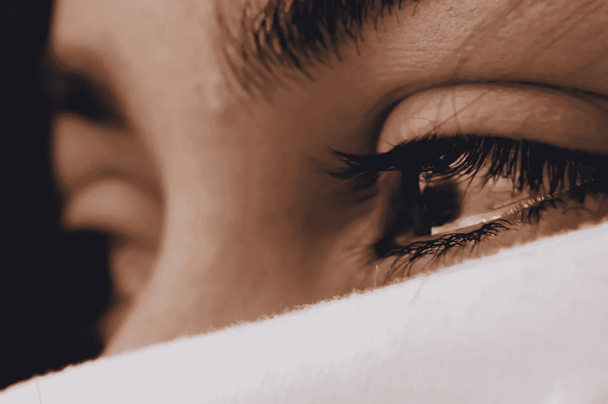

# 为格洛丽亚哭泣

> 原文：<https://medium.com/swlh/weeping-for-gloria-c1f3fc35ec40>

Photo by [Luis Galvez](https://unsplash.com/@louiscesar?utm_source=unsplash&utm_medium=referral&utm_content=creditCopyText) on [Unsplash](https://unsplash.com/search/photos/crying?utm_source=unsplash&utm_medium=referral&utm_content=creditCopyText)

就在一个多月前，我拜访了我在加利福尼亚的亲爱的朋友。我通常一年去看他们几次。在一天的品酒或观光后，我们已经养成了看电影或看一些共同喜欢的电视节目的好习惯，只有成为家人的朋友才能这样做。我们最后看了《无话不说:葛洛莉娅·范德比尔特和安德森·库珀》，这部 HBO 纪录片讲述了这对著名的母子。

我发现自己非常迷恋她。我被她的生活迷住了。但是，更重要的是，我发现自己非常密切地关注着他们作为母亲和孩子的关系。这对我来说并不奇怪。因为我和我母亲的关系——更重要的是没有关系——我在过去十年的大部分时间里都在做这件事。这种动态总是让我着迷。要么这种关系与我和她之间的关系如此相似，以至于我觉得和陌生人是同志关系。或者，通常情况下，他们是如此的不同——亲密、接纳、脆弱——以至于我根本无法理解。在后一种情况下，我发现自己在仔细寻找线索——关于我做错了什么的线索，以至于错过了我听说过的你应该与父母建立的那种关系。

在得知格洛丽亚去世的消息后，我感到胸中有一种真正的悲伤——这种悲伤只有在你爱的人身上才会感受到。我看了安德森为她写的视频讣告，我哭了。这不是我通常那种过于敏感而无法观看脸书狗狗救援视频的哭泣，而是一个人为了自己的母亲而哭的那种。自从我母亲一年多前去世后，我很少听到她哭过。

我马上意识到，我正在为失去一些东西而悲伤，我真的无法用手指抓住它们，触摸它们，或者说出它们的名字。我为格洛丽亚悲伤，因为这比为我母亲悲伤更安全。在很多方面——难以描述的方面——对我来说更有意义。我为安德森感到非常难过。有她这样的母亲该有多好；但是失去它是多么痛苦。

我真的不知道那种特定的损失。我母亲在去世前六年选择了结束我们的关系，不管她的理由是什么，对她来说都比我重要。我为仍然健在的母亲感到悲伤。她去世的时候，我已经平静了很多。我发现这并不是完全的和平。但这足以支撑我度过没有她的那些年。

没有人告诉你没有悲伤的地图。我听说过我认识的人，他们发现自己以这样或那样的形式陷入其中，对它没有遵循正确的道路这一事实表示困惑。换句话说，他们没有以有序的方式经历否认、愤怒、讨价还价、沮丧和接受——就好像他们期望生活的这一特定部分是有序的，尽管生活的其余部分不是。但我记得我也是这么想的。我记得我想知道为什么我的情感没有做它们应该做的事情。我记得为此痛打了自己一顿。

我学到的最重要的事情是:不要让任何人告诉你如何、何时或以何种顺序悲伤。在它最好的日子里，它是一个移动的目标，一片模糊。甚至不要让他们告诉你应该为谁悲伤——不管是为你的母亲，还是你自己，或者是像葛洛莉娅·范德比尔特这样的陌生人。悲伤是非常个人化的。它是你以任何可控制的方式携带的东西。如果你唯一的出路是为你曾经穿过牛仔裤的女人哭泣，而不是为生下你的女人哭泣，那就这样吧。

*原载于 2019 年 6 月 19 日*[*【https://lchillwriter.com】*](https://lchillwriter.com/weeping-for-gloria/)*。*

在我的[网站](https://lchillwriter.com)阅读更多内容，并在[脸书](https://www.facebook.com/LCHillWriter/) / [推特](https://twitter.com/LCHillWriter) / [Instagram](https://www.instagram.com/lchillwriter/) 上关注我