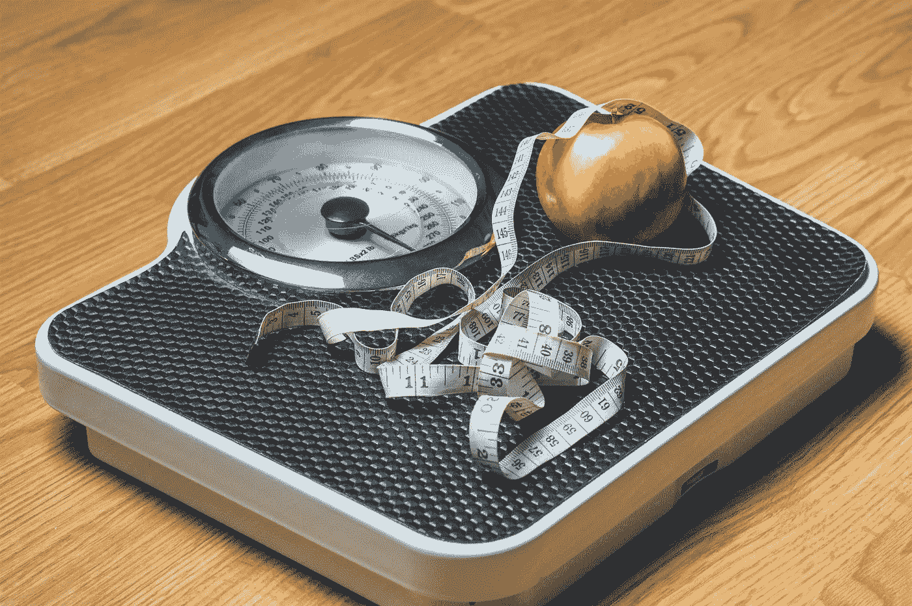

# 招聘中的体重偏差

> 原文：<https://medium.com/swlh/weight-bias-in-hiring-77aeab0d1f9d>

## 一种很少被提及的多样性

Image by [TeroVesalainen](https://pixabay.com/users/TeroVesalainen-809550/?utm_source=link-attribution&utm_medium=referral&utm_campaign=image&utm_content=2036969) from [Pixabay](https://pixabay.com/?utm_source=link-attribution&utm_medium=referral&utm_campaign=image&utm_content=2036969)

当我们谈论多样性和平等机会时，大多数人想到的是种族、性别、宗教、国籍、残疾和年龄。

一件很少被提及甚至被认为是一种歧视的事情是体重偏见。