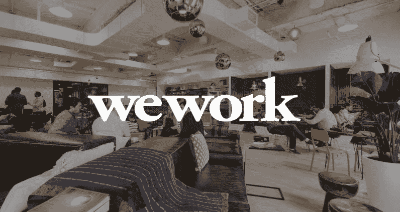
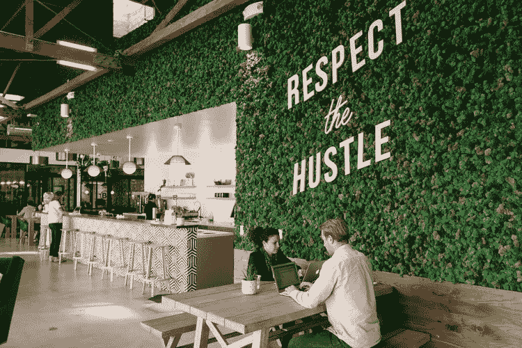
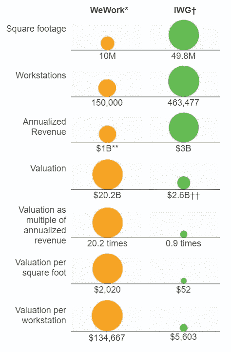
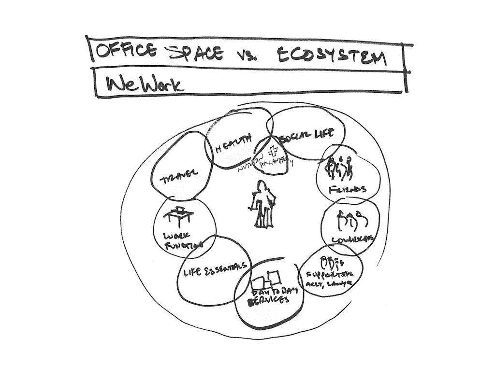
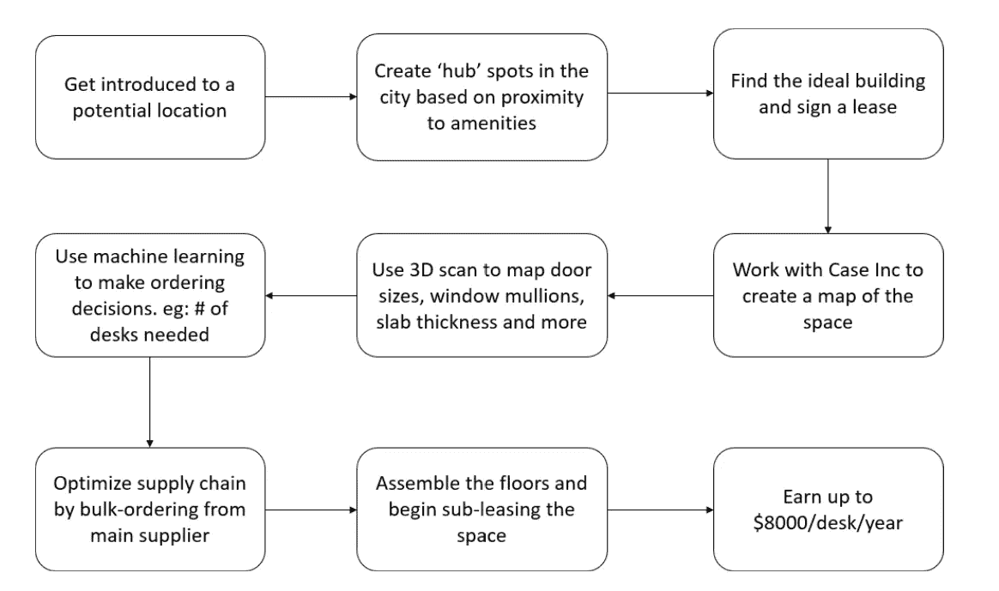
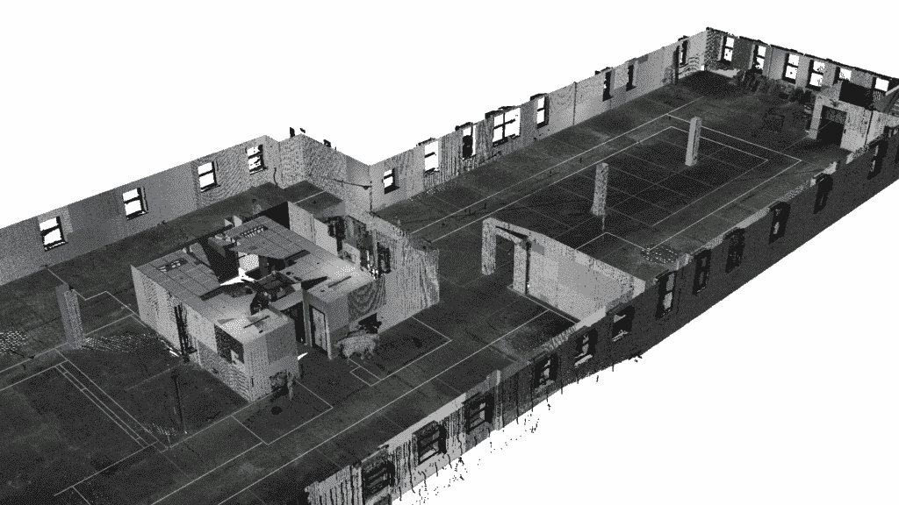
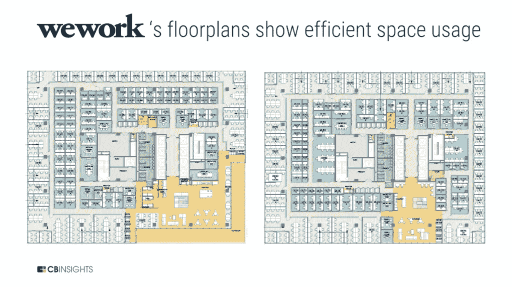
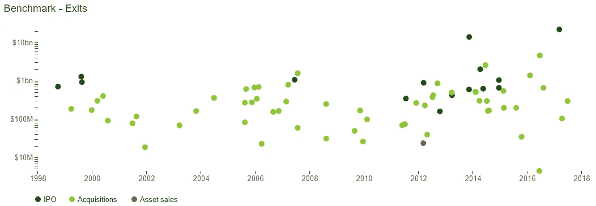
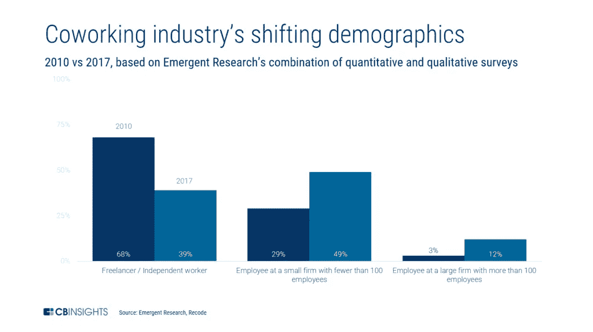

# we work——最被高估的初创企业或一生中最大的收获？

> 原文：<https://medium.com/swlh/wework-most-overvalued-start-up-or-catch-of-a-lifetime-ea27879d6de8>

# GreenDesk 如何成为 WeWork —最初的日子

米格尔·麦克维以为他只是去他的朋友吉尔家度过一个星期六晚上。但是当他和吉尔上了电梯，这个高个子的以色列人脱掉衬衫走进来，开始和电梯里的每个人交谈。米格尔起初被他的大胆吓了一跳，后来才知道他其实是吉尔的室友。除了 6 英尺 8 英寸的框架，他们没有任何共同之处。然而，正如谚语所说*两极吸引*，米格尔·麦克维和亚当·诺伊曼后来成为了 WeWork 的创始人。

Adam Neumann on the left and Miguel McKelvey on the right

事后看来，他们偶然发现公共工作空间这一概念并不令人吃惊。米格尔和其他五个女人一起长大，她们是他最好的朋友，过着嬉皮士的生活，打破所有的规范。另一方面，亚当来自以色列，他在那里服了五年兵役，到过很多地方。他也有社区成长的根源。

亚当带来了原始的激情和不愿意满足于房东的拒绝，而米格尔则带来了他在纽约一家公司担任建筑师时的商业头脑和建筑知识。他们在 2008 年首次创建了[绿色办公桌，专注于可持续的共同工作空间，以可回收家具和电力为特色。很快，他们意识到这是不可扩展的，并把它卖给了他们的房东，同时每个人赚了一百万美元。](https://www.businessinsider.com/the-founding-story-of-wework-2015-10)

A WeWork office in Culver City, LA

但是公共工作空间的想法从未离开过他们的脑海。所以，进入 [WeWork](https://en.wikipedia.org/wiki/WeWork) (一个*绿色办公桌 2.0？*)。WeWork 于 2010 年 2 月在纽约的 [SoHo 区](https://en.wikipedia.org/wiki/SoHo)成立，同年迎来了第一位神秘投资者——乔尔·施雷伯。作为一名哈西德派正统犹太人，乔尔为一笔潜在的房地产交易会见了亚当和米格尔。当这个计划失败后，乔尔打电话给他们，提出 1500 万美元成为公司的一部分。你很难在网上找到乔尔的照片，他保持着令人难以置信的低调生活方式。尽管据说是他推动了 WeWork 最初的发展，但他已经因欺诈投资者和不按时付款而被起诉了 12 次。

快进到 2018 年，WeWork 已经吞噬了超过 65 亿美元的资金，估值高达 470 亿美元，在 24 个国家的 300 多个地方建造了超过 1500 万平方英尺的办公空间，并冒险进入一些无关紧要的项目，如建造一所幼儿园学校和一个人工波浪池(不是开玩笑)。*都 7 年了。*

因此，我将为双方唱反调，以了解支持者和批评者(有很多)，让你从靶心看到双方。你想属于前一类还是后一类，我将由你决定。

# **“最被高估的初创企业”——背景故事是什么？**

鉴于该公司的时间框架和价值主张，许多房地产传统主义者和公司高管指责 WeWork 称其估值过高。

> “如果你把这个[定位为一家房地产公司，它就不值得这个](https://www.wsj.com/articles/now-worth-10-billion-is-wework-a-2000-redux-1436910924?mod=article_inline)，”管理着超过 500 亿美元房地产资产的喜达屋资本集团(Starwood Capital Group LLC)总裁 Barry Sternlicht 说。
> 
> [—《华尔街日报》文章](https://www.wsj.com/articles/wework-a-20-billion-startup-fueled-by-silicon-valley-pixie-dust-1508424483)

让我们看看为什么会这样的几个原因。

## 1.房地产市场的波动性:

当被问到这个问题时，亚当反驳道。“WeWork 其实并不是一家房地产公司。他认为，“这是一种意识状态，是一代相互关联的情商企业家，”[。](https://www.nytimes.com/2018/02/17/business/the-wework-manifesto-first-office-space-next-the-world.html?mtrref=undefined&gwh=A8F1F72B4A254B9FFC2E22C34A17FCA5&gwt=payhttps://www.nytimes.com/2018/02/17/business/the-wework-manifesto-first-office-space-next-the-world.html?mtrref=undefined&gwh=A8F1F72B4A254B9FFC2E22C34A17FCA5&gwt=pay)然而，当你除去免费的水疗中心和硬木地板，WeWork *实际上是一家房地产公司*，并承受着这一类别的所有风险。商业模式很简单:租金套利。它向用户收取的费用比付给房东的还要多。

当前的模式要求 WeWork 在十年内向其房东支付数百万美元，不管经济灾难如何，比如 2008 年危机或网络泡沫。事实上，另一家采用相同商业模式的公司雷格斯在 2003 年泡沫破裂时申请破产。如果利率上升，或者初创企业开始走出大门，WeWork 就有大麻烦了。

## 2.更大的竞争对手正在迎头赶上

虽然 WeWork 正在享用一大块馅饼，但它并没有烤它。公共工作空间的概念已经存在了几十年，雷格斯(现在的 IWG)是拥有 3000 多个位置的大玩家之一。首席执行官迪克森在接受采访时表示，他并不担心 WeWork。他说:“没有什么神奇的成分是其他人没有的。2018 年，[全球有*19000*个联合办公地点](https://www.cbinsights.com/research/report/wework-strategy-teardown/#investors) *。

[Source: Wall Street Journal](https://www.wsj.com/articles/wework-a-20-billion-startup-fueled-by-silicon-valley-pixie-dust-1508424483)

如你所见，撇开惊人的尺寸差异不谈，WeWork 也不是一笔便宜的交易。当融资交易结束时，一些初创企业被认为会撤离。在纽约，一张单人办公桌起价 400 美元，一间四人的私人办公室在 T2 起价高达 1640 美元。值这个价吗？还是只有免费坐在星巴克喝着 3 美元一杯的咖啡那么好？

*也有一些著名的即将到来的竞争对手，包括 [Krontel 和 RocketSpace](https://www.cbinsights.com/research/report/wework-strategy-teardown/#investors) ，它们分别筹集了 1.55 亿美元和 3.36 亿美元。

## 3.令人惊讶的资产缺乏:

尽管 WeWork 设法扩展到 300 多个地点，但它仍然不拥有任何财产。它与房东签署 10-15 年的租赁合同，支付固定的商定价格，同时以更高的价格出租(它有 180 亿美元的租赁义务)。但是，即使在市场崩溃时，他们能通过这种方式获得越来越多的收入吗？[评论家不这么认为。](https://www.ft.com/content/87c43322-755e-11e8-b6ad-3823e4384287)

Source: Financial Times

然而，它们不受影响，继续凶猛地生长。他们最新的创意是[72 号船坞，这是一座位于布鲁克林旧海军船坞](https://www.wework.com/buildings/dock-72-at-the-brooklyn-navy-yard--new-york-city--NY)的 16 层建筑，造价[4 亿美元。这座波浪形的折纸建筑旨在成为共同工作空间的巅峰——充满了办公空间、餐厅、酒吧和豪华水疗中心。](https://www.globest.com/2018/07/25/a-peek-into-dock-72-at-brooklyn-navy-yard-image-slideshow/?slreturn=20190201220237)

## 4.在不熟悉的领域冒险

为了扩大网络，WeWork 涉足了两个主要领域:居住空间和教育，完成了生命的循环。据说 WeLive 是一个由宿舍式公寓组成的联合生活空间，配有健身房和水疗中心。虽然它的目标是到 2018 年达到 68 个地点，但只达到了两个。

另一方面，WeGrow 据说是第一所面向孩子的“创业”学校。当它在 2018 年 9 月开放时，有 46 名学生报名上课，从幼儿园到四年级不等。对于一个典型的一年级学生来说，它每年收费 42000 美元。我猜塑造早期企业家是有代价的。

这些企业以及更多的企业并没有为 WeWork 带来大量的收入，如果有的话。看起来是巧妙还是轻率？时间会证明一切。

# WeWork 如何证明其 470 亿美元的估值是合理的

是时候扳动开关，仔细看看了。虽然一些成功可以归因于大规模投资和纯粹的偶然事件，但很大程度上是由数据驱动的倡议和公共工作空间的新方法支撑的。

## 1.一连串的收购——有些更令人震惊:

对于一家尚未提交 IPO 申请的公司来说，WeWork 在收购方面无疑一直很活跃。他们似乎平均每两个月收购一家公司(包括 Naked Hub、Spacemob、Flaitron School、Meetup 等等)。令人惊讶的是，这些公司本身似乎与公共空间没有直接关系。它们的范围从建筑工人的应用程序到人工波浪池发电机到教育技术。

在大量资金的支持下，加上软银首席执行官孙正义的大力支持，WeWork 似乎正在向各个方向发展，希望在未来将它们连接成一个整体的 *WeGroup* 公司。这也抵消了依赖房地产的风险。

## 2.技术引发数据引发优化:

作为一家每月为[增加大约 50 万到 100 万平方英尺空间的公司](https://www.cbinsights.com/research/report/wework-strategy-teardown/#investors)，如果没有一个严格和专注的数据使用方法，很难盈利。我们知道这一点。下面的流程图展示了他们执行的任务集的一个非常简化的版本。

A representation of WeWork’s process flow from acquisition to leasing — made by me

上面的流程图中没有显示的是他们设计办公室的细节。

> 传感器和面部识别软件等其他测量工具让 WeWork 可以跟踪其办公空间的使用情况，甚至可以跟踪到成员如何调整办公桌以及办公室哪些区域客流量最大等数据。最终，这些工具甚至可以追踪成员在会议中的专注程度。
> 
> — [CB Insights 报告](https://www.cbinsights.com/research/report/wework-strategy-teardown/)

一家仅在建筑、室内设计、工程和相关活动领域就有 1300 多名员工的公司——这一员工名单使其成为世界上最大的建筑公司之一——是一家认真对待工作的公司。

## 3.深刻的投资者信念(和口袋):

在一次采访中，当被问及所谓的虚高估值时， Adam 沉默但坚定。他开始列出所有支持它的投资者，包括基准资本、富达投资、摩根大通、高盛、哈佛管理公司、威灵顿管理公司，当然还有软银。

众所周知，这些公司取得了一系列成功，这表明了它们的良好直觉。

[A chart of Benchmark’s investments over time — look at the # dots over the $1 bn mark](https://www.cbinsights.com/research/benchmark-venture-capital-founder-friendly/)

至于软银首席执行官，他无法停止对公司的狂热。[尽管迫于投资者的压力，他将 160 亿美元的投资大幅缩减为 20 亿美元](https://www.wsj.com/articles/weworks-not-working-for-softbank-anymore-11546940472)，但他称 WeWork 为下一个*阿里巴巴。*史蒂夫·乔布斯、阿尔伯特·爱因斯坦和本杰明·富兰克林的著名传记作家沃尔特·伊萨克森宣称，诺依曼具备上述狂热爱好者的某些品质。显然，WeWork 拥有强大的骨干力量。

## 4.稳步扩张和增长:

WeWork 需要占用 60%的典型办公空间才能实现收支平衡。猜猜他们灌了多少？*百分之八十一*。没错，他们在 2018 年获得了 15 亿美元的收入，仅在第三季度就获得了 4.82 亿美元的收入。这并不是说它在财务上一帆风顺。他们净亏损 12 亿美元。然而，按照他们开设新地点、收购公司和国际扩张的速度，这是意料之中的。

其中一个被证明是成功的扩展是由 We 提供动力的计划。WeWork 最大的价值主张也是它的致命弱点。给予初创企业随时搬进搬出的灵活性损害了长期稳定性。我们通过向企业提供办公空间解决方案来应对这一点。这几乎占了其目前用户群的 30%。他们还通过从租赁转向共同管理交易、购买房产(最近的一笔收购是曼哈顿的 Lord Taylor 大楼)以及让会员签署长期合同来降低风险。

A clear shift in company sizes over the years

尽管它们充满了市场不稳定性，但至少它们解决了所有这些问题。

# 结论——革命还是衰退？

有一点是肯定的——we work 成功打入了一个由退伍军人占据的领域，将一个*乏味* 的商业模式转变为一个*时尚*的商业模式。在这个过程中，它也成为一些最令人垂涎的初创企业的孵化器，以及未来企业家的社交场所。我们的世界正在加速走向共享经济，并且取得了成功——从优步、Airbnb、阿里巴巴等公司可以看出这一点。WeWork 是朝着这个方向迈出的又一大步。

WeWork 是会引发一场革命还是会陷入衰退取决于三个因素:a)当前和未来投资者的强烈主张(和信念), b)减少对房东和短期用户租赁的依赖，c)使其投资组合多样化，以进入美国和海外更有利可图的市场。当下一次经济衰退来临时，我们将会知道谁是对的:房地产传统主义者，还是那些试图颠覆他们的人。

*******************************************************************

*如果你想取得联系，请使用此链接在我的日历上预定一个时间段:*[*https://calendly.com/sb4027/answering-your-questions*](https://calendly.com/sb4027/answering-your-questions)*。或者发邮件给 ask@bsoundarya.com。* [***加入我的邮件列表，在那里我每隔几周详细回答匿名问题。***](https://goo.gl/forms/PdzFwCcBs3lnFir63)

*我确实在社交媒体的其他字母汤上也是，如果你也是:* [*个人博客*](http://www.poojabalasubramani.com)*[*insta gram*](https://www.instagram.com/thecuriousmaverick/)*[*【脸书*](https://www.facebook.com/pooja.balasubramani?ref=bookmarks)*[*LinkedIn*](https://www.linkedin.com/in/soundarya-balasubramani/)*。****

****

## **这篇文章发表在 [The Startup](https://medium.com/swlh) 上，这是 Medium 最大的创业刊物，拥有+441，678 名读者。**

## **在这里订阅接收[我们的头条新闻](https://growthsupply.com/the-startup-newsletter/)。**

****