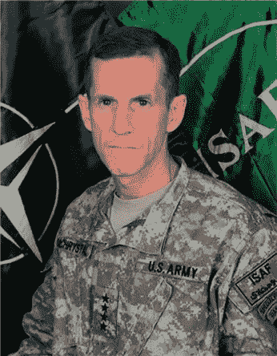

# 基地组织、英国海军和美国国家航空和宇宙航行局传授了什么管理知识

> 原文：<https://medium.com/swlh/what-al-qaeda-the-british-navy-nasa-teach-about-management-814b79a34551>

## 麦克克里斯托将军的反恐斗争和僵化的领导

Gen. Stanley McChrystal — U.S. Army [Public domain] / [Wikipedia Commons](https://upload.wikimedia.org/wikipedia/commons/0/0c/StanleyMcChrystal.jpg)

> “这些人想杀害无辜的儿童。许多人被杀，许多人受伤，他们现在都在医院，我是其中之一。”— [艾哈迈德·侯赛因](https://www.nytimes.com/2004/10/01/world/middleeast/2-car-bombings-in-iraq-kill-41-many-children.html)，一名 14 岁的男孩在污水处理厂袭击中受伤