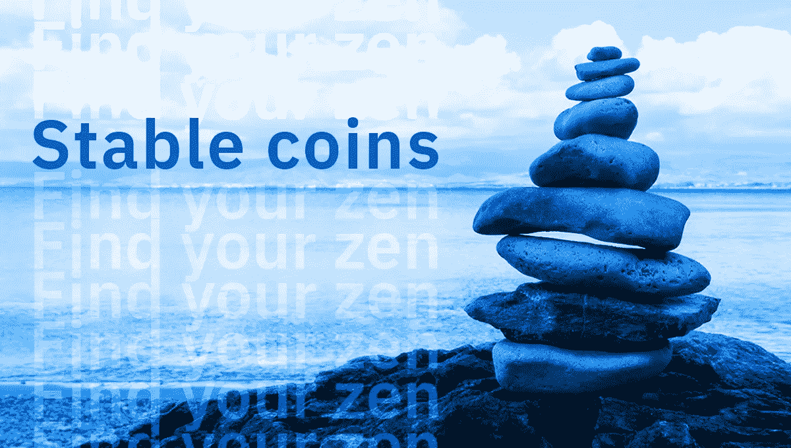

# 什么是 stablecoins，为什么它们很重要？

> 原文：<https://medium.com/swlh/what-are-stablecoins-and-why-are-they-important-27c3aa96db5c>

stablecoins 的出现可以说是数字资产行业最重要的事件之一。它们的出现几乎和 Altcoins 的发布或者比特币期货合约的推出一样意义重大。我们已经在 2019 年[预测](https://crypterium.com/news/open/807a0416-0c4b-4d0d-8df2-420b98c5551c)中简要提到了这个话题，而本文将只关注稳定的预测。

稳定硬币为数字资产持有者的最大问题:波动性提供了一个简单但有争议的解决方案。在一个你持有的资产价格总是在变化的市场中，你需要选择将你的资金存放在一个价值保持不变的地方，同时仍然能够像任何其他数字资产一样花费和转移它。

稳定币是一种新型货币，它被设计成将价格波动最小化，并与另一种稳定资产挂钩，如黄金或美元。这是一种有全球化潜力的货币，但它不受央行的约束。

## 集中和分散

关于数字资产的主要概念——去中心化，也是 stablecoins 的核心。有两种类型——集中式和分散式。以上所有例子都是集中稳定货币，它们与真实货币或交易所交易商品(如贵金属或工业金属)挂钩。由货币或商品直接支持的稳定硬币是集中的，而那些利用比特币或以太币等其他硬币的硬币被称为分散的。

## 例子

最受欢迎的集中式稳定币是 Tether (USDT)，按市值计算，它已成为第八大加密货币，按最高日交易量计算，它仅次于比特币。

然而，围绕系绳有很多争议。有人怀疑稳定币并非真正由美元支持，因为该公司尚未同意进行透明审计。Tether 也被指控导致比特币价格操纵。

再比如双子座。“双子美元”(GUSD)也声称与美元 1:1 挂钩，然而，它与 USDT 和其他稳定货币的区别在于它们强调透明度和监管合规性。

集中的稳定货币遍布全球，并与不同的货币相联系。美国、英国和瑞士是 stablecoin 最受欢迎的发行地。

总的来说，至少有 57 个稳定的中心，其中绝大多数是集中的。自称去中心化的稳定币的例子是戴。戴是一种以太币。它与其他产品不同，因为它实现了完全分散的技术。它的价格是稳定的，是由以太币而不是美元支持的。

## 结论

Stablecoins 确实在塑造数字资产的未来方面发挥了作用。过去，Stablecoins 引发了一些担忧，特别是它们是否真的得到了它们所声称的美元数量的支持。现在，随着整个市场的成熟，我们看到各种各样的公司找到了帮助他们赢得信任的机构支持，比如 USDC，它得到了高盛和 Circle 的支持。

稳定债券的发展可能在很大程度上取决于波动性影响增长市场的方式。过去，波动性给数字资产进步带来了问题，随着主流采用的第一波浪潮结束，人们的观点是:波动性越小越好。

作为传统加密货币的替代品，Stablecoins 的发展很有可能会很快，但不会真正取代它们。

## 关于隐密处

根据毕马威和 H2Ventures 的说法，Crypterium 是最有前途的金融科技公司之一。我们正在打造一款移动应用，以满足数字资产时代的银行需求。

我们的目标很明确:有了 Crypterium，无论你用传统货币做什么，你都可以用数字资产来做。这个想法得到了 TechCrunch 联合创始人 Keith Teare 和超过 40 万注册用户的支持，而且这个数字还在与日俱增。

该团队由 Visa 中欧和东欧前总经理 Steven Parker 以及来自全球金融机构(如复兴保险、伦敦衍生品交易所、美国运通等)的高管领导。

加入我们的 [**电报新闻频道**](https://t.me/crypterium_en) 或其他社交媒体，保持更新！

[**网站**](http://crypterium.com)**๏**[**电报**](https://t.me/crypterium)**๏**[**脸书**](https://www.facebook.com/pg/crypterium.org)**๏**[**推特**](https://twitter.com/crypterium)**๏**[**bitcointalk**](https://bitcointalk.org/index.php?topic=2214098.0)****************

************

## ******这篇文章发表在 [The Startup](https://medium.com/swlh) 上，这是 Medium 最大的创业刊物，拥有+415，678 名读者。******

## ******订阅接收[我们的头条新闻在这里](http://growthsupply.com/the-startup-newsletter/)。******

************