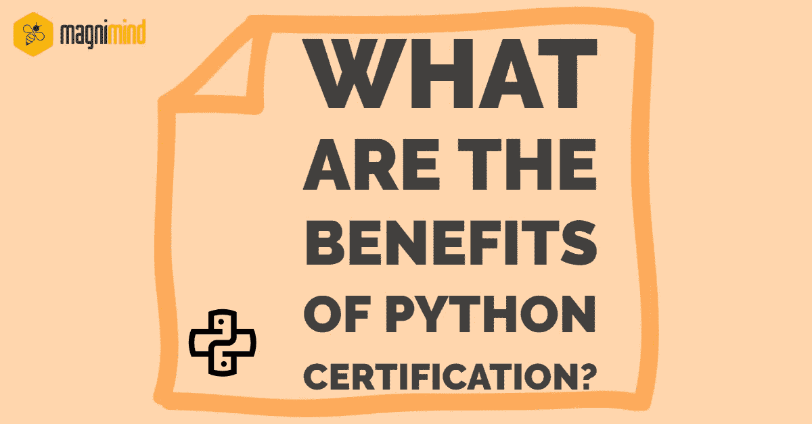

# Python 认证有什么好处？

> 原文：<https://medium.com/swlh/what-are-the-benefits-of-python-certification-ff6444e4644f>

在今天这个由技术驱动的动态世界中，几乎一切都在快速变化，Python 的受欢迎程度似乎保持不变。

> 如今，Python 已经成为最常用的编程语言之一，而 ***Python 认证*** 已经成为整个编程领域最受追捧的需求之一。

这可能会让你想知道为什么几乎每一个技术驱动的组织，从巨头到初创公司，都如此偏爱那些拥有 **Python 认证**的人。

# 1-关于 Python 的几句话

[***Python***](https://magnimindacademy.com/python-certification-with-7-steps/)是一种通用的高级动态编程语言，到现在已经有快三十年的历史了。它被广泛应用于各种各样的应用中——从机器学习到网络和桌面应用，再到网络服务器等等。

虽然 Python 可以用于小型项目，但科技巨头*如微软、谷歌、脸书、网飞、美国宇航局等。也利用这种编程语言。*

# *2-拥有 Python 认证的好处*

**

**到目前为止，如果你还不确定是否应该获得 **Python 认证**，看看获得认证的好处。**

## *2.1-这是你对 Python 专业知识的证明*

**

*在当今的竞争环境中，获得对您的 Python 专业知识的认可以展示您的技能变得比以往任何时候都更加重要。如今，潜在雇主不会只看候选人的投资组合。他们还寻找不同的方法来验证候选人的知识。*

*当招聘 Python 程序员时，招聘人员经常寻找 **Python 认证**来筛选候选人，这些候选人将在下一轮面试中获得进一步展示其技能的机会。没有 Python 认证肯定会降低你通过第一轮选拔的机会。而这大概就是获得一个 **Python 认证**最大的**好处了。***

## *2.2-给你成就感*

**

*即使你是一个伟大的 Python 程序员，目标的成就感总是会激励你去做更多的事情。从这个角度来看，获得一个 **Python 认证**会给你一个急需的动力，让你全力以赴。此外，投入时间和精力获得认证为您提供了另一个检查和验证技能的机会。*

*对于任何学习者来说，清楚地了解自己在学习过程中所处的位置是极其重要的。换句话说，准备获得 **Python 认证**不仅有助于你评估自己的技能并找出需要改进的地方，还能让你对自己的整个技能概况有一个客观的了解，这可能是试图获得 **Python 认证**的第二大**好处。***

## *2.3-它给你一个竞争优势*

**

*随着对 Python 程序员的需求呈指数级增长，拥有一个 **Python 认证**有助于你脱颖而出，尤其是当竞争一些最好工作的开发人员、程序员等的数量也在增加的时候。*

*一个 **Python 认证**不仅向雇主证明你已经掌握了必要的专业知识，还让他们明白你实际上愿意扩展你的知识，这是获得这种认证的另一个主要**好处。***

## *2.4-为更好的工作铺平道路*

**

*拥有 **Python 认证**意味着你更容易被你所在领域的知名招聘人员接受。*

> *正如我们已经讨论过的，Python 认证已经成为许多招聘人员的关键要求之一，这样的认证可以极大地帮助你向获得更好的高薪工作迈进一步。*

*事实上，获得认证的专业人士通常比未获得认证的同行挣得多。所以，一旦你获得了 **Python 认证**，你就能在更有声望的职位上期待更高的薪水。简而言之，拥有一个 **Python 认证**加强了你作为专家的地位。你应该记住，每当你的简历显示你有特定的技能时，你都需要证明它们，只有证书才能帮助你实现这个目标，至少在最初的筛选阶段是这样。*

## *2.5-你会给组织带来很多好处*

**

*从组织的角度来看，拥有 **Python 认证**的员工会给 it 部门带来诸多好处，这就是为什么很多公司不仅试图招聘认证的 Python 专业人员，还鼓励现有员工获得 **Python 认证。***

*拥有 **Python 认证**的员工被认为是知识和技能的基准，可以纳入组织的技能框架，并确保从事不同项目的团队得到培训，达到预期和一致的所需技能水平。认证专业人员也有助于最大限度地减少停机时间，因为他们拥有适当的技能来处理问题，并比非认证同行更快地解决各种复杂的问题。*

> *简而言之，拥有 **Python 认证，**你非常适合为公司带来准确性和效率，这也是为什么许多潜在雇主强调招聘认证 Python 专业人员的关键原因。*

# *3-为什么你应该努力获得 Python 认证？*

**

*你可能会问为什么我们强调获得 **Python 认证**而不是其他编程语言的认证。让我们来看看努力获得 **Python 认证**的**好处** s **。***

## *3.1-简单易学*

**

> *尝试获得 Python 认证的最大好处是，这种编程语言非常容易学习，你可以把它作为进入其他编程语言和框架的跳板。*

*如果你是一个完全的初学者，正在尝试进入编程世界，你首先想要的可能是你想要学习的语言的简单性。*

*一旦你完成了你的 **Python 认证，**你总是可以探索其他编程语言来拓宽你的知识面，而不是局限于一种语言。*

## *3.2-用途广泛*

**

*尽管 Python 对于初学者来说是一种简单易学的编程语言，但它提供了完成高端工作所需的所有资源和能力。几乎所有的事情都可以用它来完成，而且有很多重要的项目都是用 Python 开发的。*

*一旦你获得了 **Python 认证，**你就可以在*【web 开发】 ***机器学习*** 、人工智能、游戏开发等等领域找到大量的机会。所以，如果你想进入编码世界，但不确定如何着手，获得 Python 认证可能是你最好的选择。**

## **3.3-它的价值和需求都在增加**

****

**我们已经讨论过，许多行业领导者使用 Python 作为他们的主要和次要编程语言，这表明这种语言的发展几乎均匀地分布在各个行业。**

> **而且由于它的简单性、用户友好性、可伸缩性和创新性，Python 也是许多创业公司的首选。**

**因此，拥有 **Python 认证**意味着你永远不会失去宝贵的工作机会。**

## **3.4-它拥有一个庞大的社区**

****

**与其他编程语言相比，试图获得 **Python 认证**的另一个主要**好处是存在一个巨大的社区。您可能意识到这样一个事实，当您学习一种编程语言或使用它开发一个项目时，一个健壮的社区是非常方便的。如果您在使用 Python 学习或开发项目时遇到任何技术问题或有任何疑问，您可以随时从社交媒体平台、论坛、Q & A 网站等上千名 Python 社区成员那里寻求指导。****

**另外，由于 Python 是开源的，如果你愿意，你可以学习它的每一个方面来强化你的知识。这种大规模活跃社区和开放性的结合意味着几乎每个人，从专业开发人员到临时程序员，都可以在他们需要的水平上使用 Python。**

## **3.5-它拥有巨大的资源**

****

**Python 拥有大量的标准库，这是学习它的另一个重要的好处。人们和公司使用它的次数越多，围绕它开发的资源就越多，以帮助开发人员完成复杂的任务，而不会遇到许多编码困难。**

> **今天，Python 已经成为科学界的领先工具，这要归功于它各种各样的专业库。**

**游戏开发有 PyGame，数据科学有 NumPy*，机器学习有 TensorFlow，不一而足。***

# ***包扎***

******

***如果你想在更好的工作岗位和更高的薪水方面让你的职业生涯更上一层楼，获得 Python 认证是值得考虑的。这种编程语言被世界上一些最好的公司所选择，并且发展得相当快。它平易近人，功能多样，简单，同时又完整。***

***Python 也是 ***机器学习*** 、数据可视化、 ***数据分析*** 的绝佳选择。所以，如果你打算进入数据科学领域，获得 Python 认证可能是你的第一个目标。***

**您应该记住的一点是，有几个机构提供 Python 培训课程。**

> **您应该尝试注册一个由经验丰富的专业人士教授课程的学院，这些专业人士了解 Python 的所有知识，可以帮助您获得完整的语言知识。**

**你应该关注的另外两件事包括练习技能的范围和合理定价的课程费用。理想情况下，你应该选择一个包含实践培训和认证的 **Python 认证**项目，以优化投资的**收益。****

** [## Python 认证有什么好处？-马格尼明德学院

### 在当今这个由技术驱动的动态世界中，几乎一切都在快速变化，Python 的流行似乎…

magnimindacademy.com](https://magnimindacademy.com/what-are-the-benefits-of-python-certification/) 

> 在这里订阅接收[我们的头条新闻。](http://eepurl.com/gjDwwP)

## 这篇文章发表在 [The Startup](https://medium.com/swlh) 上，这是 Medium 最大的创业刊物，拥有+446，678 名读者。

## 订阅接收[我们的头条新闻](https://growthsupply.com/the-startup-newsletter/)。

**