# 有哪些最好的免费 Instagram 应用？

> 原文：<https://medium.com/swlh/what-are-the-best-free-instagram-apps-9034127e4c9e>

世界上最大的照片分享网络上的竞争与日俱增。

Instagram 报告称，有超过 2500 万个活跃的商业档案，而 [*有 2 亿多名 Instagram 用户*](https://business.instagram.com/getting-started/#why-instagram) 每天至少访问一个商业档案。当你将这些巨大的数字与最近的一项调查结合起来，发现 60%的 Instagrammers 在网络上找到新产品…

…显而易见，为什么各品牌都在激烈争夺用户新闻源的首要位置。

如果你在一家机构、品牌、企业工作，或者你希望成为下一个 Insta 的大影响者，今天你就有机会了。

我们将深入研究一些免费的 Instagram 应用程序，它们将改变你的个人资料和社交帖子。有了这些应用程序的帮助，你就不用那么辛苦地创作内容来增加你的 Instagram 粉丝了。

在我们开始之前，我需要借助一张非常普通的照片，因为我想展示这些应用程序的多功能性和图像转换潜力…

…所以，我们在这里:

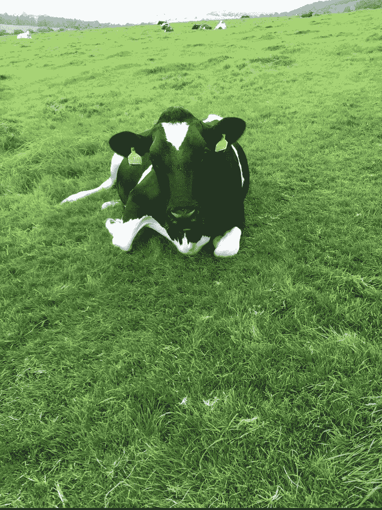

这对你来说够平均了吧？

# 免费 Instagram 应用

# 照片编辑的 Insta 应用程序:SnapSeed

我想用一个我认为最重要的应用程序来开始我们的倒计时。

[*SnapSeed*](https://support.google.com/snapseed/#topic=6155507) 是 Google 开发的高质量专业图片编辑器。这个应用程序有超过 29 个工具和过滤器，具有令人印象深刻的图像样式选项。

有很多类似的照片编辑应用程序，但 SnapSeed 易于使用的界面使其具有优势。

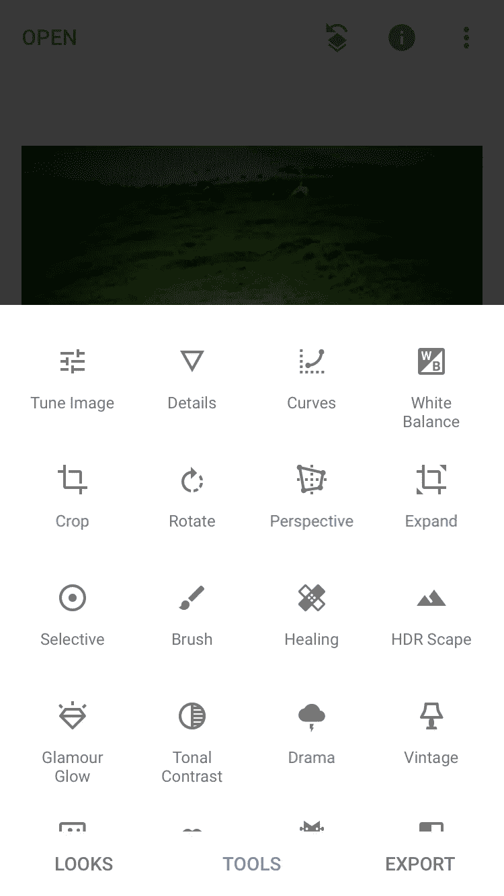

包括在他们的工具和过滤器列表中，你会发现'愈合'，' HDR 景观'，'文本'，'头部姿势'，'框架'等等！

我花了总共 30 秒的时间在 SnapSeed 上摆弄我们的奶牛照片，得到了一些比原来更有趣的东西…

…但是如果你愿意在这个应用上花 5 分钟时间，你可以把一张普通的(不可想象的)照片变成令人惊叹的东西。

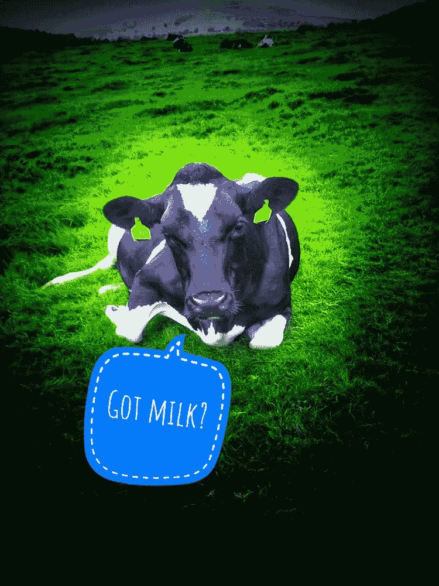

# 获得关注的 Insta 应用程序:Giphy Cam

如果 SnapSeed 是我们榜单中最安全的应用，那么 Giphy Cam 无疑是最出彩的。

这个应用程序有许多看起来很疯狂的照片和视频编辑选项，这将真正使你的图片在 Instagram Newsfeed 中脱颖而出。

顾名思义，Giphy Cam 允许您从照片或视频创建 GIF，甚至可以为最平凡的图像带来生命(幸运的是我当时选择了那头牛！).

该应用程序易于使用，效果会立即应用到您的照片上。

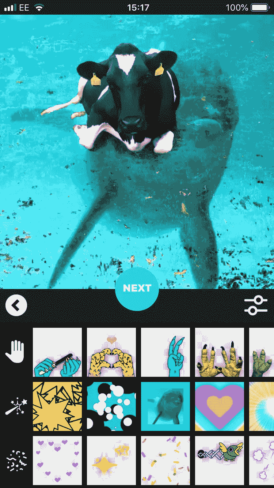

编辑功能包括过滤器，GIF 贴纸，脸，移动背景，(见上面的海豚)覆盖，框架和文本…

…而且每一部都保证会比上一部带给观众更多的惊喜！

我的奶牛照片的 GIF 只用了 10 秒钟就找到、应用并保存了，它将比原始照片产生更多的参与度:

# 品牌模板的 Insta 应用程序:结束

[*Over*](https://madewithover.com/) 是 Instagram 上品牌最全的 app 之一。它的功能是作为一个图像编辑器，但这不是它上榜的原因(因为它无法在这个领域与 SnapSeed 一起完成)。

Over 拥有最全面的帖子模板库。这是一个免费的增值应用程序，所以请准备好只提供精选的模板…

…但即使如此，也有足够多的选项，尤其是如果您刚刚开始使用它！

模板部分有一个搜索选项，以及一系列不同的类别，为任何行业的品牌提供令人惊叹的选项。

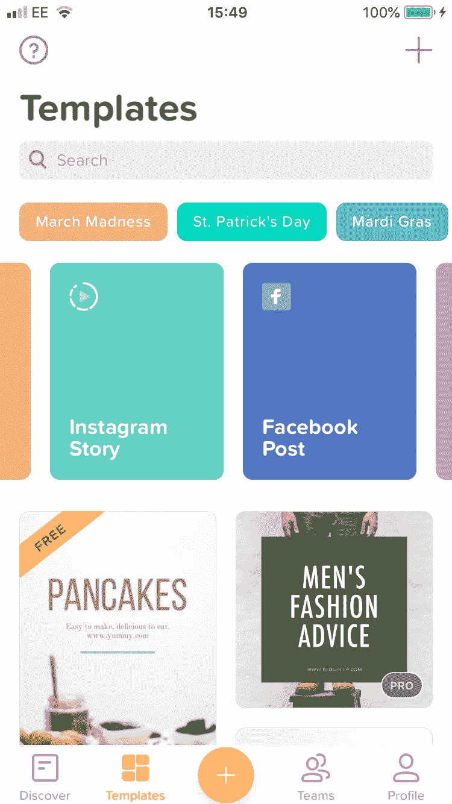

这是一个易于使用的应用程序，只需轻触几个按钮，就可以将标准图像转换为品牌信息。

如果你正在寻求提升你的品牌内容游戏，我预测 Over 可能会成为你 2019 年 Insta 战略的重要组成部分。

这是我用奶牛照片很快就达到的效果(顺便说一句:如果我有一张不同的照片，我会用一个更好的模板！):

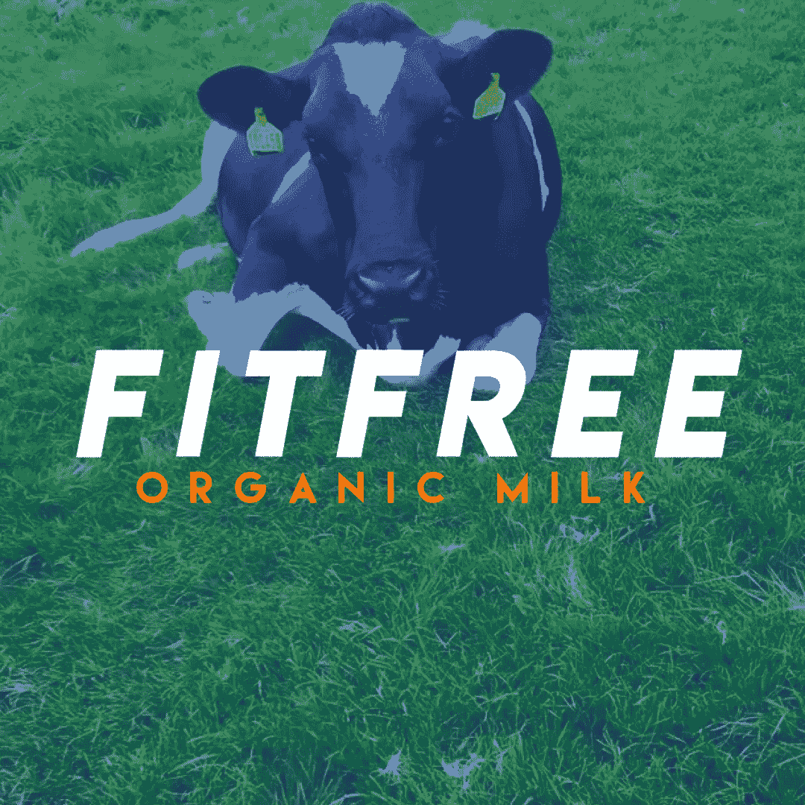

# 用于时尚故事编辑和策划的 Insta 应用程序:展开

如果你想将你的 Instagram 故事从普通人中分离出来，那么 [*展开*](https://unfoldstori.es/) 可能是实现这一目标的应用。

这个应用程序是一个 Instagram 故事设计者和构建者，具有一系列可定制的模板。这允许您在将故事上传到您的个人资料之前创建和检查您的故事。

如果你想通过几篇故事帖子与你的关注者分享一条信息，你可以在 Unfold 上格式化它们，然后优化你的故事以吸引关注。

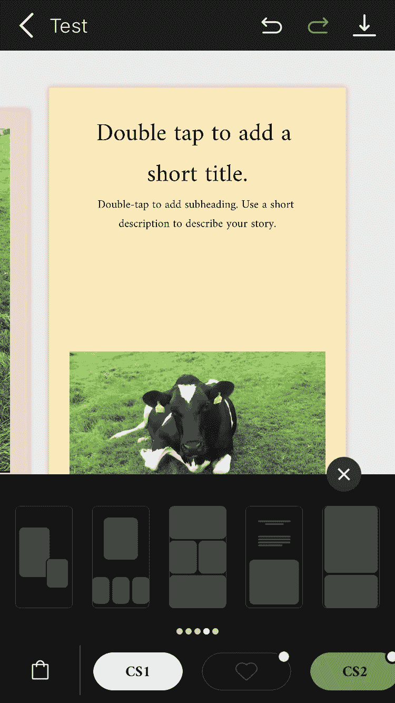

每天有超过 5 亿个 Instagram 故事被发布，其中三分之一的点击率是由企业创造的。

如果你还没有，确保你定期发布 Instagram 故事来娱乐和吸引你的观众。故事是洞察你的业务和提高品牌知名度的好方法。

以下是我在 Unfold(瞬间)上用我们的奶牛照片创作的:

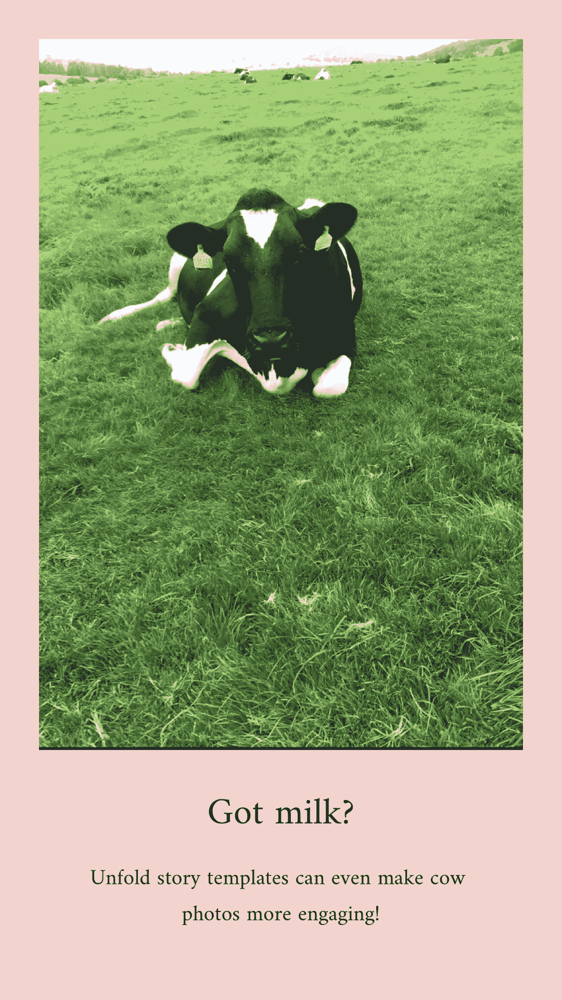

# 用于自拍和修饰的 Insta 应用程序:Facetune 2

如果你是一个有抱负的 Insta 影响者，或者你在你的帖子中使用了大量个性化内容， [*Facetune 2*](https://www.facetuneapp.com/) 可能是你的应用。

像这个列表中的一些其他产品一样，Facetune 2 是一个免费增值产品，但它提供了足够多的免费工具。

要了解这个应用程序的真正威力，你真的需要安装它，自拍并使用他们的面部编辑工具。Facetune 2 甚至可以将最丑的自拍变成美丽的东西。

自拍编辑工具包括可以调整鼻子、嘴巴和眼睛大小的滑动比例、平滑度调整(去除瑕疵)和牙齿美白。

不幸的是，这些编辑工具在我们的奶牛身上看起来并不那么好。

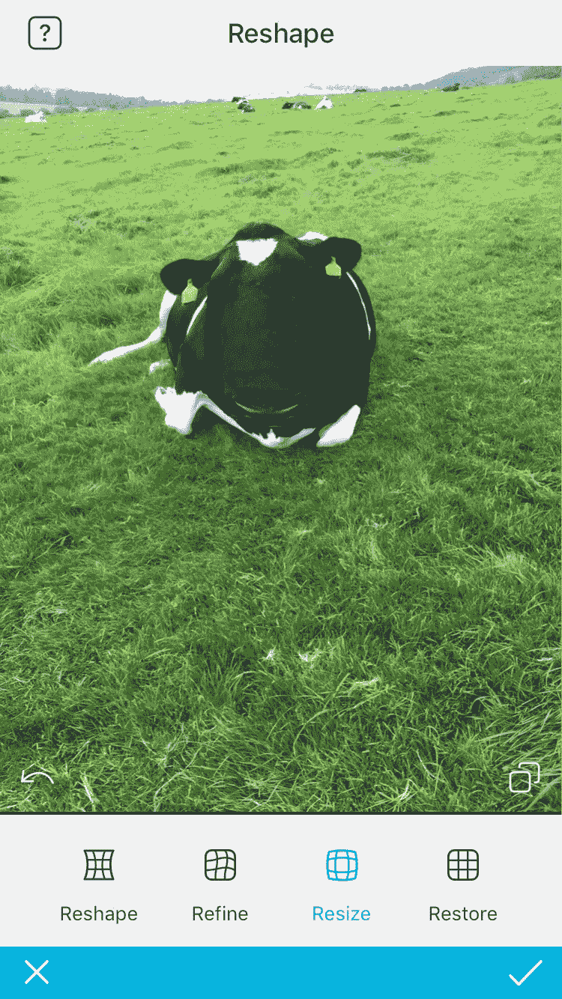

除了作为终极自拍编辑应用程序，Facetune 2 还配备了一些强大的工具，可以转换普通照片。这些包括散焦，晕影，灯光效果，增强，裁剪，霓虹灯，油漆和更多(在免费版本)…

…我花了几分钟时间为我们的奶牛照片测试了其中的一些功能，结果如下:

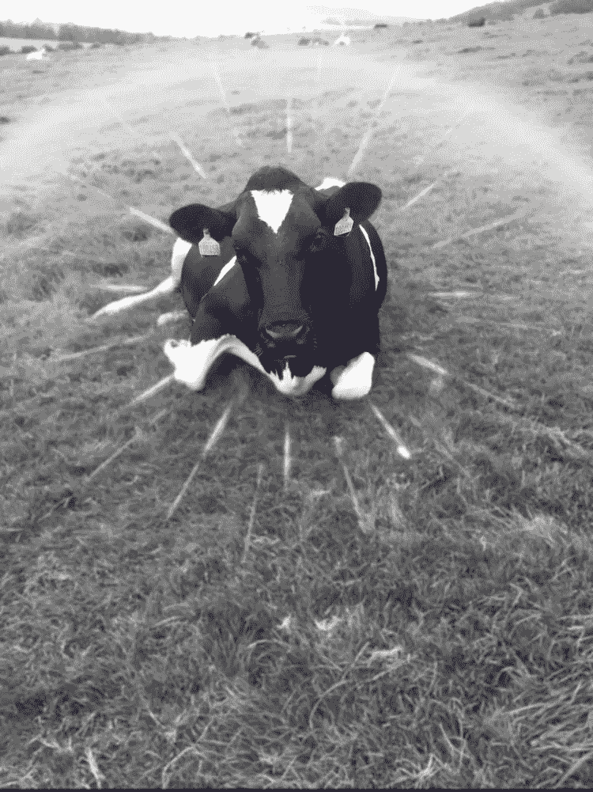

# 拼贴画的 Insta 应用程序:Pic 缝合

我们名单中的最后一个应用程序是(我认为是)最好的 Instagram 拼贴生成器。

[*Pic Stitch*](https://pic-stitch.en.softonic.com/iphone) 自带大量不同格式，几乎可以用于任何用途。这些分为两类，经典款和时尚款:

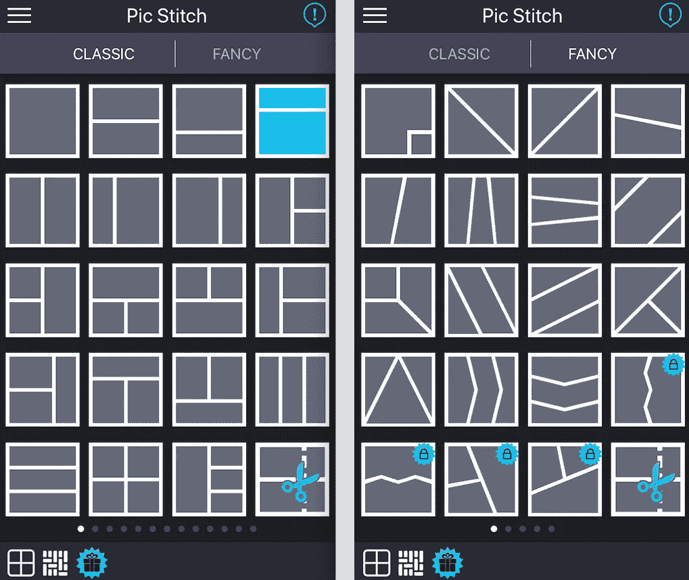

正如你所看到的，有几个锁定的模板(这是另一个免费增值应用)，但有足够多的拼贴开始使用。

这个应用程序最好的一点(也是它在其他 Insta collage 应用程序之上上榜的原因)是内置的编辑软件。

Pic Stich 附带了许多工具，可以在将图片插入拼贴之前对其进行转换，正如你所想象的，它真的很容易使用。

以下是我们用“奇特”模板拼贴的一些奶牛照片:

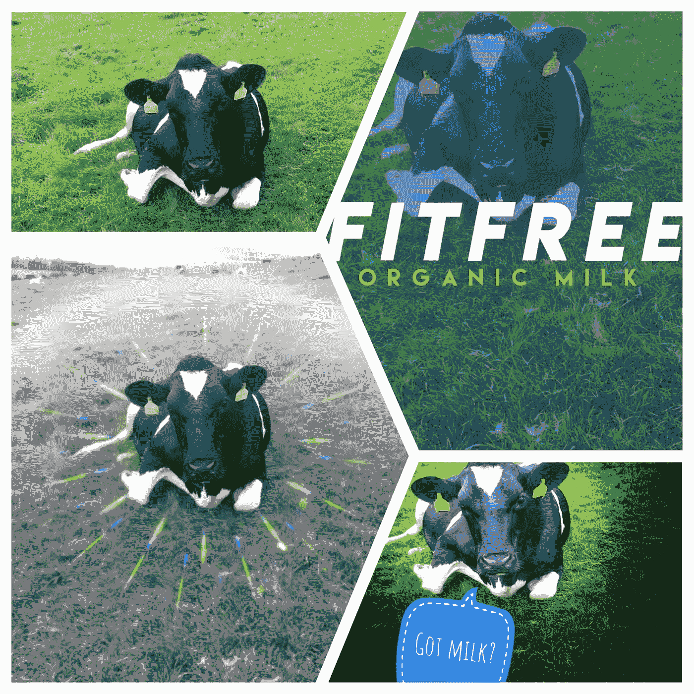

# 结论

如果你在这些应用程序中找不到你想要的东西，你一定错过了什么！

这 7 个免费应用程序提供了各种各样的编辑选项，并保证提升你的即时游戏。

我已经用一个平凡的图像(向牛道歉)展示了它们的能力(非常快)…所以想象一下用一个稍微高于平均水平的东西会有什么可能！

挑出你最喜欢的，试一试。记住，所有这些应用程序都是免费的，所以你不会有任何损失！

你怎么看待这些免费的 Insta 应用？我错过什么了吗？

如果你想了解更多关于提升 Instagram 关注度的信息，请查看我们的[***insta gram 标签***](https://www.einsteinmarketer.com/instagram-hashtags/) 终极指南(这是我们有史以来最受欢迎的帖子之一！).

## 这篇文章发表在 [The Startup](https://medium.com/swlh) 上，这是 Medium 最大的创业刊物，拥有+431，678 名读者。

## 在这里订阅接收[我们的头条新闻](https://growthsupply.com/the-startup-newsletter/)。

