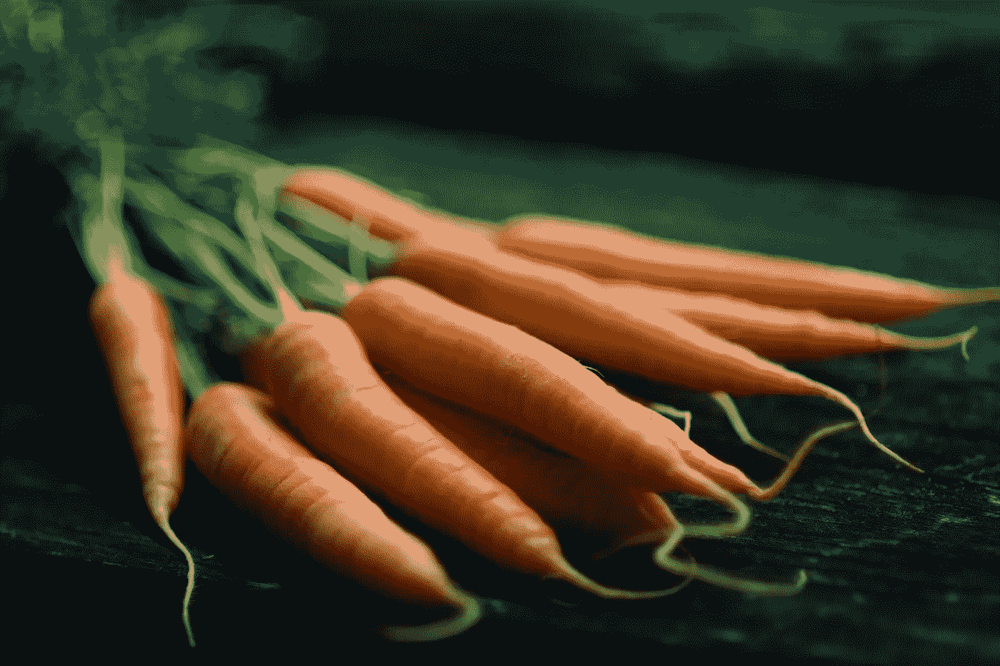

# 你今天在责备自己什么？

> 原文：<https://medium.com/swlh/what-are-you-beating-yourself-up-about-today-4e706aa6d3f8>

## 研究表明，少用大棒，多用胡萝卜会提高表现，让你达到目标

Photo by [Jonathan Pielmayer](https://unsplash.com/photos/eFFnKMiDMGc?utm_source=unsplash&utm_medium=referral&utm_content=creditCopyText) on [Unsplash](https://unsplash.com/search/photos/carrot-stick?utm_source=unsplash&utm_medium=referral&utm_content=creditCopyText)

我曾经告诉自己，我将要参加的每一次考试都会失败。

我当时得到的 A 只是侥幸。鉴于我不良的学习习惯和我不如…