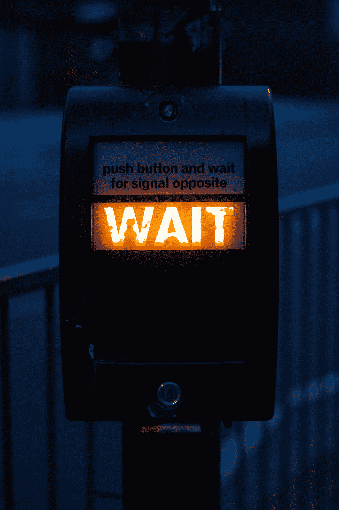

# 你还在等什么？

> 原文：<https://medium.com/swlh/what-are-you-waiting-for-75d27ce7e3b9>

## 分析麻痹和对失败的恐惧如何限制我们成功的能力。

Photo by [Xu Haiwei](https://unsplash.com/@mrsunburnt?utm_source=medium&utm_medium=referral) on [Unsplash](https://unsplash.com?utm_source=medium&utm_medium=referral)

伊索寓言是公元前六世纪一位希腊讲故事的奴隶所写或收集的道德故事。在《狐狸和猫》中，主角听到猎狗接近他们，需要做出反应。猫看到一个潜在的选择，而狐狸看到许多。当猫爬上一棵树时，狐狸正在…