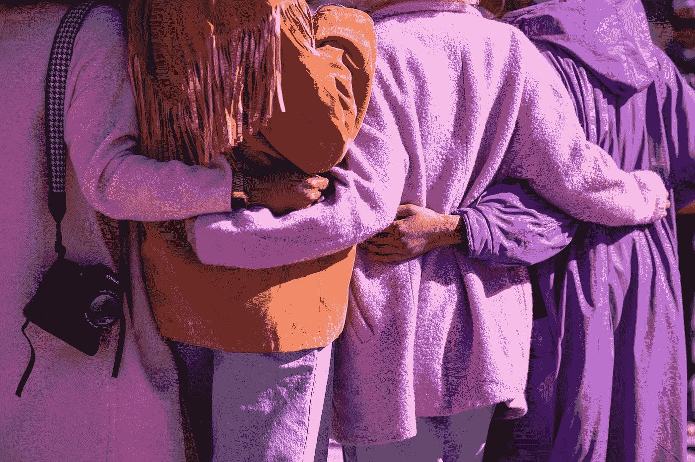

# 区块链需要无私的人

> 原文：<https://medium.com/swlh/what-blockchain-needs-is-selflessness-5286501c9d4a>

## 尽管有巨大的潜力，但我们没有看到进展的原因，以及我们应该如何看待区块链的采用

Photo by [Vonecia Carswell](https://unsplash.com/@v_well?utm_source=unsplash&utm_medium=referral&utm_content=creditCopyText) on [Unsplash](https://unsplash.com/search/photos/community?utm_source=unsplash&utm_medium=referral&utm_content=creditCopyText)

作为一个经常幻想区块链将如何改变我们的世界的人，我已经就这项技术的未来进行了(太多)多次对话，但都没有产生切实的计划…