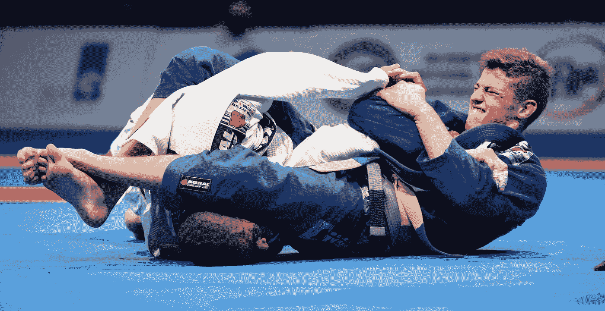

# 巴西柔术和你的职业有什么共同点

> 原文：<https://medium.com/swlh/what-brazilian-jiu-jitsu-and-your-career-have-in-common-92324c095140>

你可能想不到，但是你的职业生涯和一项人们试图扼杀你的运动有很多相似之处。(或者，如果你有过特别糟糕的工作，你可能会这么想)。

但是，柔术下面的很多因素，不仅仅可以带进你的事业，而是一般的生活。武术创始人艾里奥·格雷西说…